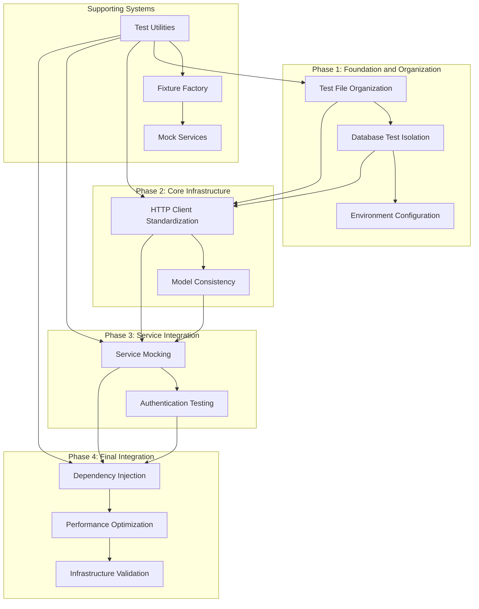
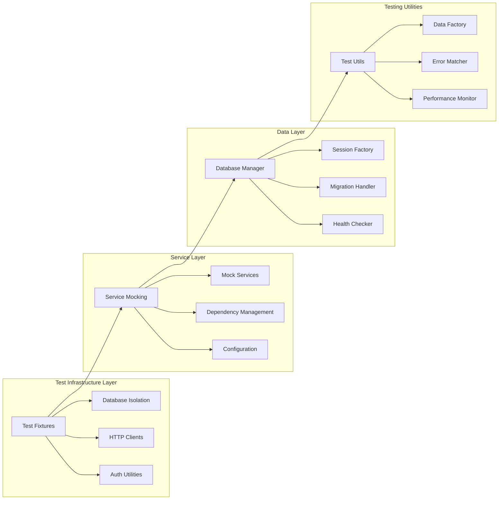

# Backend Health System Fix P2 - Design Document

## Overview

This design document outlines the technical approach for systematically resolving critical backend test infrastructure failures in the Medical Device Regulatory Assistant project. The solution implements a phased approach to fix database testing isolation, HTTP client patterns, model consistency, service integration, authentication testing, and dependency injection while maintaining the existing FastAPI/SQLAlchemy architecture and improving overall system reliability.

## Architecture

### High-Level Architecture



### Component Architecture



## Components and Interfaces

### 1. Test File Organization System

#### 1.1 Test File Auditor and Organizer

**Purpose**: Analyze and reorganize the 227+ test files into a maintainable structure

**Interface**:

```python
# backend/testing/test_organizer.py
from typing import Dict, List, Set
from pathlib import Path
from dataclasses import dataclass

@dataclass
class TestFileInfo:
    path: Path
    category: str  # unit, integration, performance, fixtures
    functionality: str  # database, api, services, auth
    dependencies: Set[str]
    test_count: int
    is_duplicate: bool

class TestFileOrganizer:
    """Organizes and consolidates test files"""

    def __init__(self, test_root: Path):
        self.test_root = test_root
        self.file_info: Dict[str, TestFileInfo] = {}

    def audit_test_files(self) -> Dict[str, List[TestFileInfo]]:
        """Audit all test files and categorize them"""

    def identify_duplicates(self) -> List[tuple[TestFileInfo, TestFileInfo]]:
        """Identify duplicate or overlapping test files"""

    def create_organization_plan(self) -> Dict[str, str]:
        """Create plan for reorganizing test files"""

    def execute_reorganization(self, plan: Dict[str, str]) -> None:
        """Execute the reorganization plan"""
```

**Implementation**:

```python
import ast
import re
from pathlib import Path
from typing import Dict, List, Set
from dataclasses import dataclass

class TestFileOrganizer:
    def __init__(self, test_root: Path):
        self.test_root = test_root
        self.file_info: Dict[str, TestFileInfo] = {}
        self.target_structure = {
            "unit": ["models", "services", "utils", "core"],
            "integration": ["api", "database", "services", "auth"],
            "fixtures": ["database", "auth", "services", "mock_data"],
            "utils": ["test_data_factory", "mock_services", "performance_monitor"]
        }

    def audit_test_files(self) -> Dict[str, List[TestFileInfo]]:
        """Audit all test files and categorize them"""
        test_files = list(self.test_root.rglob("test_*.py"))
        categorized = {"unit": [], "integration": [], "performance": [], "fixtures": [], "obsolete": []}

        for file_path in test_files:
            info = self._analyze_test_file(file_path)
            self.file_info[str(file_path)] = info
            categorized[info.category].append(info)

        return categorized

    def _analyze_test_file(self, file_path: Path) -> TestFileInfo:
        """Analyze a single test file"""
        with open(file_path, 'r') as f:
            content = f.read()

        # Parse AST to count tests and analyze imports
        try:
            tree = ast.parse(content)
            test_count = len([node for node in ast.walk(tree)
                            if isinstance(node, ast.FunctionDef) and node.name.startswith('test_')])

            # Analyze imports to determine dependencies
            dependencies = set()
            for node in ast.walk(tree):
                if isinstance(node, ast.Import):
                    for alias in node.names:
                        dependencies.add(alias.name.split('.')[0])
                elif isinstance(node, ast.ImportFrom):
                    if node.module:
                        dependencies.add(node.module.split('.')[0])
        except:
            test_count = len(re.findall(r'def test_\w+', content))
            dependencies = set()

        # Categorize based on file name and content
        category = self._categorize_test_file(file_path, content, dependencies)
        functionality = self._determine_functionality(file_path, content)
        is_duplicate = self._check_for_duplicates(file_path, content)

        return TestFileInfo(
            path=file_path,
            category=category,
            functionality=functionality,
            dependencies=dependencies,
            test_count=test_count,
            is_duplicate=is_duplicate
        )

    def _categorize_test_file(self, file_path: Path, content: str, dependencies: Set[str]) -> str:
        """Categorize test file based on content and dependencies"""
        file_name = file_path.name.lower()

        # Performance tests
        if 'performance' in file_name or 'benchmark' in file_name or 'load' in file_name:
            return "performance"

        # Integration tests (multiple services, database + API, etc.)
        if ('integration' in file_name or
            'fastapi' in dependencies or
            ('database' in content and 'api' in content) or
            'TestClient' in content):
            return "integration"

        # Fixture files
        if ('fixture' in file_name or 'conftest' in file_name or
            'mock' in file_name or 'factory' in file_name):
            return "fixtures"

        # Unit tests (single component)
        return "unit"

    def create_organization_plan(self) -> Dict[str, str]:
        """Create plan for reorganizing test files"""
        plan = {}

        for file_path, info in self.file_info.items():
            if info.is_duplicate:
                plan[file_path] = "DELETE"
            else:
                new_path = self._determine_new_path(info)
                if new_path != file_path:
                    plan[file_path] = new_path

        return plan

    def _determine_new_path(self, info: TestFileInfo) -> str:
        """Determine new path for a test file"""
        base_path = self.test_root / info.category

        if info.functionality:
            base_path = base_path / info.functionality

        return str(base_path / info.path.name)
```

### 2. Database Test Isolation System

#### 2.1 Isolated Database Manager

**Purpose**: Provide completely isolated database instances for each test function

**Interface**:

```python
# backend/testing/database_isolation.py
from typing import AsyncGenerator, Optional, Dict, Any
from sqlalchemy.ext.asyncio import AsyncSession, AsyncEngine
from contextlib import asynccontextmanager

class IsolatedDatabaseManager:
    """Manages isolated database instances for testing"""

    def __init__(self, base_url: str = "sqlite+aiosqlite:///:memory:"):
        self.base_url = base_url
        self.engines: Dict[str, AsyncEngine] = {}

    @asynccontextmanager
    async def isolated_session(self, test_id: str = None) -> AsyncGenerator[AsyncSession, None]:
        """Provide completely isolated database session for testing"""

    async def create_test_schema(self, session: AsyncSession) -> None:
        """Create all tables in the test database"""

    async def cleanup_test_database(self, test_id: str) -> None:
        """Clean up test database resources"""
```

**Implementation**:

```python
import uuid
from sqlalchemy.ext.asyncio import create_async_engine, async_sessionmaker
from sqlalchemy.pool import StaticPool
from models.base import Base

class IsolatedDatabaseManager:
    def __init__(self, base_url: str = "sqlite+aiosqlite:///:memory:"):
        self.base_url = base_url
        self.engines: Dict[str, AsyncEngine] = {}
        self.session_factories: Dict[str, async_sessionmaker] = {}

    @asynccontextmanager
    async def isolated_session(self, test_id: str = None) -> AsyncGenerator[AsyncSession, None]:
        if test_id is None:
            test_id = str(uuid.uuid4())

        # Create unique engine for this test
        engine = create_async_engine(
            self.base_url,
            poolclass=StaticPool,
            connect_args={"check_same_thread": False},
            echo=False
        )

        self.engines[test_id] = engine

        # Create session factory
        session_factory = async_sessionmaker(
            bind=engine,
            expire_on_commit=False
        )
        self.session_factories[test_id] = session_factory

        try:
            # Create all tables
            async with engine.begin() as conn:
                await conn.run_sync(Base.metadata.create_all)

            # Provide session
            async with session_factory() as session:
                yield session
        finally:
            # Cleanup
            await self.cleanup_test_database(test_id)

    async def cleanup_test_database(self, test_id: str) -> None:
        if test_id in self.engines:
            await self.engines[test_id].dispose()
            del self.engines[test_id]
            del self.session_factories[test_id]
```

#### 2.2 Test Data Factory

**Purpose**: Provide consistent test data creation with automatic cleanup

**Interface**:

```python
# backend/testing/test_data_factory.py
from typing import Dict, Any, List, Optional
from sqlalchemy.ext.asyncio import AsyncSession

class TestDataFactory:
    """Factory for creating test data with automatic cleanup tracking"""

    def __init__(self, session: AsyncSession):
        self.session = session
        self.created_entities: List[tuple] = []

    async def create_user(self, **kwargs) -> 'User':
        """Create a test user with default values"""

    async def create_project(self, user_id: int, **kwargs) -> 'Project':
        """Create a test project with default values"""

    async def create_predicate_device(self, project_id: int, **kwargs) -> 'PredicateDevice':
        """Create a test predicate device with default values"""

    async def cleanup_all(self) -> None:
        """Clean up all created test data"""
```

**Implementation**:

```python
import uuid
from datetime import datetime
from models.user import User
from models.project import Project, ProjectStatus
from models.predicate_device import PredicateDevice

class TestDataFactory:
    def __init__(self, session: AsyncSession):
        self.session = session
        self.created_entities: List[tuple] = []

    async def create_user(self, **kwargs) -> User:
        default_data = {
            "google_id": f"test_user_{uuid.uuid4()}",
            "email": f"test_{uuid.uuid4()}@example.com",
            "name": "Test User",
            "created_at": datetime.utcnow(),
            **kwargs
        }

        user = User(**default_data)
        self.session.add(user)
        await self.session.flush()  # Get ID without committing

        self.created_entities.append(('user', user.id))
        return user

    async def create_project(self, user_id: int, **kwargs) -> Project:
        default_data = {
            "user_id": user_id,
            "name": f"Test Project {uuid.uuid4()}",
            "description": "Test project description",
            "device_type": "Test Device",
            "intended_use": "Test intended use",
            "status": ProjectStatus.DRAFT,
            "created_at": datetime.utcnow(),
            **kwargs
        }

        project = Project(**default_data)
        self.session.add(project)
        await self.session.flush()

        self.created_entities.append(('project', project.id))
        return project

    async def create_predicate_device(self, project_id: int, **kwargs) -> PredicateDevice:
        default_data = {
            "project_id": project_id,
            "k_number": f"K{uuid.uuid4().hex[:6].upper()}",
            "device_name": "Test Predicate Device",
            "intended_use": "Test predicate intended use",
            "product_code": "ABC",
            "clearance_date": datetime.utcnow().date(),
            "confidence_score": 0.85,
            **kwargs
        }

        predicate = PredicateDevice(**default_data)
        self.session.add(predicate)
        await self.session.flush()

        self.created_entities.append(('predicate_device', predicate.id))
        return predicate

    async def cleanup_all(self) -> None:
        # Clean up in reverse order of creation
        for entity_type, entity_id in reversed(self.created_entities):
            try:
                if entity_type == 'predicate_device':
                    await self.session.execute(
                        text("DELETE FROM predicate_devices WHERE id = :id"),
                        {"id": entity_id}
                    )
                elif entity_type == 'project':
                    await self.session.execute(
                        text("DELETE FROM projects WHERE id = :id"),
                        {"id": entity_id}
                    )
                elif entity_type == 'user':
                    await self.session.execute(
                        text("DELETE FROM users WHERE id = :id"),
                        {"id": entity_id}
                    )
            except Exception as e:
                # Log cleanup errors but don't fail the test
                logger.warning(f"Failed to cleanup {entity_type} {entity_id}: {e}")

        self.created_entities.clear()
```

### 3. HTTP Client Testing Infrastructure

#### 3.1 Standardized Test Client Factory

**Purpose**: Provide consistent FastAPI TestClient instances for API testing

**Interface**:

```python
# backend/testing/http_client.py
from typing import Dict, Any, Optional
from fastapi.testclient import TestClient
from fastapi import FastAPI

class TestClientFactory:
    """Factory for creating standardized test clients"""

    def __init__(self, app: FastAPI):
        self.app = app

    def create_client(self, **kwargs) -> TestClient:
        """Create a TestClient with standard configuration"""

    def create_authenticated_client(self, user_data: Dict[str, Any]) -> TestClient:
        """Create a TestClient with authentication headers"""

    def create_admin_client(self) -> TestClient:
        """Create a TestClient with admin privileges"""
```

**Implementation**:

```python
from fastapi.testclient import TestClient
from fastapi import FastAPI
import jwt
from datetime import datetime, timedelta

class TestClientFactory:
    def __init__(self, app: FastAPI):
        self.app = app
        self.jwt_secret = "test_secret_key"
        self.jwt_algorithm = "HS256"

    def create_client(self, **kwargs) -> TestClient:
        """Create a TestClient with standard configuration"""
        return TestClient(self.app, **kwargs)

    def create_authenticated_client(self, user_data: Dict[str, Any]) -> TestClient:
        """Create a TestClient with authentication headers"""
        # Create JWT token
        payload = {
            "sub": str(user_data.get("id", "test_user")),
            "email": user_data.get("email", "test@example.com"),
            "name": user_data.get("name", "Test User"),
            "exp": datetime.utcnow() + timedelta(hours=1)
        }

        token = jwt.encode(payload, self.jwt_secret, algorithm=self.jwt_algorithm)

        client = TestClient(self.app)
        client.headers.update({"Authorization": f"Bearer {token}"})
        return client

    def create_admin_client(self) -> TestClient:
        """Create a TestClient with admin privileges"""
        admin_data = {
            "id": "admin_user",
            "email": "admin@example.com",
            "name": "Admin User",
            "role": "admin"
        }
        return self.create_authenticated_client(admin_data)
```

#### 3.2 API Test Utilities

**Purpose**: Provide common utilities for API endpoint testing

**Interface**:

```python
# backend/testing/api_test_utils.py
from typing import Dict, Any, Optional
from fastapi.testclient import TestClient
from httpx import Response

class APITestUtils:
    """Utilities for API endpoint testing"""

    @staticmethod
    def assert_success_response(response: Response, expected_status: int = 200) -> Dict[str, Any]:
        """Assert successful response and return JSON data"""

    @staticmethod
    def assert_error_response(response: Response, expected_status: int, expected_error_code: str = None) -> Dict[str, Any]:
        """Assert error response with expected status and error code"""

    @staticmethod
    def assert_validation_error(response: Response, field_name: str) -> Dict[str, Any]:
        """Assert validation error for specific field"""
```

**Implementation**:

```python
import json
from typing import Dict, Any, Optional
from httpx import Response

class APITestUtils:
    @staticmethod
    def assert_success_response(response: Response, expected_status: int = 200) -> Dict[str, Any]:
        """Assert successful response and return JSON data"""
        assert response.status_code == expected_status, (
            f"Expected status {expected_status}, got {response.status_code}. "
            f"Response: {response.text}"
        )

        try:
            return response.json()
        except json.JSONDecodeError:
            assert False, f"Response is not valid JSON: {response.text}"

    @staticmethod
    def assert_error_response(response: Response, expected_status: int, expected_error_code: str = None) -> Dict[str, Any]:
        """Assert error response with expected status and error code"""
        assert response.status_code == expected_status, (
            f"Expected status {expected_status}, got {response.status_code}. "
            f"Response: {response.text}"
        )

        try:
            data = response.json()
        except json.JSONDecodeError:
            assert False, f"Error response is not valid JSON: {response.text}"

        if expected_error_code:
            error_info = data.get("detail", {})
            if isinstance(error_info, dict):
                actual_error_code = error_info.get("error_code")
                assert actual_error_code == expected_error_code, (
                    f"Expected error code {expected_error_code}, got {actual_error_code}"
                )

        return data

    @staticmethod
    def assert_validation_error(response: Response, field_name: str) -> Dict[str, Any]:
        """Assert validation error for specific field"""
        data = APITestUtils.assert_error_response(response, 422)

        # Check if it's a Pydantic validation error
        if "detail" in data and isinstance(data["detail"], list):
            field_errors = [error for error in data["detail"] if error.get("loc", [])[-1] == field_name]
            assert field_errors, f"No validation error found for field '{field_name}'"

        return data
```

### 4. Service Integration and Mocking System

#### 4.1 Mock Service Factory

**Purpose**: Provide consistent mocking for external services

**Interface**:

```python
# backend/testing/mock_services.py
from typing import Dict, Any, List, Optional
from unittest.mock import Mock, AsyncMock

class MockServiceFactory:
    """Factory for creating mock services"""

    def create_mock_openfda_service(self, **kwargs) -> Mock:
        """Create mock OpenFDA service with standard methods"""

    def create_mock_redis_client(self, **kwargs) -> AsyncMock:
        """Create mock Redis client"""

    def create_mock_auth_service(self, **kwargs) -> Mock:
        """Create mock authentication service"""
```

**Implementation**:

```python
from unittest.mock import Mock, AsyncMock
from typing import Dict, Any, List, Optional

class MockServiceFactory:
    def create_mock_openfda_service(self, **kwargs) -> Mock:
        """Create mock OpenFDA service with standard methods"""
        mock_service = Mock()

        # Default search results
        default_results = kwargs.get('search_results', [
            {
                "k_number": "K123456",
                "device_name": "Test Device",
                "intended_use": "Test indication",
                "product_code": "ABC",
                "clearance_date": "2023-01-01"
            }
        ])

        # Mock search_predicates method
        mock_service.search_predicates = AsyncMock(return_value=default_results)

        # Mock get_device_details method
        mock_service.get_device_details = AsyncMock(return_value={
            "k_number": "K123456",
            "device_name": "Test Device",
            "intended_use": "Test indication",
            "product_code": "ABC",
            "clearance_date": "2023-01-01",
            "detailed_info": "Additional device information"
        })

        # Mock health check
        mock_service.health_check = AsyncMock(return_value={
            "healthy": True,
            "status": "connected"
        })

        return mock_service

    def create_mock_redis_client(self, **kwargs) -> AsyncMock:
        """Create mock Redis client"""
        mock_client = AsyncMock()

        # Mock basic Redis operations
        mock_client.ping = AsyncMock(return_value=True)
        mock_client.get = AsyncMock(return_value=None)
        mock_client.set = AsyncMock(return_value=True)
        mock_client.delete = AsyncMock(return_value=1)
        mock_client.exists = AsyncMock(return_value=False)

        # Mock info command
        mock_client.info = AsyncMock(return_value={
            "redis_version": "7.0.0",
            "connected_clients": 1,
            "used_memory_human": "1.00M"
        })

        return mock_client

    def create_mock_auth_service(self, **kwargs) -> Mock:
        """Create mock authentication service"""
        mock_service = Mock()

        # Default user data
        default_user = kwargs.get('user_data', {
            "id": "test_user",
            "email": "test@example.com",
            "name": "Test User"
        })

        # Mock authentication methods
        mock_service.get_current_user = AsyncMock(return_value=default_user)
        mock_service.verify_token = AsyncMock(return_value=True)
        mock_service.create_token = Mock(return_value="test_token")

        return mock_service
```

#### 4.2 Service Dependency Injection

**Purpose**: Provide configurable dependency injection for services

**Interface**:

```python
# backend/testing/dependency_injection.py
from typing import Dict, Any, Optional, TypeVar, Type
from contextlib import asynccontextmanager

T = TypeVar('T')

class TestDependencyContainer:
    """Container for managing test dependencies"""

    def __init__(self):
        self._services: Dict[str, Any] = {}
        self._factories: Dict[str, callable] = {}

    def register_service(self, name: str, service: Any) -> None:
        """Register a service instance"""

    def register_factory(self, name: str, factory: callable) -> None:
        """Register a service factory"""

    def get_service(self, name: str, service_type: Type[T] = None) -> T:
        """Get a service by name"""

    @asynccontextmanager
    async def override_dependencies(self, overrides: Dict[str, Any]):
        """Temporarily override dependencies for testing"""
```

**Implementation**:

```python
from typing import Dict, Any, Optional, TypeVar, Type
from contextlib import asynccontextmanager

T = TypeVar('T')

class TestDependencyContainer:
    def __init__(self):
        self._services: Dict[str, Any] = {}
        self._factories: Dict[str, callable] = {}
        self._overrides: Dict[str, Any] = {}

    def register_service(self, name: str, service: Any) -> None:
        """Register a service instance"""
        self._services[name] = service

    def register_factory(self, name: str, factory: callable) -> None:
        """Register a service factory"""
        self._factories[name] = factory

    def get_service(self, name: str, service_type: Type[T] = None) -> T:
        """Get a service by name"""
        # Check overrides first
        if name in self._overrides:
            return self._overrides[name]

        # Check registered services
        if name in self._services:
            return self._services[name]

        # Check factories
        if name in self._factories:
            service = self._factories[name]()
            self._services[name] = service
            return service

        raise ValueError(f"Service '{name}' not found")

    @asynccontextmanager
    async def override_dependencies(self, overrides: Dict[str, Any]):
        """Temporarily override dependencies for testing"""
        old_overrides = self._overrides.copy()
        self._overrides.update(overrides)

        try:
            yield
        finally:
            self._overrides = old_overrides
```

### 5. Model Consistency and Migration System

#### 5.1 Enhanced Project Status Enum

**Purpose**: Add missing ACTIVE status to ProjectStatus enum

**Implementation**:

```python
# backend/models/project.py (updated)
class ProjectStatus(enum.Enum):
    """Project status enumeration"""
    DRAFT = "draft"
    ACTIVE = "active"  # Added missing status
    IN_PROGRESS = "in_progress"
    COMPLETED = "completed"
```

#### 5.2 Database Migration Handler

**Purpose**: Handle enum changes and schema updates safely

**Interface**:

```python
# backend/database/migration_handler.py
from typing import List, Dict, Any
from alembic import command
from alembic.config import Config

class MigrationHandler:
    """Handles database migrations and schema updates"""

    def __init__(self, alembic_cfg_path: str = "alembic.ini"):
        self.alembic_cfg = Config(alembic_cfg_path)

    async def generate_migration(self, message: str) -> str:
        """Generate a new migration file"""

    async def apply_migrations(self) -> None:
        """Apply pending migrations"""

    async def validate_enum_migration(self, enum_name: str, new_values: List[str]) -> bool:
        """Validate enum migration safety"""
```

**Implementation**:

```python
import logging
from alembic import command
from alembic.config import Config
from alembic.script import ScriptDirectory
from alembic.runtime.environment import EnvironmentContext

logger = logging.getLogger(__name__)

class MigrationHandler:
    def __init__(self, alembic_cfg_path: str = "alembic.ini"):
        self.alembic_cfg = Config(alembic_cfg_path)

    async def generate_migration(self, message: str) -> str:
        """Generate a new migration file"""
        try:
            # Generate migration
            command.revision(
                self.alembic_cfg,
                message=message,
                autogenerate=True
            )

            # Get the latest revision
            script_dir = ScriptDirectory.from_config(self.alembic_cfg)
            latest_revision = script_dir.get_current_head()

            logger.info(f"Generated migration: {latest_revision}")
            return latest_revision

        except Exception as e:
            logger.error(f"Failed to generate migration: {e}")
            raise

    async def apply_migrations(self) -> None:
        """Apply pending migrations"""
        try:
            command.upgrade(self.alembic_cfg, "head")
            logger.info("Applied all pending migrations")
        except Exception as e:
            logger.error(f"Failed to apply migrations: {e}")
            raise

    async def validate_enum_migration(self, enum_name: str, new_values: List[str]) -> bool:
        """Validate enum migration safety"""
        # For SQLite, enum changes are handled by recreating the table
        # This is generally safe for adding new values
        logger.info(f"Validating enum migration for {enum_name}: {new_values}")
        return True
```

### 6. Authentication Testing Infrastructure

#### 6.1 Authentication Test Fixtures

**Purpose**: Provide reliable authentication testing utilities

**Interface**:

```python
# backend/testing/auth_fixtures.py
from typing import Dict, Any, Optional
from fastapi import Request
from fastapi.security import HTTPBearer

class AuthTestFixtures:
    """Authentication fixtures for testing"""

    def __init__(self, jwt_secret: str = "test_secret"):
        self.jwt_secret = jwt_secret
        self.jwt_algorithm = "HS256"

    def create_test_token(self, user_data: Dict[str, Any]) -> str:
        """Create a test JWT token"""

    def create_auth_headers(self, user_data: Dict[str, Any]) -> Dict[str, str]:
        """Create authentication headers"""

    def mock_current_user(self, user_data: Dict[str, Any]) -> Mock:
        """Create mock for current user dependency"""
```

**Implementation**:

```python
import jwt
from datetime import datetime, timedelta
from typing import Dict, Any, Optional
from unittest.mock import Mock, patch

class AuthTestFixtures:
    def __init__(self, jwt_secret: str = "test_secret"):
        self.jwt_secret = jwt_secret
        self.jwt_algorithm = "HS256"

    def create_test_token(self, user_data: Dict[str, Any]) -> str:
        """Create a test JWT token"""
        payload = {
            "sub": str(user_data.get("id", "test_user")),
            "email": user_data.get("email", "test@example.com"),
            "name": user_data.get("name", "Test User"),
            "exp": datetime.utcnow() + timedelta(hours=1),
            "iat": datetime.utcnow(),
            **user_data.get("extra_claims", {})
        }

        return jwt.encode(payload, self.jwt_secret, algorithm=self.jwt_algorithm)

    def create_auth_headers(self, user_data: Dict[str, Any]) -> Dict[str, str]:
        """Create authentication headers"""
        token = self.create_test_token(user_data)
        return {"Authorization": f"Bearer {token}"}

    def mock_current_user(self, user_data: Dict[str, Any]) -> Mock:
        """Create mock for current user dependency"""
        mock_user = Mock()
        mock_user.id = user_data.get("id", "test_user")
        mock_user.email = user_data.get("email", "test@example.com")
        mock_user.name = user_data.get("name", "Test User")

        return mock_user

    def create_unauthenticated_headers(self) -> Dict[str, str]:
        """Create headers for unauthenticated requests"""
        return {}

    def create_invalid_token_headers(self) -> Dict[str, str]:
        """Create headers with invalid token"""
        return {"Authorization": "Bearer invalid_token"}
```

### 7. Performance Monitoring and Optimization

#### 7.1 Test Performance Monitor

**Purpose**: Monitor test execution performance and resource usage

**Interface**:

```python
# backend/testing/performance_monitor.py
from typing import Dict, Any, List, Optional
from dataclasses import dataclass
from contextlib import asynccontextmanager

@dataclass
class TestPerformanceMetrics:
    test_name: str
    execution_time_ms: float
    memory_usage_mb: float
    database_queries: int
    http_requests: int

class TestPerformanceMonitor:
    """Monitor test performance and resource usage"""

    def __init__(self):
        self.metrics: List[TestPerformanceMetrics] = []
        self.thresholds = {
            'execution_time_ms': 5000,  # 5 seconds
            'memory_usage_mb': 100,     # 100 MB
            'database_queries': 50,
            'http_requests': 10
        }

    @asynccontextmanager
    async def monitor_test(self, test_name: str):
        """Monitor a test execution"""

    def analyze_performance(self) -> Dict[str, Any]:
        """Analyze collected performance metrics"""

    def get_slow_tests(self, threshold_ms: float = 1000) -> List[TestPerformanceMetrics]:
        """Get tests that exceed execution time threshold"""
```

**Implementation**:

````python
import time
import psutil
import asyncio
from typing import Dict, Any, List, Optional
from dataclasses import dataclass
from contextlib import asynccontextmanager

@dataclass
class TestPerformanceMetrics:
    test_name: str
    execution_time_ms: float
    memory_usage_mb: float
    database_queries: int
    http_requests: int

class TestPerformanceMonitor:
    def __init__(self):
        self.metrics: List[TestPerformanceMetrics] = []
        self.thresholds = {
            'execution_time_ms': 5000,
            'memory_usage_mb': 100,
            'database_queries': 50,
            'http_requests': 10
        }
        self._current_metrics = {}

    @asynccontextmanager
    async def monitor_test(self, test_name: str):
        """Monitor a test execution"""
        start_time = time.time()
        start_memory = psutil.Process().memory_info().rss / 1024 / 1024  # MB

        # Initialize counters
        self._current_metrics[test_name] = {
            'database_queries': 0,
            'http_requests': 0
        }

        try:
            yield self
        finally:
            end_time = time.time()
            end_memory = psutil.Process().memory_info().rss / 1024 / 1024

            metrics = TestPerformanceMetrics(
                test_name=test_name,
                execution_time_ms=(end_time - start_time) * 1000,
                memory_usage_mb=end_memory - start_memory,
                database_queries=self._current_metrics[test_name]['database_queries'],
                http_requests=self._current_metrics[test_name]['http_requests']
            )

            self.metrics.append(metrics)

            # Check thresholds
            self._check_thresholds(metrics)

            # Cleanup
            del self._current_metrics[test_name]

    def _check_thresholds(self, metrics: TestPerformanceMetrics):
        """Check if metrics exceed thresholds"""
        warnings = []

        if metrics.execution_time_ms > self.thresholds['execution_time_ms']:
            warnings.append(f"Slow test: {metrics.test_name} took {metrics.execution_time_ms:.2f}ms")

        if metrics.memory_usage_mb > self.thresholds['memory_usage_mb']:
            warnings.append(f"High memory usage: {metrics.test_name} used {metrics.memory_usage_mb:.2f}MB")

        for warning in warnings:
            print(f"⚠️  {warning}")

    def analyze_performance(self) -> Dict[str, Any]:
        """Analyze collected performance metrics"""
        if not self.metrics:
            return {"message": "No performance data collected"}

        total_time = sum(m.execution_time_ms for m in self.metrics)
        avg_time = total_time / len(self.metrics)

        slow_tests = [m for m in self.metrics if m.execution_time_ms > 1000]
        memory_intensive = [m for m in self.metrics if m.memory_usage_mb > 50]

        return {
            "total_tests": len(self.metrics),
            "total_execution_time_ms": total_time,
            "average_execution_time_ms": avg_time,
            "slow_tests_count": len(slow_tests),
            "memory_intensive_tests_count": len(memory_intensive),
            "recommendations": self._generate_recommendations()
        }

    def _generate_recommendations(self) -> List[str]:
        """Generate performance recommendations"""
        recommendations = []

        slow_tests = self.get_slow_tests(1000)
        if slow_tests:
            recommendations.append(f"Optimize {len(slow_tests)} slow tests")

        memory_intensive = [m for m in self.metrics if m.memory_usage_mb > 50]
        if memory_intensive:
            recommendations.append(f"Review memory usage in {len(memory_intensive)} tests")

        return recommendations

### 8. Test Infrastructure Validation System

#### 8.1 Test Isolation Validator

**Purpose**: Validate that test isolation is working correctly and detect cross-test contamination

**Interface**:
```python
# backend/testing/isolation_validator.py
from typing import Dict, Any, List, Optional
from dataclasses import dataclass

@dataclass
class IsolationTestResult:
    test_name: str
    isolation_score: float  # 0.0 to 1.0
    contamination_detected: bool
    affected_tests: List[str]
    recommendations: List[str]

class TestIsolationValidator:
    """Validates test isolation and detects cross-test contamination"""

    def __init__(self):
        self.baseline_state: Dict[str, Any] = {}
        self.test_states: Dict[str, Dict[str, Any]] = {}

    async def validate_isolation(self, test_suite: List[str]) -> List[IsolationTestResult]:
        """Run isolation validation across test suite"""

    async def detect_state_leakage(self, test_name: str) -> bool:
        """Detect if test is leaking state to other tests"""

    async def measure_isolation_score(self, test_name: str) -> float:
        """Measure isolation effectiveness (0.0 = no isolation, 1.0 = perfect isolation)"""
````

**Implementation**:

````python
import asyncio
import hashlib
import json
from typing import Dict, Any, List, Optional
from dataclasses import dataclass

class TestIsolationValidator:
    def __init__(self):
        self.baseline_state: Dict[str, Any] = {}
        self.test_states: Dict[str, Dict[str, Any]] = {}
        self.contamination_patterns: List[str] = []

    async def validate_isolation(self, test_suite: List[str]) -> List[IsolationTestResult]:
        """Run isolation validation across test suite"""
        results = []

        # Capture baseline state
        await self._capture_baseline_state()

        # Run tests multiple times in different orders
        for iteration in range(3):
            shuffled_tests = test_suite.copy()
            if iteration > 0:
                import random
                random.shuffle(shuffled_tests)

            for test_name in shuffled_tests:
                result = await self._validate_single_test(test_name, iteration)
                if iteration == 0:  # Only add results from first iteration
                    results.append(result)

        return results

    async def _capture_baseline_state(self):
        """Capture baseline system state before any tests"""
        self.baseline_state = {
            "database_tables": await self._get_database_state(),
            "environment_vars": dict(os.environ),
            "memory_usage": psutil.Process().memory_info().rss,
            "open_files": len(psutil.Process().open_files())
        }

    async def _validate_single_test(self, test_name: str, iteration: int) -> IsolationTestResult:
        """Validate isolation for a single test"""
        pre_state = await self._capture_test_state()

        # Run the test (mock execution for validation)
        await self._simulate_test_execution(test_name)

        post_state = await self._capture_test_state()

        # Analyze state changes
        contamination_detected = await self._detect_contamination(pre_state, post_state)
        isolation_score = await self._calculate_isolation_score(pre_state, post_state)
        affected_tests = await self._identify_affected_tests(test_name, post_state)

        recommendations = self._generate_isolation_recommendations(
            test_name, contamination_detected, isolation_score
        )

        return IsolationTestResult(
            test_name=test_name,
            isolation_score=isolation_score,
            contamination_detected=contamination_detected,
            affected_tests=affected_tests,
            recommendations=recommendations
        )

    def _generate_isolation_recommendations(
        self, test_name: str, contamination_detected: bool, isolation_score: float
    ) -> List[str]:
        """Generate recommendations for improving test isolation"""
        recommendations = []

        if contamination_detected:
            recommendations.extend([
                f"Test {test_name} is leaking state - review cleanup procedures",
                "Ensure all database transactions are properly rolled back",
                "Check for global variable modifications",
                "Verify mock objects are properly reset"
            ])

        if isolation_score < 0.8:
            recommendations.extend([
                f"Test {test_name} has low isolation score ({isolation_score:.2f})",
                "Consider using isolated database sessions",
                "Review fixture scopes and cleanup",
                "Check for shared resource usage"
            ])

        return recommendations

#### 8.2 CI/CD Integration Validator

**Purpose**: Ensure test fixes work correctly in automated CI/CD environments

**Interface**:
```python
# backend/testing/cicd_validator.py
from typing import Dict, Any, List, Optional
from dataclasses import dataclass

@dataclass
class CICDValidationResult:
    environment: str
    test_success_rate: float
    execution_time_ms: float
    resource_usage: Dict[str, Any]
    issues_detected: List[str]
    recommendations: List[str]

class CICDValidator:
    """Validates test execution in CI/CD environments"""

    def __init__(self):
        self.environments = ["local", "github_actions", "docker", "kubernetes"]

    async def validate_cicd_compatibility(self) -> List[CICDValidationResult]:
        """Validate test execution across different CI/CD environments"""

    async def simulate_cicd_environment(self, env_type: str) -> Dict[str, Any]:
        """Simulate specific CI/CD environment conditions"""

    async def validate_resource_constraints(self, env_type: str) -> Dict[str, Any]:
        """Validate test execution under resource constraints"""
````

    def get_slow_tests(self, threshold_ms: float = 1000) -> List[TestPerformanceMetrics]:
        """Get tests that exceed execution time threshold"""
        return [m for m in self.metrics if m.execution_time_ms > threshold_ms]

````

## Data Models

### 1. Enhanced Test Configuration

```python
from pydantic import BaseModel
from typing import Dict, List, Optional, Any

class TestDatabaseConfig(BaseModel):
    """Configuration for test database setup"""
    url: str = "sqlite+aiosqlite:///:memory:"
    isolation_level: str = "function"  # function, class, module
    auto_cleanup: bool = True
    create_schema: bool = True

class TestHTTPConfig(BaseModel):
    """Configuration for HTTP client testing"""
    use_test_client: bool = True
    timeout_seconds: float = 30.0
    follow_redirects: bool = True
    verify_ssl: bool = False

class TestAuthConfig(BaseModel):
    """Configuration for authentication testing"""
    jwt_secret: str = "test_secret_key"
    jwt_algorithm: str = "HS256"
    token_expiry_hours: int = 1
    mock_oauth: bool = True

class TestServiceConfig(BaseModel):
    """Configuration for service mocking"""
    mock_external_services: bool = True
    mock_redis: bool = True
    mock_fda_api: bool = True
    service_timeout_seconds: float = 5.0

class TestPerformanceConfig(BaseModel):
    """Configuration for performance monitoring"""
    enable_monitoring: bool = True
    execution_time_threshold_ms: float = 5000
    memory_threshold_mb: float = 100
    database_query_threshold: int = 50

class TestConfiguration(BaseModel):
    """Complete test configuration"""
    database: TestDatabaseConfig = TestDatabaseConfig()
    http: TestHTTPConfig = TestHTTPConfig()
    auth: TestAuthConfig = TestAuthConfig()
    services: TestServiceConfig = TestServiceConfig()
    performance: TestPerformanceConfig = TestPerformanceConfig()

    # Environment settings
    environment: str = "test"
    debug: bool = False
    log_level: str = "INFO"
````

### 2. Test Result Models

```python
from pydantic import BaseModel
from typing import List, Optional, Dict, Any
from datetime import datetime
from enum import Enum

class TestStatus(str, Enum):
    PASSED = "passed"
    FAILED = "failed"
    SKIPPED = "skipped"
    ERROR = "error"

class TestResult(BaseModel):
    """Individual test result"""
    test_name: str
    status: TestStatus
    execution_time_ms: float
    error_message: Optional[str] = None
    error_traceback: Optional[str] = None
    performance_metrics: Optional[Dict[str, Any]] = None
    timestamp: datetime

class TestSuiteResult(BaseModel):
    """Test suite execution result"""
    suite_name: str
    total_tests: int
    passed_tests: int
    failed_tests: int
    skipped_tests: int
    error_tests: int
    total_execution_time_ms: float
    results: List[TestResult]
    timestamp: datetime

    @property
    def success_rate(self) -> float:
        if self.total_tests == 0:
            return 0.0
        return (self.passed_tests / self.total_tests) * 100
```

## Error Handling

### 1. Test-Specific Exception Handling

```python
# backend/testing/exceptions.py
class TestInfrastructureError(Exception):
    """Base exception for test infrastructure errors"""
    pass

class DatabaseIsolationError(TestInfrastructureError):
    """Raised when database isolation fails"""
    def __init__(self, test_name: str, original_error: Exception):
        self.test_name = test_name
        self.original_error = original_error
        super().__init__(f"Database isolation failed for test {test_name}: {original_error}")

class ServiceMockingError(TestInfrastructureError):
    """Raised when service mocking fails"""
    def __init__(self, service_name: str, reason: str):
        self.service_name = service_name
        self.reason = reason
        super().__init__(f"Failed to mock service {service_name}: {reason}")

class AuthenticationTestError(TestInfrastructureError):
    """Raised when authentication testing setup fails"""
    def __init__(self, auth_type: str, reason: str):
        self.auth_type = auth_type
        self.reason = reason
        super().__init__(f"Authentication test setup failed for {auth_type}: {reason}")
```

### 2. Test Error Recovery

```python
# backend/testing/error_recovery.py
import logging
from typing import Dict, Any, Optional, Callable
from contextlib import asynccontextmanager

logger = logging.getLogger(__name__)

class TestErrorRecovery:
    """Handles test error recovery and cleanup"""

    def __init__(self):
        self.cleanup_handlers: Dict[str, Callable] = {}
        self.recovery_strategies: Dict[type, Callable] = {}

    def register_cleanup_handler(self, name: str, handler: Callable):
        """Register a cleanup handler for specific resources"""
        self.cleanup_handlers[name] = handler

    def register_recovery_strategy(self, exception_type: type, strategy: Callable):
        """Register a recovery strategy for specific exception types"""
        self.recovery_strategies[exception_type] = strategy

    @asynccontextmanager
    async def error_recovery_context(self, test_name: str):
        """Context manager for test error recovery"""
        try:
            yield
        except Exception as e:
            logger.error(f"Test {test_name} failed with error: {e}")

            # Try recovery strategy
            recovery_strategy = self.recovery_strategies.get(type(e))
            if recovery_strategy:
                try:
                    await recovery_strategy(e, test_name)
                    logger.info(f"Recovery successful for test {test_name}")
                except Exception as recovery_error:
                    logger.error(f"Recovery failed for test {test_name}: {recovery_error}")

            # Always run cleanup
            await self._run_cleanup_handlers(test_name)

            # Re-raise original exception
            raise

    async def _run_cleanup_handlers(self, test_name: str):
        """Run all registered cleanup handlers"""
        for handler_name, handler in self.cleanup_handlers.items():
            try:
                if asyncio.iscoroutinefunction(handler):
                    await handler(test_name)
                else:
                    handler(test_name)
            except Exception as e:
                logger.warning(f"Cleanup handler {handler_name} failed: {e}")
```

## Testing Strategy

### 1. Organized Test Structure (Post-Consolidation)

```
backend/tests/
├── conftest.py                 # Global test configuration
├── fixtures/                   # Reusable test fixtures
│   ├── database.py            # Database isolation fixtures
│   ├── http_client.py         # HTTP client fixtures
│   ├── auth.py                # Authentication fixtures
│   ├── services.py            # Service mocking fixtures
│   └── mock_data.py           # Test data fixtures
├── unit/                      # Unit tests (single component)
│   ├── models/                # Model tests
│   │   ├── test_project.py    # Project model tests
│   │   ├── test_user.py       # User model tests
│   │   └── test_enums.py      # Enum definition tests
│   ├── services/              # Service tests
│   │   ├── test_project_service.py
│   │   ├── test_auth_service.py
│   │   └── test_health_service.py
│   ├── core/                  # Core functionality tests
│   │   ├── test_exceptions.py
│   │   ├── test_configuration.py
│   │   └── test_error_handler.py
│   └── utils/                 # Utility tests
├── integration/               # Integration tests (multiple components)
│   ├── api/                   # API endpoint tests
│   │   ├── test_project_api.py
│   │   ├── test_health_api.py
│   │   └── test_websocket_api.py
│   ├── database/              # Database integration tests
│   │   ├── test_database_integration.py
│   │   ├── test_migrations.py
│   │   └── test_seeding.py
│   ├── services/              # Service integration tests
│   │   ├── test_openfda_integration.py
│   │   ├── test_cache_integration.py
│   │   └── test_service_dependencies.py
│   └── auth/                  # Authentication integration tests
│       ├── test_auth_endpoints.py
│       ├── test_jwt_validation.py
│       └── test_oauth_flow.py
├── performance/               # Performance tests
│   ├── test_load_testing.py   # Load testing
│   ├── test_benchmarks.py     # Benchmark tests
│   └── test_memory_usage.py   # Memory usage tests
└── utils/                     # Test utilities
    ├── test_organizer.py      # Test file organization
    ├── test_data_factory.py   # Test data creation
    ├── mock_services.py       # Service mocking
    ├── performance_monitor.py # Performance monitoring
    ├── isolation_validator.py # Test isolation validation
    └── cicd_validator.py      # CI/CD compatibility validation
```

**File Count Reduction Target**: From 227+ files to approximately 50-70 well-organized test files

### 2. Test Execution Strategy

```python
# backend/tests/conftest.py
import pytest
import asyncio
from typing import AsyncGenerator
from sqlalchemy.ext.asyncio import AsyncSession

from testing.database_isolation import IsolatedDatabaseManager
from testing.http_client import TestClientFactory
from testing.auth_fixtures import AuthTestFixtures
from testing.mock_services import MockServiceFactory
from testing.performance_monitor import TestPerformanceMonitor

# Global test configuration
@pytest.fixture(scope="session", autouse=True)
def setup_test_environment():
    """Setup test environment variables and configuration"""
    import os

    # Store original environment
    original_env = {}
    test_env_vars = ["TESTING", "DATABASE_URL", "REDIS_URL", "JWT_SECRET", "FDA_API_KEY"]

    for key in test_env_vars:
        if key in os.environ:
            original_env[key] = os.environ[key]

    # Set test environment
    os.environ["TESTING"] = "true"
    os.environ["DATABASE_URL"] = "sqlite+aiosqlite:///:memory:"
    os.environ["REDIS_URL"] = ""  # Disable Redis for testing
    os.environ["JWT_SECRET"] = "test_secret_key"
    os.environ["FDA_API_KEY"] = "test_api_key"

    yield

    # Restore original environment
    for key in test_env_vars:
        if key in original_env:
            os.environ[key] = original_env[key]
        else:
            os.environ.pop(key, None)

# Test file organization fixture
@pytest.fixture(scope="session")
def test_file_organizer():
    """Provide test file organizer for validation"""
    from testing.test_organizer import TestFileOrganizer
    from pathlib import Path

    return TestFileOrganizer(Path(__file__).parent)

# Database fixtures
@pytest.fixture
async def isolated_db() -> AsyncGenerator[AsyncSession, None]:
    """Provide isolated database session for each test"""
    db_manager = IsolatedDatabaseManager()
    async with db_manager.isolated_session() as session:
        yield session

@pytest.fixture
async def test_data_factory(isolated_db):
    """Provide test data factory with automatic cleanup"""
    from testing.test_data_factory import TestDataFactory
    factory = TestDataFactory(isolated_db)
    yield factory
    await factory.cleanup_all()

# HTTP client fixtures
@pytest.fixture
def test_client():
    """Provide FastAPI test client"""
    from main import app
    factory = TestClientFactory(app)
    return factory.create_client()

@pytest.fixture
def authenticated_client():
    """Provide authenticated test client"""
    from main import app
    factory = TestClientFactory(app)
    user_data = {"id": "test_user", "email": "test@example.com", "name": "Test User"}
    return factory.create_authenticated_client(user_data)

# Service mocking fixtures
@pytest.fixture
def mock_services():
    """Provide mock services factory"""
    return MockServiceFactory()

@pytest.fixture
def mock_openfda_service(mock_services):
    """Provide mock OpenFDA service"""
    return mock_services.create_mock_openfda_service()

# Performance monitoring
@pytest.fixture
def performance_monitor():
    """Provide performance monitor for tests"""
    return TestPerformanceMonitor()

# Authentication fixtures
@pytest.fixture
def auth_fixtures():
    """Provide authentication test fixtures"""
    return AuthTestFixtures()

# Validation fixtures
@pytest.fixture
def isolation_validator():
    """Provide test isolation validator"""
    from testing.isolation_validator import TestIsolationValidator
    return TestIsolationValidator()

@pytest.fixture
def cicd_validator():
    """Provide CI/CD compatibility validator"""
    from testing.cicd_validator import CICDValidator
    return CICDValidator()

# Test execution order management
@pytest.fixture(scope="session", autouse=True)
def ensure_test_order():
    """Ensure tests run in dependency order"""
    # This fixture can be used to enforce test execution order
    # when dependencies between test categories exist
    yield
```

This comprehensive design provides a robust foundation for systematically resolving all identified backend test infrastructure issues while maintaining system stability and improving developer productivity. The modular architecture allows for incremental implementation and easy maintenance.
