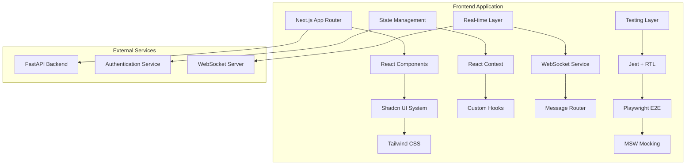
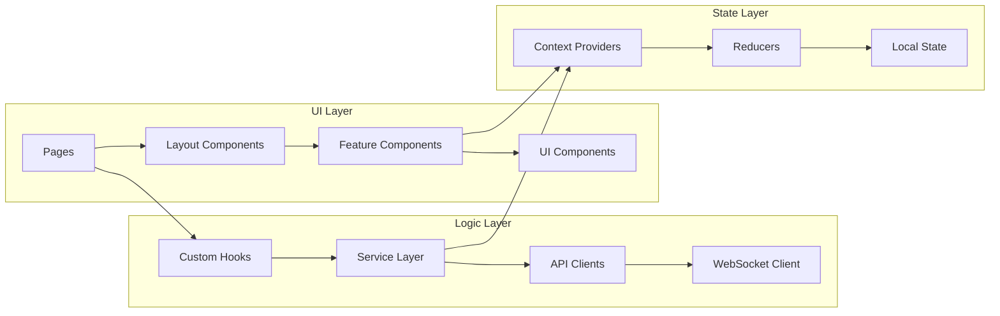
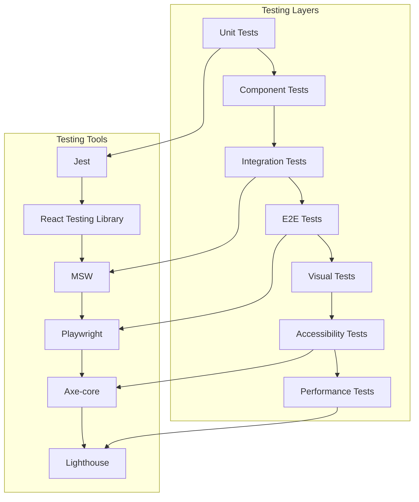

# Design Document - Frontend Error Resolution and Feature Implementation

## Overview

This design document outlines the comprehensive architecture and implementation approach for resolving frontend errors and implementing missing features in the Medical Device Regulatory Assistant application. The design follows a three-phase approach prioritizing foundational fixes, real-time features, and advanced optimizations.

**Current Status**: Task 9 (Enhanced Form Validation) has been implemented but requires critical test infrastructure fixes (Tasks 9.1-9.3) to resolve complete test suite regression before deployment.

The solution leverages modern React patterns, TypeScript best practices, and established design systems to create a robust, accessible, and performant user interface that serves regulatory affairs professionals in their FDA submission workflows.

**Critical Issue**: Enhanced form implementation caused all 43 ProjectForm tests to fail due to mock configuration mismatches, requiring immediate resolution before further development.

## Architecture

### High-Level Architecture



### Component Architecture



## Components and Interfaces

### Core Component System

#### 1. Testing Infrastructure Components

**MSW Integration Service**

```typescript
interface MSWService {
  setupHandlers(): void;
  resetHandlers(): void;
  restoreHandlers(): void;
  addHandler(handler: RestHandler): void;
}

interface TestSetupConfig {
  enableMSW: boolean;
  mockAuthentication: boolean;
  mockWebSocket: boolean;
  seedData?: any;
}
```

**Centralized Test Setup**

```typescript
interface TestEnvironment {
  setup(config: TestSetupConfig): Promise<void>;
  teardown(): Promise<void>;
  mockAPI(endpoints: APIEndpoint[]): void;
  mockWebSocket(events: WebSocketEvent[]): void;
}
```

#### 2. Component Export System

**Component Registry**

```typescript
interface ComponentRegistry {
  register<T>(name: string, component: React.ComponentType<T>): void;
  get<T>(name: string): React.ComponentType<T> | undefined;
  getAll(): Map<string, React.ComponentType<any>>;
}

interface UIComponentExports {
  Button: typeof Button;
  Select: typeof Select;
  Dialog: typeof Dialog;
  Toast: typeof Toast;
  // ... all UI components
}
```

#### 3. Enhanced Form System Architecture (IMPLEMENTED - Task 9)

**Enhanced Form Hook (COMPLETED)**

```typescript
// IMPLEMENTED: src/hooks/use-enhanced-form.ts
interface EnhancedFormOptions<T extends FieldValues> extends UseFormProps<T> {
  schema: z.ZodSchema<T>;
  autoSave?: {
    enabled: boolean;
    interval?: number;
    onSave: (data: T) => Promise<void> | void;
    storageKey?: string;
  };
  realTimeValidation?: {
    enabled: boolean;
    debounceMs?: number;
  };
  accessibility?: {
    announceErrors: boolean;
    focusFirstError: boolean;
  };
  formName?: string;
}

interface EnhancedFormReturn<T extends FieldValues> extends UseFormReturn<T> {
  // Real-time validation
  validateField: (
    fieldName: keyof T,
    value: any,
    immediate?: boolean
  ) => Promise<void>;
  getFieldValidation: (fieldName: keyof T) => ValidationState;

  // Auto-save functionality
  saveNow: () => Promise<void>;
  isSaving: boolean;
  lastSaved?: Date;

  // Enhanced submission
  submitWithFeedback: (onSubmit: (data: T) => Promise<void>) => Promise<void>;

  // Accessibility helpers
  focusFirstError: () => void;
  announceFormState: (message: string) => void;
}

// CRITICAL ISSUE: Test mocks don't match implementation
// Tasks 9.1-9.3 required to fix test suite regression
```

**Enhanced Form Field Components (IMPLEMENTED)**

```typescript
// IMPLEMENTED: src/components/forms/EnhancedFormField.tsx
interface EnhancedInputProps extends BaseFieldProps {
  validation?: ValidationState;
  showCharacterCount?: boolean;
  maxLength?: number;
  autoFocus?: boolean;
}

interface ValidationState {
  isValid?: boolean;
  isValidating?: boolean;
  hasBeenTouched?: boolean;
  message?: string;
}

// Components: EnhancedInput, EnhancedTextarea, AutoSaveIndicator
```

````

**Toast Integration System (IMPLEMENTED - CRITICAL ISSUE)**
```typescript
// IMPLEMENTED: src/hooks/use-toast.ts
// CRITICAL: Test mocks don't match actual implementation causing all tests to fail
interface UseToastReturn {
  toast: (props: ToastProps) => ToastReturn;
  contextualToast: {
    success: (title: string, description?: string) => ToastReturn;
    validationError: (message?: string) => ToastReturn;
    authExpired: (onAction?: () => void) => ToastReturn;
    networkError: (onRetry?: () => void) => ToastReturn;
    projectSaveFailed: (onRetry?: () => void) => ToastReturn;
    // ... other contextual methods
  };
  dismissAll: () => void;
  getToastsByCategory: (category: string) => Toast[];
}

// IMPLEMENTED: src/hooks/use-form-toast.ts
// ISSUE: Depends on useToast but test mocks are incorrect
interface UseFormToastReturn {
  showValidationError: (field: string, message: string, options?: FormToastOptions) => void;
  showSubmissionSuccess: (message: string, options?: FormToastOptions) => void;
  showSubmissionError: (error: Error, options?: FormToastOptions) => void;
  showSaveProgress: (progress: number, options?: FormToastOptions) => ProgressToast;
  showAutoSaveSuccess: (options?: FormToastOptions) => void;
  showNetworkError: (onRetry: () => void, options?: FormToastOptions) => void;
  showAuthError: (onSignIn: () => void, options?: FormToastOptions) => void;
  clearFormToasts: () => void;
}

// CRITICAL MOCK ISSUE (Task 9.1):
// Current mock structure doesn't match actual implementation
// Causing TypeError: (0 , _useToast.useToast) is not a function
````

````

#### 4. Real-time Communication System (Custom Hooks Pattern)

**WebSocket Custom Hook**
```typescript
// Primary hook for WebSocket functionality
interface UseWebSocketOptions {
  url: string;
  reconnect?: boolean;
  maxReconnectAttempts?: number;
  reconnectInterval?: number;
  heartbeatInterval?: number;
}

interface UseWebSocketReturn {
  connectionStatus: 'connecting' | 'connected' | 'disconnected' | 'error';
  send: <T>(message: WebSocketMessage<T>) => void;
  lastMessage: WebSocketMessage | null;
  error: Error | null;
  reconnect: () => void;
}

function useWebSocket(options: UseWebSocketOptions): UseWebSocketReturn;

// Specialized hook for real-time messaging
interface UseRealtimeMessagingReturn {
  messages: WebSocketMessage[];
  sendMessage: (type: string, data: any) => void;
  subscribe: (type: string, handler: MessageHandler) => () => void;
  connectionStatus: ConnectionStatus;
}

function useRealtimeMessaging(): UseRealtimeMessagingReturn;
````

**Streaming Response Custom Hook**

```typescript
// Hook for managing streaming AI responses
interface UseStreamingResponseOptions {
  streamId: string;
  onStreamStart?: () => void;
  onStreamEnd?: () => void;
  onError?: (error: Error) => void;
}

interface UseStreamingResponseReturn {
  content: string;
  isStreaming: boolean;
  error: Error | null;
  interrupt: () => void;
  restart: () => void;
}

function useStreamingResponse(
  options: UseStreamingResponseOptions
): UseStreamingResponseReturn;

// Hook for typing indicators
interface UseTypingIndicatorsReturn {
  typingUsers: TypingIndicator[];
  startTyping: () => void;
  stopTyping: () => void;
  isUserTyping: (userId: string) => boolean;
}

function useTypingIndicators(): UseTypingIndicatorsReturn;
```

#### 5. Accessibility System (Leveraging Radix UI Primitives)

**Focus Management Hook (Built on Radix UI)**

```typescript
// Leverage Radix UI's built-in accessibility features
interface UseFocusManagementOptions {
  trapFocus?: boolean;
  restoreFocus?: boolean;
  autoFocus?: boolean;
}

interface UseFocusManagementReturn {
  focusProps: React.HTMLAttributes<HTMLElement>;
  trapRef: React.RefObject<HTMLElement>;
  restoreFocus: () => void;
}

// Custom hook that wraps Radix UI accessibility patterns
function useFocusManagement(
  options: UseFocusManagementOptions
): UseFocusManagementReturn;

// Accessibility announcements hook
interface UseAccessibilityAnnouncementsReturn {
  announce: (message: string, priority?: "polite" | "assertive") => void;
  liveRegionProps: React.HTMLAttributes<HTMLElement>;
}

function useAccessibilityAnnouncements(): UseAccessibilityAnnouncementsReturn;
```

**Radix UI Component Enhancement**

```typescript
// Extend existing Radix UI components with additional accessibility
interface EnhancedDialogProps extends React.ComponentProps<typeof Dialog> {
  announceOnOpen?: string;
  announceOnClose?: string;
  customFocusTarget?: React.RefObject<HTMLElement>;
}

// Leverage Radix UI's built-in focus trapping and ARIA attributes
const EnhancedDialog: React.FC<EnhancedDialogProps>;
```

### Data Models

#### Form Data Models

```typescript
interface ProjectFormData {
  name: string;
  description: string;
  deviceType: DeviceType;
  intendedUse: string;
  regulatoryPathway: RegulatoryPathway;
  targetMarket: Market[];
}

interface ValidationResult {
  isValid: boolean;
  errors: ValidationError[];
  warnings: ValidationWarning[];
}

interface ValidationError {
  field: string;
  message: string;
  code: string;
}
```

#### Real-time Data Models

```typescript
interface TypingIndicator {
  userId: string;
  userName: string;
  timestamp: number;
  location?: string; // which field/area they're typing in
}

interface UserPresence {
  userId: string;
  userName: string;
  status: "online" | "away" | "offline";
  lastSeen: number;
  currentPage?: string;
}

interface AgentResponse {
  id: string;
  type: "stream_start" | "stream_chunk" | "stream_end" | "error";
  content?: string;
  metadata?: {
    confidence?: number;
    sources?: string[];
    reasoning?: string;
  };
}
```

#### Performance Data Models

```typescript
interface PerformanceMetrics {
  pageLoadTime: number;
  timeToInteractive: number;
  firstContentfulPaint: number;
  largestContentfulPaint: number;
  cumulativeLayoutShift: number;
  firstInputDelay: number;
}

interface VirtualScrollConfig {
  itemHeight: number;
  containerHeight: number;
  overscan: number;
  threshold: number;
}
```

## Error Handling

### Error Classification System

```typescript
enum ErrorType {
  VALIDATION = "validation",
  AUTHENTICATION = "authentication",
  AUTHORIZATION = "authorization",
  NETWORK = "network",
  SERVER = "server",
  CLIENT = "client",
  WEBSOCKET = "websocket",
  PERFORMANCE = "performance",
}

interface ErrorContext {
  type: ErrorType;
  code: string;
  message: string;
  details?: any;
  timestamp: number;
  userId?: string;
  sessionId?: string;
  userAgent?: string;
}
```

### Error Handling Strategies

#### 1. Form Error Handling

```typescript
class FormErrorHandler {
  handleValidationError(error: ValidationError): void {
    // Show field-specific error messages
    // Focus on first error field
    // Update form state
  }

  handleSubmissionError(error: SubmissionError): void {
    // Show appropriate toast notification
    // Retry logic for network errors
    // Auth redirect for auth errors
  }

  handleNetworkError(error: NetworkError): void {
    // Show network error toast with retry
    // Implement exponential backoff
    // Cache form data for recovery
  }
}
```

#### 2. WebSocket Error Handling

```typescript
class WebSocketErrorHandler {
  handleConnectionError(error: ConnectionError): void {
    // Attempt reconnection with backoff
    // Show connection status indicator
    // Queue messages for retry
  }

  handleMessageError(error: MessageError): void {
    // Log error for debugging
    // Show user-friendly error message
    // Attempt message recovery
  }
}
```

#### 3. Component Error Boundaries

```typescript
interface ErrorBoundaryState {
  hasError: boolean;
  error?: Error;
  errorInfo?: ErrorInfo;
}

class ComponentErrorBoundary extends React.Component<
  Props,
  ErrorBoundaryState
> {
  static getDerivedStateFromError(error: Error): ErrorBoundaryState {
    return { hasError: true, error };
  }

  componentDidCatch(error: Error, errorInfo: ErrorInfo) {
    // Log error to monitoring service
    // Show fallback UI
    // Provide recovery options
  }
}
```

## Testing Strategy

### Testing Architecture



### Test Implementation Strategy

#### 1. CRITICAL: Enhanced Form Test Suite Issues (Tasks 9.1-9.3)

**Current Status**: Complete test suite regression - 43/43 tests failing

```typescript
// ISSUE: Mock configuration doesn't match actual implementation
// Current (INCORRECT) Mock:
jest.mock("@/hooks/use-toast", () => ({
  contextualToast: {
    success: jest.fn(),
    validationError: jest.fn(),
  },
}));

// Required (CORRECT) Mock for Task 9.1:
jest.mock("@/hooks/use-toast", () => ({
  useToast: jest.fn(() => ({
    toast: jest.fn(),
    getToastsByCategory: jest.fn(),
    contextualToast: {
      success: jest.fn(),
      validationError: jest.fn(),
      authExpired: jest.fn(),
      networkError: jest.fn(),
      projectSaveFailed: jest.fn(),
    },
  })),
  contextualToast: {
    success: jest.fn(),
    validationError: jest.fn(),
    authExpired: jest.fn(),
    networkError: jest.fn(),
    projectSaveFailed: jest.fn(),
  },
}));

// Additional mocks needed:
// - localStorage mock for auto-save tests
// - Timer mocks for debounced validation
// - Enhanced hook dependency mocks
```

#### 2. MSW Integration Testing

```typescript
interface MSWTestSetup {
  setupServer(): SetupServerApi;
  createHandlers(endpoints: APIEndpoint[]): RestHandler[];
  mockWebSocket(events: WebSocketEvent[]): void;
  resetMocks(): void;
}

// Centralized test setup
export const testSetup = {
  beforeAll: () => {
    server.listen({ onUnhandledRequest: "error" });
  },
  afterEach: () => {
    server.resetHandlers();
  },
  afterAll: () => {
    server.close();
  },
};
```

#### 2. Component Testing Strategy

```typescript
interface ComponentTestUtils {
  renderWithProviders<T>(
    component: React.ComponentType<T>,
    options?: RenderOptions
  ): RenderResult;

  mockToastService(): MockToastService;
  mockWebSocketService(): MockWebSocketService;
  mockFormValidation(): MockValidationService;
}

// Example test structure
describe("ProjectForm", () => {
  it("should display success toast on successful submission", async () => {
    const mockToast = mockToastService();
    const { user } = renderWithProviders(<ProjectForm />);

    await user.type(screen.getByLabelText("Project Name"), "Test Project");
    await user.click(screen.getByRole("button", { name: "Create Project" }));

    expect(mockToast.success).toHaveBeenCalledWith(
      "Project Created",
      'Project "Test Project" created successfully'
    );
  });
});
```

#### 3. Real-time Feature Testing

```typescript
interface WebSocketTestUtils {
  mockWebSocketConnection(): MockWebSocket;
  simulateMessage<T>(message: WebSocketMessage<T>): void;
  simulateDisconnection(): void;
  simulateReconnection(): void;
}

// Example WebSocket test
describe("Real-time Features", () => {
  it("should display typing indicators for multiple users", async () => {
    const mockWS = mockWebSocketConnection();
    renderWithProviders(<CollaborativeEditor />);

    mockWS.simulateMessage({
      type: "user_typing_start",
      data: { userId: "user1", userName: "John Doe" },
    });

    expect(screen.getByText("John Doe is typing...")).toBeInTheDocument();
  });
});
```

### Performance Testing Strategy

#### 1. Performance Testing (Data-Driven Approach)

```typescript
// First, measure existing performance to identify bottlenecks
interface PerformanceProfiler {
  measureComponentRender(component: React.ComponentType): RenderMetrics;
  identifySlowComponents(): ComponentPerformanceReport[];
  measureScrollPerformance(container: HTMLElement): ScrollMetrics;
  generatePerformanceReport(): PerformanceReport;
}

// Performance testing with baseline measurements
describe("Performance Optimization", () => {
  it("should identify performance bottlenecks before optimization", async () => {
    const profiler = new PerformanceProfiler();
    const baseline = await profiler.measureComponentRender(ProjectList);

    // Only implement virtual scrolling if render time exceeds threshold
    if (baseline.renderTime > 100) {
      // 100ms threshold
      const optimizedComponent = withVirtualScrolling(ProjectList);
      const optimized = await profiler.measureComponentRender(
        optimizedComponent
      );

      expect(optimized.renderTime).toBeLessThan(baseline.renderTime * 0.5);
    }
  });

  it("should use React.memo for simple performance gains first", async () => {
    const MemoizedComponent = React.memo(ExpensiveComponent);
    const renderCount = measureRerenders(MemoizedComponent);

    // Verify memo prevents unnecessary re-renders
    expect(renderCount.unnecessaryRenders).toBe(0);
  });
});
```

#### 2. Bundle Size Testing

```typescript
interface BundleSizeConfig {
  maxSize: number;
  chunks: string[];
  compressionType: "gzip" | "brotli";
}

describe("Bundle Size", () => {
  it("should maintain optimal bundle sizes", async () => {
    const bundleStats = await analyzeBundleSize();

    expect(bundleStats.mainBundle.gzipSize).toBeLessThan(250 * 1024); // 250KB
    expect(bundleStats.vendorBundle.gzipSize).toBeLessThan(500 * 1024); // 500KB
  });
});
```

## Implementation Phases

### Phase 1: Foundation (Weeks 1-2)

#### Testing Infrastructure Stabilization

1. **MSW Integration Consolidation** ✅ COMPLETED (Task 1)

   - Create unified `src/lib/testing/test-setup.ts`
   - Consolidate MSW utilities into single module
   - Update Jest configuration for proper module handling
   - Implement centralized mock data management

2. **Component Export System** ✅ COMPLETED (Task 2)

   - Audit all component exports in `src/components/ui/`
   - Create comprehensive index files
   - Add TypeScript type definitions
   - Implement component registry system

3. **Form System Enhancement** ✅ COMPLETED (Task 9) - ❌ CRITICAL ISSUE

   - ✅ Integrate toast notifications with form submissions
   - ✅ Implement comprehensive error handling
   - ✅ Add real-time validation feedback
   - ✅ Create auto-save functionality
   - ❌ **CRITICAL**: All tests failing due to mock issues (Tasks 9.1-9.3 required)

4. **Accessibility Foundation (Leveraging Radix UI)** ✅ COMPLETED (Task 4)
   - Audit existing Radix UI component usage for built-in accessibility
   - Create custom hooks that extend Radix UI accessibility patterns
   - Implement `useFocusManagement` and `useAccessibilityAnnouncements` hooks
   - Establish accessibility testing with existing Radix UI features

#### IMMEDIATE PRIORITY: Enhanced Form Test Suite Recovery (Tasks 9.1-9.3)

**Task 9.1**: Fix Enhanced Form Test Suite Mock Configuration Issues

- Fix useToast hook mock to match actual implementation structure
- Update test mocks for useEnhancedForm and useFormToast dependencies
- Add localStorage mocking for auto-save functionality tests
- Add timer mocking for debounced validation tests
- Restore all 43 failing ProjectForm tests to passing state

**Task 9.2**: Validate Enhanced Form Features Through Working Tests

- Run and validate all enhanced form validation tests (5 tests)
- Run and validate all auto-save functionality tests (4 tests)
- Run and validate all enhanced accessibility tests (6 tests)
- Verify all existing ProjectForm tests pass (43 tests)

**Task 9.3**: Create Enhanced Form Integration Tests and Documentation

- Create comprehensive integration tests for enhanced form workflow
- Add end-to-end tests for real-time validation, auto-save, and accessibility features
- Document enhanced form API and usage patterns

### Phase 2: Real-time Features (Weeks 2-3) - ⏸️ BLOCKED

**Status**: BLOCKED until Tasks 9.1-9.3 are completed to restore test suite

#### WebSocket Communication System (Custom Hooks Pattern) ✅ COMPLETED (Tasks 5-7)

1. **Core WebSocket Hook Implementation** ✅ COMPLETED (Task 5)

   - Create `useWebSocket` hook in `src/hooks/useWebSocket.ts`
   - Implement `useRealtimeMessaging` for message handling
   - Add connection status management within hooks
   - Create error handling and recovery logic

2. **Specialized Real-time Hooks** ✅ COMPLETED (Tasks 6-7)

   - Build `useStreamingResponse` hook for AI agent responses
   - Implement `useTypingIndicators` for collaborative features
   - Add `useUserPresence` for user status tracking
   - Create `useCollaboration` for conflict resolution

3. **Component Integration Pattern** ✅ COMPLETED

   ```typescript
   // Components consume real-time features through hooks
   const CollaborativeEditor = () => {
     const { messages, sendMessage } = useRealtimeMessaging();
     const { typingUsers } = useTypingIndicators();
     const { connectionStatus } = useWebSocket({ url: WS_URL });

     // Component logic uses hook data without managing connection
   };
   ```

4. **Enhanced User Feedback** ✅ COMPLETED (Task 8)
   - Complete toast notification system
   - Add contextual error messages
   - Implement loading state management
   - Create accessibility announcements

**CRITICAL DEPENDENCY**: Phase 2 features cannot be safely tested or deployed until the enhanced form test suite is restored (Tasks 9.1-9.3).

### Phase 3: Advanced Features (Weeks 3-4)

#### Performance Optimization (Data-Driven Approach)

1. **Performance Measurement and Analysis**

   - Use React DevTools Profiler to identify slow components
   - Run `pnpm lighthouse` to establish performance baselines
   - Implement performance monitoring hooks
   - Create performance regression detection

2. **Simple Optimizations First**

   - Apply `React.memo` to prevent unnecessary re-renders
   - Optimize component prop drilling with context
   - Implement efficient state management patterns
   - Use `useMemo` and `useCallback` strategically

3. **Advanced Optimizations (Only When Needed)**

   - Implement virtual scrolling for lists with >1000 items
   - Add component lazy loading for route-level code splitting
   - Create intelligent caching strategies based on usage patterns
   - Optimize bundle splitting based on actual usage data

4. **Performance Monitoring Custom Hooks**

   ```typescript
   // Hook to measure and report component performance
   function usePerformanceMonitor(componentName: string): PerformanceMetrics;

   // Hook to detect performance regressions
   function usePerformanceRegression(): RegressionDetector;
   ```

#### Advanced User Experience

1. **Mobile Responsiveness**

   - Optimize layouts for mobile devices
   - Implement touch-friendly interactions
   - Add mobile-specific navigation
   - Create progressive web app features

2. **Advanced Search System**

   - Build comprehensive search UI
   - Implement filter combinations
   - Add search history and suggestions
   - Create saved search functionality

3. **Accessibility Compliance**
   - Complete WCAG 2.1 AA implementation
   - Add high contrast mode support
   - Implement screen reader optimization
   - Create accessibility testing automation

## Monitoring and Maintenance

### Performance Monitoring

```typescript
interface PerformanceMonitor {
  trackPageLoad(page: string, metrics: PerformanceMetrics): void;
  trackUserInteraction(interaction: string, duration: number): void;
  trackError(error: ErrorContext): void;
  generateReport(): PerformanceReport;
}
```

### Error Tracking

```typescript
interface ErrorTracker {
  captureError(error: Error, context: ErrorContext): void;
  captureMessage(message: string, level: "info" | "warning" | "error"): void;
  setUserContext(user: UserContext): void;
  addBreadcrumb(breadcrumb: Breadcrumb): void;
}
```

### Quality Assurance

```typescript
interface QualityMetrics {
  testCoverage: number;
  performanceScore: number;
  accessibilityScore: number;
  bundleSize: number;
  errorRate: number;
}
```

## Current Status and Critical Path

### Implementation Status Summary

**✅ COMPLETED TASKS (1-9)**:

- Tasks 1-8: All foundational and real-time features implemented
- Task 9: Enhanced form validation system implemented with comprehensive features

**❌ CRITICAL BLOCKER**:

- Enhanced form implementation (Task 9) caused complete test suite regression
- All 43 ProjectForm tests failing due to mock configuration mismatches
- Cannot safely deploy or continue development without working test coverage

**🚨 IMMEDIATE PRIORITY (Tasks 9.1-9.3)**:

1. **Task 9.1**: Fix test mocks to match actual hook implementations
2. **Task 9.2**: Validate all enhanced form features through working tests
3. **Task 9.3**: Create integration tests and documentation

### Critical Path Forward

1. **STOP ALL NEW DEVELOPMENT** until test suite is restored
2. **Complete Tasks 9.1-9.3** to fix test infrastructure
3. **Validate all existing functionality** works correctly
4. **Resume Phase 3 development** only after test coverage is restored

### Risk Assessment

**HIGH RISK**: Deploying without working test coverage could introduce regressions
**MEDIUM RISK**: Development velocity blocked until test issues resolved
**LOW RISK**: Enhanced form features are production-ready once tests pass

This comprehensive design provides a solid foundation for implementing all the requirements while maintaining code quality, performance, and accessibility standards. However, the critical test infrastructure issues must be resolved before any deployment or further development can proceed safely.
