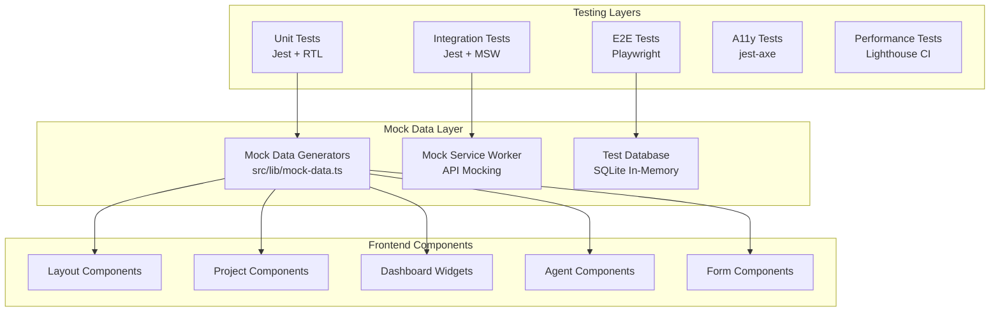
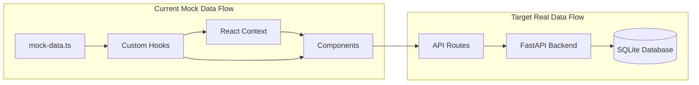
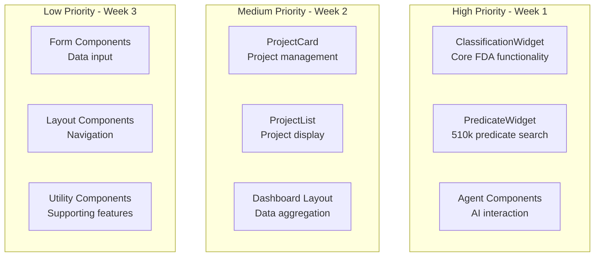

# Design Document

## Overview

This design document outlines the comprehensive frontend testing strategy for the Medical Device Regulatory Assistant. The design focuses on creating a systematic approach to test all frontend components with mock data, identify mock data usage patterns, and establish a migration path to real backend integration.

## Parameters
- `SPECS_FOLDER` = `./.kiro/specs/frontend-testing-comprehensive/task-execute-history/` 


## Development Rules
- Use **`pnpm`** instead of npm for JavaScript/TypeScript.
- Use **`poetry`** for Python commands (e.g. `poetry run python test_document_tool.py`).
- Create the test script and run it instead of run it directly with `poetry run python -c`
- Follow **Test-Driven Development (TDD)**.
- Always clear the terminal before running a new command. Type the clear command first, press Enter, then type the actual command and press Enter again.

  Example 1(Windows):

  ```
    cls
    <command>
  ```

  Example 2 (Mac and Linux)

  ```
  clear
  <command>
  ```

- After reading this file, say: **"I will use poetry and pnpm"**.

--

### Workflow
1. Create a code-writing plan for the task.
2. Define the testing criteria.
3. Fetch related documentation (context7) if needed.
4. Implement the task/code.
5. Run tests after completing the task. If tests fail, fetch additional documentation (context7).
6. Write a **task report** in `SPECS_FOLDER` (e.g. `task-1.md`).
   - Be transparent about test results, especially if some tests require future verification.

--

### Test-Driven Development (TDD)
- **Pre-Development**: Clearly define expected test outcomes before coding.
- **Post-Development**: Document all test results in the `SPECS_FOLDER` folder to ensure traceability.
--

### Task Report Format

Each completed task requires a report:

**Task Report**
- **Task**: \[Task ID and Title]
- **Summary of Changes**
  - \[Brief description of change #1]
  - \[Brief description of change #2]
- **Test Plan & Results**
  - **Unit Tests**: \[Description]
    - Result: \[✔ All tests passed / ✘ Failures]
  - **Integration Tests**: \[Description]
    - Result: \[✔ Passed / ✘ Failures]
  - **Manual Verification**: \[Steps & findings]
    - Result: \[✔ Works as expected]
- **Code Snippets (Optional)**: Show relevant diffs or highlights.

---

## Architecture

### Testing Architecture Overview



### Mock Data Flow Analysis



## Mock Data Usage Analysis

### Current Mock Data Components Identified

Based on the codebase analysis, here are the components currently using mock data:

#### Dashboard Components
```typescript
// ClassificationWidget - Uses mock classification data
interface ClassificationWidgetMockUsage {
  mockDataSource: 'generateMockDeviceClassification';
  dataFields: ['deviceClass', 'productCode', 'regulatoryPathway', 'confidence'];
  migrationPriority: 'high'; // Critical for user workflow
  dependencies: ['@/types/dashboard', 'mock-data.ts'];
}

// PredicateWidget - Uses mock predicate device data
interface PredicateWidgetMockUsage {
  mockDataSource: 'generateMockPredicateDevices';
  dataFields: ['kNumber', 'deviceName', 'intendedUse', 'confidenceScore'];
  migrationPriority: 'high'; // Core functionality
  dependencies: ['@/types/dashboard', 'mock-data.ts'];
}
```

#### Project Components
```typescript
// ProjectCard - Uses mock project data
interface ProjectCardMockUsage {
  mockDataSource: 'generateMockProject' // (needs to be created);
  dataFields: ['name', 'description', 'status', 'created_at', 'updated_at'];
  migrationPriority: 'medium'; // Important but less complex
  dependencies: ['@/types/project'];
}
```

### Mock Data Migration Priority Matrix



## Components and Interfaces

### 1. Mock Data Audit System

#### MockDataAuditor Interface
```typescript
interface MockDataAuditor {
  scanComponents(): ComponentMockUsage[];
  generateMigrationPlan(): MigrationPlan;
  validateMockDataIntegrity(): ValidationResult[];
}

interface ComponentMockUsage {
  componentPath: string;
  mockDataUsed: string[];
  migrationPriority: 'high' | 'medium' | 'low';
  dependencies: string[];
  testCoverage: number;
}

interface MigrationPlan {
  phases: MigrationPhase[];
  estimatedEffort: number;
  riskAssessment: RiskLevel;
}
```

#### Implementation Strategy
- Static analysis of component files to identify mock data imports
- Runtime analysis to track mock data usage patterns
- Dependency graph analysis to determine migration order
- Test coverage analysis to ensure safe migration

### 2. Enhanced Mock Data Generators

#### Extended Mock Data Structure
```typescript
// Enhanced mock data generators with database compatibility
interface EnhancedMockData {
  // Existing generators
  generateMockProject(overrides?: Partial<Project>): Project;
  generateMockClassification(overrides?: Partial<DeviceClassification>): DeviceClassification;
  generateMockPredicateDevice(overrides?: Partial<PredicateDevice>): PredicateDevice;
  
  // New generators for comprehensive testing
  generateMockUser(overrides?: Partial<User>): User;
  generateMockSession(overrides?: Partial<Session>): Session;
  generateMockAuditLog(overrides?: Partial<AuditLog>): AuditLog;
  generateMockAgentInteraction(overrides?: Partial<AgentInteraction>): AgentInteraction;
  
  // Database seed generators
  generateDatabaseSeed(): DatabaseSeed;
  generateTestScenario(scenario: TestScenario): MockDataSet;
}

interface DatabaseSeed {
  users: User[];
  projects: Project[];
  classifications: DeviceClassification[];
  predicateDevices: PredicateDevice[];
  auditLogs: AuditLog[];
}
```

### 3. Test Infrastructure Components

#### Test Utilities
```typescript
interface TestUtils {
  // Component testing utilities
  renderWithProviders(component: ReactElement, options?: RenderOptions): RenderResult;
  createMockRouter(initialRoute?: string): MockRouter;
  createMockSession(user?: Partial<User>): Session;
  
  // Mock service utilities
  setupMockAPI(endpoints: MockEndpoint[]): void;
  teardownMockAPI(): void;
  
  // Database testing utilities
  setupTestDatabase(): Promise<TestDatabase>;
  seedTestDatabase(data: DatabaseSeed): Promise<void>;
  cleanupTestDatabase(): Promise<void>;
}

interface MockEndpoint {
  method: 'GET' | 'POST' | 'PUT' | 'DELETE';
  path: string;
  response: any;
  delay?: number;
  error?: boolean;
}
```

#### Test Data Management
```typescript
interface TestDataManager {
  // Scenario-based test data
  getScenarioData(scenario: TestScenario): MockDataSet;
  createCustomScenario(config: ScenarioConfig): TestScenario;
  
  // State management for tests
  saveTestState(state: TestState): void;
  restoreTestState(stateId: string): TestState;
  
  // Data validation
  validateTestData(data: any, schema: Schema): ValidationResult;
}

enum TestScenario {
  NEW_USER_ONBOARDING = 'new_user_onboarding',
  EXISTING_PROJECT_WORKFLOW = 'existing_project_workflow',
  CLASSIFICATION_COMPLETE = 'classification_complete',
  PREDICATE_SEARCH_RESULTS = 'predicate_search_results',
  AGENT_CONVERSATION = 'agent_conversation',
  ERROR_SCENARIOS = 'error_scenarios'
}
```

### 4. Component Testing Framework

#### Component Test Structure
```typescript
interface ComponentTestSuite {
  // Standard test categories
  renderingTests: TestCase[];
  interactionTests: TestCase[];
  stateManagementTests: TestCase[];
  errorHandlingTests: TestCase[];
  accessibilityTests: TestCase[];
  
  // Mock data integration tests
  mockDataTests: TestCase[];
  dataFlowTests: TestCase[];
  
  // Performance tests
  performanceTests: TestCase[];
}

interface TestCase {
  name: string;
  description: string;
  setup: () => void;
  execute: () => Promise<void>;
  assertions: Assertion[];
  cleanup: () => void;
}
```

### 5. Migration Strategy Framework

#### Migration Phases
```typescript
interface MigrationStrategy {
  phases: MigrationPhase[];
  rollbackPlan: RollbackPlan;
  validationCriteria: ValidationCriteria[];
}

interface MigrationPhase {
  name: string;
  components: string[];
  dependencies: string[];
  estimatedDuration: number;
  riskLevel: RiskLevel;
  rollbackStrategy: RollbackStrategy;
  
  // Migration steps
  preMigrationTests: TestSuite[];
  migrationSteps: MigrationStep[];
  postMigrationTests: TestSuite[];
  validationSteps: ValidationStep[];
}

interface MigrationStep {
  description: string;
  action: MigrationAction;
  parameters: Record<string, any>;
  rollbackAction: MigrationAction;
}

enum MigrationAction {
  REPLACE_MOCK_HOOK = 'replace_mock_hook',
  UPDATE_COMPONENT_PROPS = 'update_component_props',
  MODIFY_API_CALLS = 'modify_api_calls',
  UPDATE_TESTS = 'update_tests',
  SEED_DATABASE = 'seed_database'
}
```

## Detailed Component Testing Specifications

### 1. ClassificationWidget Testing Strategy

#### Test Scenarios
```typescript
interface ClassificationWidgetTestScenarios {
  // Initial state testing
  pendingState: {
    mockData: null;
    expectedUI: 'Start Classification Analysis button';
    userInteractions: ['click start button'];
  };
  
  // Loading state testing
  loadingState: {
    mockData: { loading: true };
    expectedUI: 'Analyzing... with spinner and progress bar';
    duration: '2-5 seconds simulation';
  };
  
  // Success state testing
  completedState: {
    mockData: generateMockDeviceClassification();
    expectedUI: 'Device class, product code, confidence score display';
    userInteractions: ['click external links', 'click refresh'];
  };
  
  // Error state testing
  errorState: {
    mockData: { error: 'Classification failed' };
    expectedUI: 'Error message with retry button';
    userInteractions: ['click retry', 'click start classification'];
  };
}
```

#### Mock Data Integration Points
```typescript
interface ClassificationWidgetMockIntegration {
  // Current mock data usage
  currentImplementation: {
    dataSource: 'generateMockDeviceClassification()';
    updateMechanism: 'props-based';
    stateManagement: 'component-local';
  };
  
  // Target real data integration
  targetImplementation: {
    dataSource: 'useClassification() hook -> API call';
    updateMechanism: 'real-time updates via WebSocket';
    stateManagement: 'React Context + SWR cache';
  };
  
  // Migration strategy
  migrationSteps: [
    'Create useClassification hook with mock data',
    'Replace direct mock data usage with hook',
    'Update hook to call real API',
    'Add real-time updates',
    'Remove mock data generators'
  ];
}
```

### 2. PredicateWidget Testing Strategy

#### Complex State Management Testing
```typescript
interface PredicateWidgetStateTests {
  // Tab state management
  tabNavigation: {
    tabs: ['overview', 'top-matches', 'selected'];
    statePreservation: 'maintain selection across tab switches';
    mockData: generateMockPredicateDevices(10);
  };
  
  // Predicate selection logic
  selectionLogic: {
    multiSelect: 'allow multiple predicate selection';
    selectionPersistence: 'maintain selection across re-renders';
    maxSelections: 'no limit but warn if > 5';
  };
  
  // Confidence score calculations
  confidenceCalculations: {
    averageConfidence: 'calculate from all predicates';
    topMatches: 'sort by confidence score descending';
    confidenceThresholds: 'color coding based on score ranges';
  };
}
```

### 3. Agent Component Testing Strategy

#### Conversation Flow Testing
```typescript
interface AgentComponentTestStrategy {
  // Chat interface testing
  chatInterface: {
    messageRendering: 'test markdown, citations, code blocks';
    typingIndicators: 'show/hide based on agent status';
    messageHistory: 'persist across page refreshes';
    mockData: generateMockAgentInteraction();
  };
  
  // Citation panel integration
  citationPanel: {
    sourceDisplay: 'show FDA sources with links';
    panelToggle: 'expand/collapse functionality';
    linkValidation: 'verify external links open correctly';
    mockData: generateMockSourceCitation();
  };
  
  // Quick actions testing
  quickActions: {
    slashCommands: 'test /predicate-search, /classify-device';
    buttonTriggers: 'test toolbar button actions';
    contextAwareness: 'actions based on current project';
  };
}
```

## Data Models

### Test Configuration Models

```typescript
interface TestConfiguration {
  // Environment settings
  testEnvironment: 'development' | 'testing' | 'ci';
  databaseUrl: string;
  mockApiBaseUrl: string;
  
  // Test execution settings
  parallel: boolean;
  maxWorkers: number;
  timeout: number;
  retries: number;
  
  // Coverage requirements
  coverageThreshold: CoverageThreshold;
  
  // Mock data settings
  mockDataSeed: number;
  mockApiDelay: number;
  enableRealTimeFeatures: boolean;
}

interface CoverageThreshold {
  statements: number;
  branches: number;
  functions: number;
  lines: number;
}
```

### Component Analysis Models

```typescript
interface ComponentAnalysis {
  componentPath: string;
  componentName: string;
  
  // Mock data usage
  mockDataImports: MockDataImport[];
  mockDataUsage: MockDataUsage[];
  
  // Dependencies
  dependencies: ComponentDependency[];
  hooks: HookUsage[];
  contextUsage: ContextUsage[];
  
  // Test coverage
  testFiles: string[];
  coverageMetrics: CoverageMetrics;
  
  // Migration readiness
  migrationReadiness: MigrationReadiness;
}

interface MockDataImport {
  importPath: string;
  importedFunctions: string[];
  usageCount: number;
}

interface MockDataUsage {
  functionName: string;
  usageContext: 'direct' | 'hook' | 'context';
  frequency: number;
}
```

## Database Integration Design

### Test Database Schema

```sql
-- Test database schema matching production
CREATE TABLE test_projects (
    id INTEGER PRIMARY KEY AUTOINCREMENT,
    name TEXT NOT NULL,
    description TEXT,
    device_type TEXT,
    intended_use TEXT,
    status TEXT DEFAULT 'draft',
    created_at TIMESTAMP DEFAULT CURRENT_TIMESTAMP,
    updated_at TIMESTAMP DEFAULT CURRENT_TIMESTAMP
);

CREATE TABLE test_device_classifications (
    id INTEGER PRIMARY KEY AUTOINCREMENT,
    project_id INTEGER REFERENCES test_projects(id),
    device_class TEXT NOT NULL,
    product_code TEXT,
    regulatory_pathway TEXT,
    confidence REAL,
    reasoning TEXT,
    cfr_sections JSON,
    sources JSON,
    status TEXT DEFAULT 'pending',
    created_at TIMESTAMP DEFAULT CURRENT_TIMESTAMP
);

CREATE TABLE test_predicate_devices (
    id INTEGER PRIMARY KEY AUTOINCREMENT,
    project_id INTEGER REFERENCES test_projects(id),
    k_number TEXT NOT NULL,
    device_name TEXT,
    intended_use TEXT,
    product_code TEXT,
    clearance_date DATE,
    confidence_score REAL,
    comparison_data JSON,
    is_selected BOOLEAN DEFAULT FALSE,
    sources JSON,
    status TEXT DEFAULT 'pending',
    created_at TIMESTAMP DEFAULT CURRENT_TIMESTAMP
);
```

### Database Seeding Strategy

```typescript
interface DatabaseSeedingStrategy {
  // Seed data generation from mock data
  generateSeedData(): DatabaseSeed {
    return {
      projects: [
        generateMockProject({ name: 'CardioProbe X' }),
        generateMockProject({ name: 'NeuroStim Device' }),
        generateMockProject({ name: 'BloodGlucose Monitor' })
      ],
      classifications: [
        generateMockDeviceClassification({ projectId: 1, status: 'completed' }),
        generateMockDeviceClassification({ projectId: 2, status: 'in-progress' }),
        generateMockDeviceClassification({ projectId: 3, status: 'pending' })
      ],
      predicateDevices: generateMockPredicateDevices(15)
    };
  }
  
  // Test scenario specific seeding
  seedScenario(scenario: TestScenario): void {
    switch (scenario) {
      case TestScenario.NEW_USER_ONBOARDING:
        // Seed empty database for new user experience
        break;
      case TestScenario.EXISTING_PROJECT_WORKFLOW:
        // Seed with established projects and data
        break;
      case TestScenario.CLASSIFICATION_COMPLETE:
        // Seed with completed classification data
        break;
    }
  }
}
```

## Error Handling

### Test Error Management

```typescript
interface TestErrorHandler {
  // Error categorization
  categorizeError(error: Error): ErrorCategory;
  
  // Error recovery
  attemptRecovery(error: TestError): RecoveryResult;
  
  // Error reporting
  reportError(error: TestError, context: TestContext): void;
  
  // Error analysis
  analyzeErrorPatterns(errors: TestError[]): ErrorAnalysis;
}

enum ErrorCategory {
  MOCK_DATA_ERROR = 'mock_data_error',
  COMPONENT_RENDER_ERROR = 'component_render_error',
  API_MOCK_ERROR = 'api_mock_error',
  DATABASE_ERROR = 'database_error',
  ASSERTION_ERROR = 'assertion_error',
  TIMEOUT_ERROR = 'timeout_error'
}

interface TestError extends Error {
  category: ErrorCategory;
  testCase: string;
  component?: string;
  mockData?: string;
  context: TestContext;
  recoverable: boolean;
}
```

### Migration Error Handling

```typescript
interface MigrationErrorHandler {
  // Pre-migration validation
  validateMigrationReadiness(component: string): ValidationResult;
  
  // Migration error handling
  handleMigrationError(error: MigrationError): MigrationErrorResult;
  
  // Rollback management
  executeRollback(phase: MigrationPhase): RollbackResult;
  
  // Data integrity checks
  validateDataIntegrity(): IntegrityCheckResult;
}

interface MigrationError extends Error {
  phase: string;
  component: string;
  migrationStep: MigrationStep;
  rollbackRequired: boolean;
  dataCorruption: boolean;
}
```

## Testing Strategy

### 1. Unit Testing Strategy

#### Component Testing Approach
- **Isolation**: Test each component in isolation with mock dependencies
- **Props Testing**: Verify component behavior with different prop combinations
- **State Testing**: Test internal state management and updates
- **Event Testing**: Verify event handlers and user interactions
- **Error Boundary Testing**: Test error handling and recovery

#### Mock Data Integration
- Use centralized mock data generators for consistency
- Test components with various data scenarios (empty, loading, error, success)
- Verify component behavior with edge cases and boundary conditions
- Test data transformation and formatting logic

### 2. Integration Testing Strategy

#### API Integration Testing
- Mock all external API calls using MSW (Mock Service Worker)
- Test complete data flow from user interaction to API response
- Verify error handling for network failures and API errors
- Test optimistic updates and data synchronization

#### State Management Testing
- Test React Context providers and consumers
- Verify state updates propagate correctly through component tree
- Test state persistence and restoration
- Verify concurrent state updates don't cause conflicts

### 3. End-to-End Testing Strategy

#### User Journey Testing
- Test complete user workflows from login to task completion
- Verify navigation and routing work correctly
- Test form submissions and data persistence
- Verify real-time features and WebSocket connections

#### Cross-Browser Testing
- Test on Chrome, Firefox, Safari, and Edge
- Verify responsive design on different screen sizes
- Test touch interactions on mobile devices
- Verify accessibility features across browsers

### 4. Performance Testing Strategy

#### Component Performance
- Measure component render times and re-render frequency
- Test with large datasets to identify performance bottlenecks
- Verify lazy loading and code splitting work correctly
- Monitor memory usage and detect memory leaks

#### Application Performance
- Measure Core Web Vitals (LCP, FID, CLS)
- Test page load times and time to interactive
- Verify bundle size optimization
- Test performance under different network conditions

## Implementation Plan

### Phase 1: Mock Data Audit and Enhancement (Week 1-2)

1. **Component Analysis**
   - Scan all components for mock data usage
   - Create dependency graph of mock data flow
   - Identify components ready for migration

2. **Mock Data Enhancement**
   - Extend existing mock data generators
   - Add database-compatible mock data structures
   - Create scenario-based test data sets

3. **Test Infrastructure Setup**
   - Configure enhanced Jest setup with MSW
   - Set up test database with seeding capabilities
   - Create test utilities and helpers

### Phase 2: Comprehensive Component Testing (Week 3-4)

1. **Unit Test Implementation**
   - Test all layout components with mock data
   - Test project management components
   - Test dashboard widgets with various data states
   - Test agent interaction components

2. **Integration Test Implementation**
   - Test complete user workflows with mock APIs
   - Test state management and data flow
   - Test error handling and recovery scenarios

3. **Accessibility and Performance Testing**
   - Implement automated accessibility tests
   - Set up performance monitoring and testing
   - Create responsive design test suite

### Phase 3: E2E Testing and Migration Planning (Week 5-6)

1. **Playwright E2E Tests**
   - Implement critical user journey tests
   - Test cross-browser compatibility
   - Set up visual regression testing

2. **Migration Strategy Development**
   - Create detailed migration plan for each component
   - Develop rollback strategies and validation criteria
   - Create migration automation tools

3. **Database Integration Preparation**
   - Set up test database infrastructure
   - Create database seeding scripts from mock data
   - Implement database testing utilities

### Phase 4: Backend Integration and Migration (Week 7-8)

1. **Gradual Component Migration**
   - Start with low-risk components (display-only)
   - Migrate data fetching hooks to real APIs
   - Update tests to work with real data

2. **Database Integration**
   - Connect components to real database
   - Migrate mock data to database seeds
   - Validate data integrity and consistency

3. **Final Testing and Validation**
   - Run complete test suite with real backend
   - Perform user acceptance testing
   - Validate performance and accessibility standards

This comprehensive design provides a detailed framework for testing the frontend with mock data and systematically migrating to real backend integration while maintaining quality and reliability throughout the process.