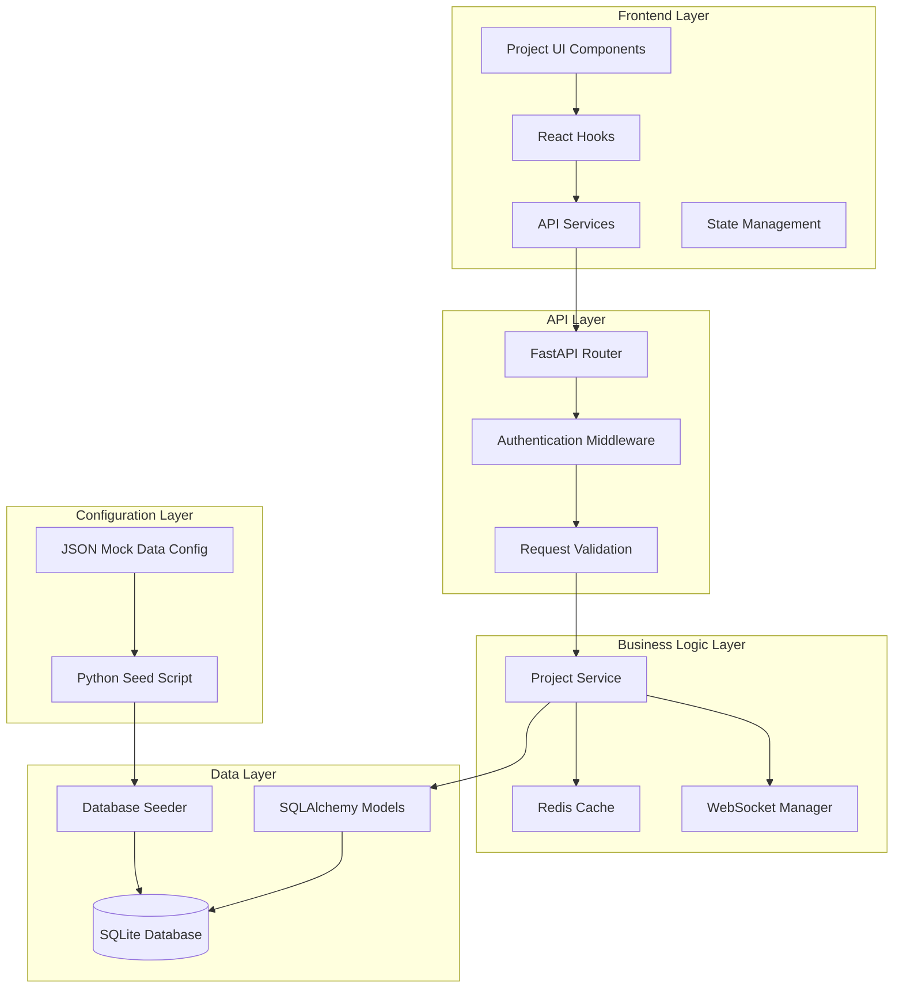
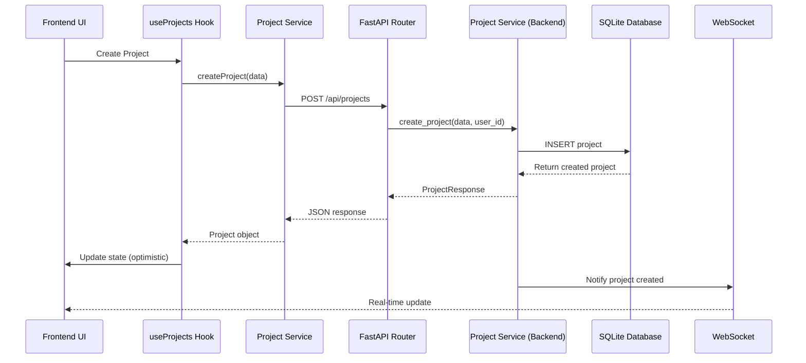

# Project Frontend-Backend Integration - Design Document

## Overview

This design document outlines the architecture for fully connecting the project management features from the frontend to the backend database in the Medical Device Regulatory Assistant. The system will implement complete CRUD operations, comprehensive mock data seeding, and JSON-based configuration tools to enable seamless project management through the existing UI.

Based on the frontend investigation analysis, the current architecture already has most components in place but needs enhancement to ensure full integration, proper data seeding, and robust error handling.

## Architecture

### System Architecture Overview



### Data Flow Architecture



## Components and Interfaces

### Frontend Components

#### 1. Enhanced Project List Component

```typescript
interface ProjectListProps {
  onCreateProject?: () => void;
  onSelectProject?: (project: Project) => void;
  onEditProject?: (project: Project) => void;
  className?: string;
}

interface ProjectListState {
  projects: Project[];
  loading: boolean;
  error?: string;
  filters: ProjectSearchFilters;
  totalCount: number;
  hasMore: boolean;
}
```

**Key Features:**

- Real-time updates via WebSocket
- Optimistic UI updates
- Advanced search and filtering
- Infinite scroll pagination
- Offline support with pending actions
- Export functionality

#### 2. Project Form Component

```typescript
interface ProjectFormProps {
  project?: Project;
  open: boolean;
  onOpenChange: (open: boolean) => void;
  onSubmit: (data: ProjectCreateRequest | ProjectUpdateRequest) => Promise<Project | null>;
}
```

**Key Features:**

- Form validation with Zod schemas
- Auto-save functionality
- Rich text editing for descriptions
- Device type suggestions
- Intended use templates

#### 3. Project Card Component

```typescript
interface ProjectCardProps {
  project: Project;
  onSelect?: (project: Project) => void;
  onEdit?: (project: Project) => void;
  onDelete?: (projectId: number) => Promise<boolean>;
  onExport?: (project: Project) => void;
  loading?: boolean;
}
```

**Key Features:**

- Progress indicators
- Status badges
- Quick actions menu
- Drag and drop support
- Context menu integration

### Backend Components

#### 1. Enhanced Project Service

```python
class ProjectService:
    """Enhanced service class for project management operations"""
    
    async def create_project(self, project_data: ProjectCreateRequest, user_id: str) -> ProjectResponse
    async def get_project(self, project_id: int, user_id: str) -> ProjectResponse
    async def update_project(self, project_id: int, project_data: ProjectUpdateRequest, user_id: str) -> ProjectResponse
    async def delete_project(self, project_id: int, user_id: str) -> Dict[str, str]
    async def list_projects(self, user_id: str, filters: ProjectSearchFilters) -> List[ProjectResponse]
    async def get_dashboard_data(self, project_id: int, user_id: str) -> ProjectDashboardData
    async def export_project(self, project_id: int, user_id: str, format_type: str) -> ProjectExportData
    async def get_project_stats(self, user_id: str) -> Dict[str, Any]
```

**Key Features:**

- Comprehensive error handling
- Performance optimization with caching
- Real-time notifications
- Audit trail logging
- Data validation and sanitization

#### 2. Enhanced API Router

```python
@router.post("/", response_model=ProjectResponse, status_code=201)
async def create_project(project_data: ProjectCreateRequest, current_user: TokenData = Depends(get_current_user))

@router.get("/", response_model=List[ProjectResponse])
async def list_projects(search: Optional[str] = None, status_filter: Optional[ProjectStatus] = None, ...)

@router.get("/{project_id}", response_model=ProjectResponse)
async def get_project(project_id: int, current_user: TokenData = Depends(get_current_user))

@router.put("/{project_id}", response_model=ProjectResponse)
async def update_project(project_id: int, project_data: ProjectUpdateRequest, ...)

@router.delete("/{project_id}")
async def delete_project(project_id: int, current_user: TokenData = Depends(get_current_user))

@router.get("/{project_id}/dashboard", response_model=ProjectDashboardData)
async def get_project_dashboard(project_id: int, current_user: TokenData = Depends(get_current_user))

@router.get("/{project_id}/export")
async def export_project(project_id: int, format_type: str = "json", ...)
```

**Key Features:**

- Comprehensive input validation
- Proper HTTP status codes
- Detailed error responses
- Rate limiting
- Request/response logging

## Data Models

### Enhanced SQLAlchemy Models

#### Project Model Extensions

```python
class Project(Base):
    __tablename__ = "projects"
    
    # Core fields
    id: Mapped[int] = mapped_column(primary_key=True, autoincrement=True)
    user_id: Mapped[int] = mapped_column(ForeignKey("users.id"), nullable=False, index=True)
    name: Mapped[str] = mapped_column(String(255), nullable=False)
    description: Mapped[Optional[str]] = mapped_column(Text, nullable=True)
    device_type: Mapped[Optional[str]] = mapped_column(String(255), nullable=True)
    intended_use: Mapped[Optional[str]] = mapped_column(Text, nullable=True)
    status: Mapped[ProjectStatus] = mapped_column(Enum(ProjectStatus), default=ProjectStatus.DRAFT)
    
    # Enhanced fields
    priority: Mapped[Optional[str]] = mapped_column(String(50), nullable=True)  # high, medium, low
    tags: Mapped[Optional[str]] = mapped_column(Text, nullable=True)  # JSON array of tags
    metadata: Mapped[Optional[str]] = mapped_column(Text, nullable=True)  # JSON metadata
    
    # Relationships with proper cascade
    user: Mapped["User"] = relationship("User", back_populates="projects")
    device_classifications: Mapped[List["DeviceClassification"]] = relationship(
        "DeviceClassification", back_populates="project", cascade="all, delete-orphan"
    )
    predicate_devices: Mapped[List["PredicateDevice"]] = relationship(
        "PredicateDevice", back_populates="project", cascade="all, delete-orphan"
    )
    agent_interactions: Mapped[List["AgentInteraction"]] = relationship(
        "AgentInteraction", back_populates="project", cascade="all, delete-orphan"
    )
    documents: Mapped[List["ProjectDocument"]] = relationship(
        "ProjectDocument", back_populates="project", cascade="all, delete-orphan"
    )
```

### Pydantic Models for API

#### Request Models

```python
class ProjectCreateRequest(BaseModel):
    name: str = Field(..., min_length=1, max_length=255)
    description: Optional[str] = Field(None, max_length=2000)
    device_type: Optional[str] = Field(None, max_length=255)
    intended_use: Optional[str] = Field(None, max_length=5000)
    priority: Optional[str] = Field(None, pattern="^(high|medium|low)$")
    tags: Optional[List[str]] = Field(None, max_items=10)

class ProjectUpdateRequest(BaseModel):
    name: Optional[str] = Field(None, min_length=1, max_length=255)
    description: Optional[str] = Field(None, max_length=2000)
    device_type: Optional[str] = Field(None, max_length=255)
    intended_use: Optional[str] = Field(None, max_length=5000)
    status: Optional[ProjectStatus] = None
    priority: Optional[str] = Field(None, pattern="^(high|medium|low)$")
    tags: Optional[List[str]] = Field(None, max_items=10)
```

#### Response Models

```python
class ProjectResponse(BaseModel):
    id: int
    name: str
    description: Optional[str]
    device_type: Optional[str]
    intended_use: Optional[str]
    status: ProjectStatus
    priority: Optional[str]
    tags: Optional[List[str]]
    created_at: datetime
    updated_at: datetime
    
    # Computed fields
    progress_percentage: Optional[float] = None
    last_activity: Optional[datetime] = None
    
    class Config:
        from_attributes = True
```

## Error Handling

### Frontend Error Handling Strategy

#### 1. Error Boundary Component

```typescript
class ProjectErrorBoundary extends React.Component {
  constructor(props) {
    super(props);
    this.state = { hasError: false, error: null };
  }

  static getDerivedStateFromError(error) {
    return { hasError: true, error };
  }

  componentDidCatch(error, errorInfo) {
    console.error('Project error:', error, errorInfo);
    // Send to error reporting service
  }

  render() {
    if (this.state.hasError) {
      return <ProjectErrorFallback error={this.state.error} />;
    }
    return this.props.children;
  }
}
```

#### 2. API Error Handling

```typescript
class APIError extends Error {
  constructor(
    message: string,
    public status: number,
    public code?: string,
    public details?: any
  ) {
    super(message);
    this.name = 'APIError';
  }
}

const handleAPIError = (error: any): APIError => {
  if (error.response) {
    return new APIError(
      error.response.data.message || 'API Error',
      error.response.status,
      error.response.data.code,
      error.response.data.details
    );
  }
  return new APIError('Network Error', 0);
};
```

### Backend Error Handling Strategy

#### 1. Custom Exception Classes

```python
class ProjectError(Exception):
    """Base exception for project-related errors"""
    def __init__(self, message: str, code: str = None, details: dict = None):
        self.message = message
        self.code = code
        self.details = details or {}
        super().__init__(self.message)

class ProjectNotFoundError(ProjectError):
    """Project not found error"""
    def __init__(self, project_id: int):
        super().__init__(
            f"Project with ID {project_id} not found",
            code="PROJECT_NOT_FOUND",
            details={"project_id": project_id}
        )

class ProjectAccessDeniedError(ProjectError):
    """Project access denied error"""
    def __init__(self, project_id: int, user_id: str):
        super().__init__(
            f"Access denied to project {project_id}",
            code="PROJECT_ACCESS_DENIED",
            details={"project_id": project_id, "user_id": user_id}
        )
```

#### 2. Global Exception Handler

```python
@app.exception_handler(ProjectError)
async def project_error_handler(request: Request, exc: ProjectError):
    return JSONResponse(
        status_code=400,
        content={
            "error": {
                "message": exc.message,
                "code": exc.code,
                "details": exc.details
            }
        }
    )

@app.exception_handler(ProjectNotFoundError)
async def project_not_found_handler(request: Request, exc: ProjectNotFoundError):
    return JSONResponse(
        status_code=404,
        content={
            "error": {
                "message": exc.message,
                "code": exc.code,
                "details": exc.details
            }
        }
    )
```

## Testing Strategy

### Frontend Testing

#### 1. Component Testing with React Testing Library

```typescript
describe('ProjectList Component', () => {
  it('should render projects correctly', async () => {
    const mockProjects = [
      { id: 1, name: 'Test Project', status: 'draft' },
      { id: 2, name: 'Another Project', status: 'in_progress' }
    ];
    
    render(<ProjectList />, {
      wrapper: ({ children }) => (
        <ProjectProvider mockData={mockProjects}>
          {children}
        </ProjectProvider>
      )
    });
    
    expect(screen.getByText('Test Project')).toBeInTheDocument();
    expect(screen.getByText('Another Project')).toBeInTheDocument();
  });

  it('should handle project creation', async () => {
    const mockCreateProject = jest.fn();
    render(<ProjectList onCreateProject={mockCreateProject} />);
    
    fireEvent.click(screen.getByText('New Project'));
    expect(mockCreateProject).toHaveBeenCalled();
  });
});
```

#### 2. Hook Testing

```typescript
describe('useProjects Hook', () => {
  it('should load projects on mount', async () => {
    const { result } = renderHook(() => useProjects(), {
      wrapper: ProjectProvider
    });
    
    await waitFor(() => {
      expect(result.current.loading).toBe(false);
    });
    
    expect(result.current.projects).toHaveLength(2);
  });

  it('should handle project creation', async () => {
    const { result } = renderHook(() => useProjects());
    
    await act(async () => {
      const project = await result.current.createProject({
        name: 'New Project',
        description: 'Test description'
      });
      expect(project).toBeDefined();
    });
  });
});
```

### Backend Testing

#### 1. Service Layer Testing

```python
@pytest.mark.asyncio
async def test_create_project():
    service = ProjectService()
    project_data = ProjectCreateRequest(
        name="Test Project",
        description="Test description",
        device_type="Medical Device",
        intended_use="Test indication"
    )
    
    project = await service.create_project(project_data, "test_user_id")
    
    assert project.name == "Test Project"
    assert project.description == "Test description"
    assert project.status == ProjectStatus.DRAFT

@pytest.mark.asyncio
async def test_project_not_found():
    service = ProjectService()
    
    with pytest.raises(ProjectNotFoundError):
        await service.get_project(999, "test_user_id")
```

#### 2. API Endpoint Testing

```python
@pytest.mark.asyncio
async def test_create_project_endpoint(client, auth_headers):
    project_data = {
        "name": "Test Project",
        "description": "Test description",
        "device_type": "Medical Device",
        "intended_use": "Test indication"
    }
    
    response = await client.post(
        "/api/projects",
        json=project_data,
        headers=auth_headers
    )
    
    assert response.status_code == 201
    data = response.json()
    assert data["name"] == "Test Project"
    assert data["status"] == "draft"

@pytest.mark.asyncio
async def test_list_projects_with_filters(client, auth_headers):
    response = await client.get(
        "/api/projects?search=test&status=draft&limit=10",
        headers=auth_headers
    )
    
    assert response.status_code == 200
    data = response.json()
    assert isinstance(data, list)
```

## Mock Data Configuration System

### JSON Configuration Schema

#### 1. Project Mock Data Schema

```json
{
  "$schema": "http://json-schema.org/draft-07/schema#",
  "type": "object",
  "properties": {
    "users": {
      "type": "array",
      "items": {
        "type": "object",
        "properties": {
          "google_id": { "type": "string" },
          "email": { "type": "string", "format": "email" },
          "name": { "type": "string" },
          "avatar_url": { "type": "string", "format": "uri" }
        },
        "required": ["google_id", "email", "name"]
      }
    },
    "projects": {
      "type": "array",
      "items": {
        "type": "object",
        "properties": {
          "name": { "type": "string" },
          "description": { "type": "string" },
          "device_type": { "type": "string" },
          "intended_use": { "type": "string" },
          "status": { "enum": ["draft", "in_progress", "completed"] },
          "priority": { "enum": ["high", "medium", "low"] },
          "tags": { "type": "array", "items": { "type": "string" } },
          "user_email": { "type": "string", "format": "email" }
        },
        "required": ["name", "user_email"]
      }
    },
    "device_classifications": {
      "type": "array",
      "items": {
        "type": "object",
        "properties": {
          "project_name": { "type": "string" },
          "device_class": { "enum": ["I", "II", "III"] },
          "product_code": { "type": "string" },
          "regulatory_pathway": { "enum": ["510k", "PMA", "De Novo"] },
          "confidence_score": { "type": "number", "minimum": 0, "maximum": 1 },
          "reasoning": { "type": "string" }
        },
        "required": ["project_name", "device_class", "product_code"]
      }
    },
    "predicate_devices": {
      "type": "array",
      "items": {
        "type": "object",
        "properties": {
          "project_name": { "type": "string" },
          "k_number": { "type": "string", "pattern": "^K\\d{6}$" },
          "device_name": { "type": "string" },
          "intended_use": { "type": "string" },
          "product_code": { "type": "string" },
          "clearance_date": { "type": "string", "format": "date" },
          "confidence_score": { "type": "number", "minimum": 0, "maximum": 1 },
          "is_selected": { "type": "boolean" }
        },
        "required": ["project_name", "k_number", "device_name"]
      }
    }
  },
  "required": ["users", "projects"]
}
```

#### 2. Sample Mock Data Configuration

```json
{
  "users": [
    {
      "google_id": "user_123456789",
      "email": "john.doe@medtech.com",
      "name": "John Doe",
      "avatar_url": "https://example.com/avatar1.jpg"
    },
    {
      "google_id": "user_987654321",
      "email": "jane.smith@deviceco.com",
      "name": "Jane Smith",
      "avatar_url": "https://example.com/avatar2.jpg"
    }
  ],
  "projects": [
    {
      "name": "Cardiac Monitoring Device",
      "description": "A wearable device for continuous cardiac rhythm monitoring",
      "device_type": "Cardiac Monitor",
      "intended_use": "For continuous monitoring of cardiac rhythm in ambulatory patients",
      "status": "in_progress",
      "priority": "high",
      "tags": ["cardiac", "wearable", "monitoring"],
      "user_email": "john.doe@medtech.com"
    },
    {
      "name": "Blood Glucose Meter",
      "description": "Portable blood glucose monitoring system",
      "device_type": "Glucose Meter",
      "intended_use": "For quantitative measurement of glucose in capillary blood",
      "status": "draft",
      "priority": "medium",
      "tags": ["diabetes", "glucose", "portable"],
      "user_email": "jane.smith@deviceco.com"
    }
  ],
  "device_classifications": [
    {
      "project_name": "Cardiac Monitoring Device",
      "device_class": "II",
      "product_code": "DPS",
      "regulatory_pathway": "510k",
      "confidence_score": 0.92,
      "reasoning": "Device is substantially equivalent to existing cardiac monitors"
    }
  ],
  "predicate_devices": [
    {
      "project_name": "Cardiac Monitoring Device",
      "k_number": "K193456",
      "device_name": "CardioWatch Pro",
      "intended_use": "Continuous cardiac rhythm monitoring",
      "product_code": "DPS",
      "clearance_date": "2019-08-15",
      "confidence_score": 0.89,
      "is_selected": true
    }
  ]
}
```

### Python Seeder Script

#### 1. Enhanced Database Seeder

```python
import json
import asyncio
from pathlib import Path
from typing import Dict, Any, List
from datetime import datetime, timezone, date
from sqlalchemy.orm import Session

from models.user import User
from models.project import Project, ProjectStatus
from models.device_classification import DeviceClassification
from models.predicate_device import PredicateDevice
from models.agent_interaction import AgentInteraction
from database.connection import get_database_manager

class EnhancedDatabaseSeeder:
    """Enhanced database seeder with JSON configuration support"""
    
    def __init__(self, config_path: str = None):
        self.db_manager = get_database_manager()
        self.config_path = config_path or "mock_data_config.json"
        self.config = self._load_config()
    
    def _load_config(self) -> Dict[str, Any]:
        """Load configuration from JSON file"""
        config_file = Path(self.config_path)
        if not config_file.exists():
            raise FileNotFoundError(f"Configuration file not found: {self.config_path}")
        
        with open(config_file, 'r') as f:
            return json.load(f)
    
    async def seed_all(self, clear_existing: bool = False) -> None:
        """Seed all data from configuration"""
        if clear_existing:
            await self.clear_all_data()
        
        async with self.db_manager.get_session() as session:
            # Create users first (needed for foreign keys)
            user_map = await self._seed_users(session)
            
            # Create projects
            project_map = await self._seed_projects(session, user_map)
            
            # Create related data
            await self._seed_device_classifications(session, project_map)
            await self._seed_predicate_devices(session, project_map)
            await self._seed_agent_interactions(session, project_map)
            
            await session.commit()
        
        print(f"Successfully seeded database with {len(self.config.get('projects', []))} projects")
    
    async def _seed_users(self, session: Session) -> Dict[str, User]:
        """Seed users and return mapping of email to User object"""
        user_map = {}
        
        for user_data in self.config.get('users', []):
            user = User(
                google_id=user_data['google_id'],
                email=user_data['email'],
                name=user_data['name'],
                avatar_url=user_data.get('avatar_url')
            )
            session.add(user)
            await session.flush()  # Get the ID
            user_map[user_data['email']] = user
        
        return user_map
    
    async def _seed_projects(self, session: Session, user_map: Dict[str, User]) -> Dict[str, Project]:
        """Seed projects and return mapping of name to Project object"""
        project_map = {}
        
        for project_data in self.config.get('projects', []):
            user = user_map.get(project_data['user_email'])
            if not user:
                print(f"Warning: User not found for email {project_data['user_email']}")
                continue
            
            project = Project(
                user_id=user.id,
                name=project_data['name'],
                description=project_data.get('description'),
                device_type=project_data.get('device_type'),
                intended_use=project_data.get('intended_use'),
                status=ProjectStatus(project_data.get('status', 'draft')),
                priority=project_data.get('priority'),
                tags=json.dumps(project_data.get('tags', [])) if project_data.get('tags') else None
            )
            session.add(project)
            await session.flush()
            project_map[project_data['name']] = project
        
        return project_map
    
    async def _seed_device_classifications(self, session: Session, project_map: Dict[str, Project]) -> None:
        """Seed device classifications"""
        for classification_data in self.config.get('device_classifications', []):
            project = project_map.get(classification_data['project_name'])
            if not project:
                continue
            
            classification = DeviceClassification(
                project_id=project.id,
                device_class=classification_data['device_class'],
                product_code=classification_data['product_code'],
                regulatory_pathway=classification_data['regulatory_pathway'],
                confidence_score=classification_data.get('confidence_score'),
                reasoning=classification_data.get('reasoning'),
                sources=json.dumps([])  # Empty sources for mock data
            )
            session.add(classification)
    
    async def _seed_predicate_devices(self, session: Session, project_map: Dict[str, Project]) -> None:
        """Seed predicate devices"""
        for predicate_data in self.config.get('predicate_devices', []):
            project = project_map.get(predicate_data['project_name'])
            if not project:
                continue
            
            clearance_date = None
            if predicate_data.get('clearance_date'):
                clearance_date = datetime.strptime(
                    predicate_data['clearance_date'], 
                    '%Y-%m-%d'
                ).date()
            
            predicate = PredicateDevice(
                project_id=project.id,
                k_number=predicate_data['k_number'],
                device_name=predicate_data['device_name'],
                intended_use=predicate_data.get('intended_use'),
                product_code=predicate_data.get('product_code'),
                clearance_date=clearance_date,
                confidence_score=predicate_data.get('confidence_score'),
                is_selected=predicate_data.get('is_selected', False),
                comparison_data=json.dumps({
                    "similarities": ["Similar intended use", "Same product code"],
                    "differences": ["Different materials", "Enhanced features"],
                    "riskAssessment": "low",
                    "testingRecommendations": ["Biocompatibility testing", "Software validation"]
                })
            )
            session.add(predicate)
    
    async def _seed_agent_interactions(self, session: Session, project_map: Dict[str, Project]) -> None:
        """Seed sample agent interactions"""
        for project_name, project in project_map.items():
            # Create sample interactions for each project
            interactions = [
                {
                    "agent_action": "device_classification",
                    "input_data": {"device_description": project.description},
                    "output_data": {"device_class": "II", "product_code": "ABC"},
                    "confidence_score": 0.85,
                    "reasoning": "Device classified based on intended use and risk profile"
                },
                {
                    "agent_action": "predicate_search",
                    "input_data": {"device_type": project.device_type},
                    "output_data": {"predicates_found": 5},
                    "confidence_score": 0.78,
                    "reasoning": "Found multiple suitable predicate devices"
                }
            ]
            
            for interaction_data in interactions:
                interaction = AgentInteraction(
                    project_id=project.id,
                    agent_action=interaction_data['agent_action'],
                    input_data=json.dumps(interaction_data['input_data']),
                    output_data=json.dumps(interaction_data['output_data']),
                    confidence_score=interaction_data['confidence_score'],
                    reasoning=interaction_data['reasoning'],
                    sources=json.dumps([]),
                    execution_time_ms=1500
                )
                session.add(interaction)
    
    async def clear_all_data(self) -> None:
        """Clear all data from database"""
        async with self.db_manager.get_session() as session:
            # Delete in reverse order of dependencies
            await session.execute("DELETE FROM agent_interactions")
            await session.execute("DELETE FROM project_documents")
            await session.execute("DELETE FROM predicate_devices")
            await session.execute("DELETE FROM device_classifications")
            await session.execute("DELETE FROM projects")
            await session.execute("DELETE FROM users")
            await session.commit()
        
        print("All data cleared from database")

# CLI script
async def main():
    import argparse
    
    parser = argparse.ArgumentParser(description='Database seeder for Medical Device Regulatory Assistant')
    parser.add_argument('--config', '-c', default='mock_data_config.json', help='Path to JSON configuration file')
    parser.add_argument('--clear', action='store_true', help='Clear existing data before seeding')
    parser.add_argument('--clear-only', action='store_true', help='Only clear data, do not seed')
    
    args = parser.parse_args()
    
    seeder = EnhancedDatabaseSeeder(args.config)
    
    if args.clear_only:
        await seeder.clear_all_data()
    else:
        await seeder.seed_all(clear_existing=args.clear)

if __name__ == "__main__":
    asyncio.run(main())
```

This comprehensive design provides a robust foundation for connecting the project frontend to the backend with proper data management, error handling, and testing strategies. The JSON-based mock data configuration system allows for easy customization and maintenance of test data scenarios.
