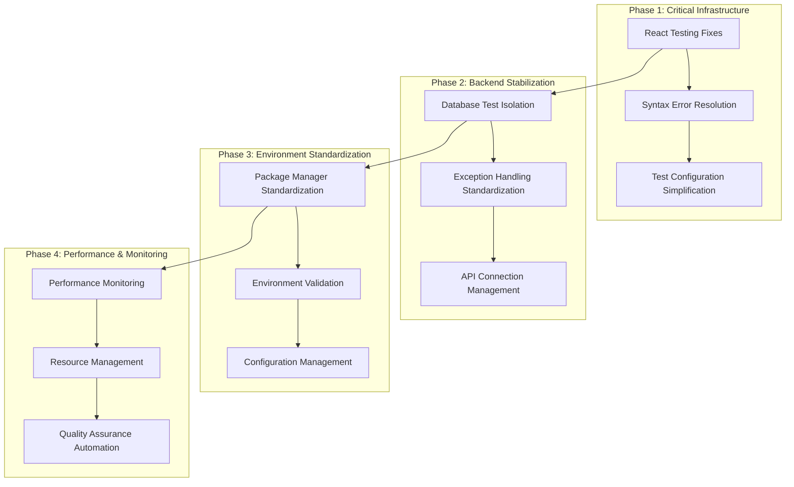
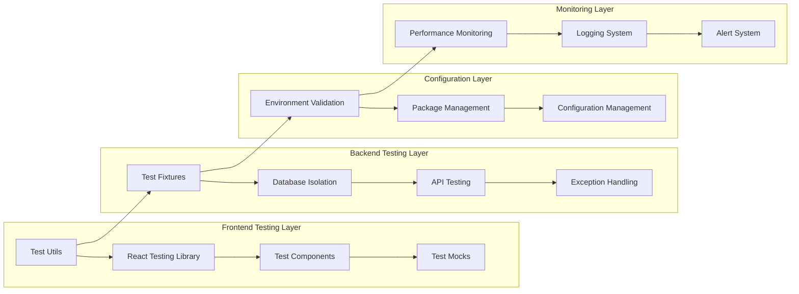

# System Error Resolution - Design Document

## Overview

This design document outlines the technical approach for systematically resolving critical errors in the Medical Device Regulatory Assistant project. The solution implements a phased approach to fix frontend testing infrastructure, backend integration issues, configuration problems, and performance bottlenecks while maintaining system stability and developer productivity.

## Architecture

### High-Level Architecture



### Component Architecture



## Components and Interfaces

### 1. Frontend Testing Infrastructure

#### 1.1 React Testing Utilities

**Purpose**: Provide consistent, reliable React component testing utilities

**Interface**:
```typescript
// src/lib/testing/react-test-utils.tsx
export interface TestRenderOptions {
  initialState?: Partial<AppState>;
  providers?: React.ComponentType[];
  mockToasts?: boolean;
}

export interface TestUtilities {
  renderWithProviders: (ui: ReactElement, options?: TestRenderOptions) => RenderResult;
  waitForAsyncUpdates: () => Promise<void>;
  mockToastSystem: () => MockToastSystem;
  cleanupTestEnvironment: () => void;
}
```

**Implementation**:
```typescript
import { render, RenderResult } from '@testing-library/react';
import { act } from 'react-dom/test-utils';

export const renderWithProviders = (
  ui: ReactElement,
  options: TestRenderOptions = {}
): RenderResult => {
  const { initialState, providers = [], mockToasts = true } = options;
  
  const AllProviders = ({ children }: { children: React.ReactNode }) => {
    return providers.reduce(
      (acc, Provider) => <Provider>{acc}</Provider>,
      mockToasts ? <MockToastProvider>{children}</MockToastProvider> : children
    );
  };
  
  return render(ui, { wrapper: AllProviders });
};

export const waitForAsyncUpdates = async (): Promise<void> => {
  await act(async () => {
    await new Promise(resolve => setTimeout(resolve, 0));
  });
};
```

#### 1.2 Toast System Testing Integration

**Purpose**: Provide reliable testing for toast notifications without React lifecycle issues

**Interface**:
```typescript
// src/lib/testing/mock-toast-system.ts
export interface MockToastSystem {
  mockToast: jest.MockedFunction<typeof toast>;
  getToastCalls: () => ToastCall[];
  clearToastHistory: () => void;
  simulateToastDisplay: (message: string, type: ToastType) => void;
}

export interface ToastCall {
  message: string;
  type: ToastType;
  timestamp: number;
}
```

**Implementation**:
```typescript
import { act } from 'react-dom/test-utils';

export class MockToastSystem implements MockToastSystem {
  private toastCalls: ToastCall[] = [];
  public mockToast: jest.MockedFunction<typeof toast>;
  
  constructor() {
    this.mockToast = jest.fn().mockImplementation((message, type) => {
      act(() => {
        this.toastCalls.push({
          message,
          type,
          timestamp: Date.now()
        });
      });
    });
  }
  
  getToastCalls(): ToastCall[] {
    return [...this.toastCalls];
  }
  
  clearToastHistory(): void {
    act(() => {
      this.toastCalls = [];
    });
  }
}
```

### 2. Backend Integration Infrastructure

#### 2.1 Database Test Isolation

**Purpose**: Provide reliable database testing with proper transaction isolation

**Interface**:
```python
# backend/testing/database_isolation.py
from typing import AsyncGenerator, Optional
from sqlalchemy.ext.asyncio import AsyncSession

class DatabaseTestIsolation:
    async def isolated_session(self) -> AsyncGenerator[AsyncSession, None]:
        """Provide isolated database session for testing"""
        
    async def setup_test_data(self, session: AsyncSession, data_config: dict) -> dict:
        """Setup test data with proper cleanup tracking"""
        
    async def cleanup_test_data(self, session: AsyncSession, cleanup_config: dict) -> None:
        """Clean up test data safely"""
        
    async def validate_isolation(self, session: AsyncSession) -> bool:
        """Validate that test isolation is working correctly"""
```

**Implementation**:
```python
import asyncio
from contextlib import asynccontextmanager
from sqlalchemy import text

class DatabaseTestIsolation:
    def __init__(self, db_manager):
        self.db_manager = db_manager
        self.cleanup_registry = {}
    
    @asynccontextmanager
    async def isolated_session(self) -> AsyncGenerator[AsyncSession, None]:
        async with self.db_manager.get_session() as session:
            # Start transaction
            await session.begin()
            
            # Create savepoint for rollback
            savepoint = await session.begin_nested()
            
            try:
                yield session
            finally:
                # Always rollback to savepoint
                await savepoint.rollback()
                await session.rollback()
    
    async def setup_test_data(self, session: AsyncSession, data_config: dict) -> dict:
        created_entities = {}
        
        for entity_type, entity_data in data_config.items():
            if entity_type == 'users':
                users = []
                for user_data in entity_data:
                    user = User(**user_data)
                    session.add(user)
                    users.append(user)
                await session.flush()  # Get IDs without committing
                created_entities['users'] = [u.id for u in users]
            
            elif entity_type == 'projects':
                projects = []
                for project_data in entity_data:
                    project = Project(**project_data)
                    session.add(project)
                    projects.append(project)
                await session.flush()
                created_entities['projects'] = [p.id for p in projects]
        
        return created_entities
```

#### 2.2 Exception Handling Standardization

**Purpose**: Provide consistent exception handling across all system layers

**Interface**:
```python
# backend/core/exceptions.py
from typing import Optional, Dict, Any
from fastapi import HTTPException

class RegulatoryAssistantException(Exception):
    """Base exception for all application errors"""
    def __init__(self, message: str, error_code: str, details: Optional[Dict[str, Any]] = None):
        self.message = message
        self.error_code = error_code
        self.details = details or {}
        super().__init__(message)

class ExceptionMapper:
    def map_to_http_exception(self, exc: Exception) -> HTTPException:
        """Map application exceptions to HTTP exceptions"""
        
    def create_error_response(self, exc: Exception) -> Dict[str, Any]:
        """Create standardized error response"""
```

**Implementation**:
```python
from fastapi import HTTPException, status

class ProjectNotFoundError(RegulatoryAssistantException):
    def __init__(self, project_id: int, user_id: str):
        super().__init__(
            message=f"Project {project_id} not found for user {user_id}",
            error_code="PROJECT_NOT_FOUND",
            details={"project_id": project_id, "user_id": user_id}
        )

class ExceptionMapper:
    EXCEPTION_MAP = {
        ProjectNotFoundError: (status.HTTP_404_NOT_FOUND, "Project not found"),
        ValidationError: (status.HTTP_422_UNPROCESSABLE_ENTITY, "Validation error"),
        DatabaseError: (status.HTTP_500_INTERNAL_SERVER_ERROR, "Database error"),
    }
    
    def map_to_http_exception(self, exc: Exception) -> HTTPException:
        if isinstance(exc, RegulatoryAssistantException):
            status_code, default_detail = self.EXCEPTION_MAP.get(
                type(exc), 
                (status.HTTP_500_INTERNAL_SERVER_ERROR, "Internal server error")
            )
            
            return HTTPException(
                status_code=status_code,
                detail={
                    "error_code": exc.error_code,
                    "message": exc.message,
                    "details": exc.details
                }
            )
        
        # Handle standard exceptions
        return HTTPException(
            status_code=status.HTTP_500_INTERNAL_SERVER_ERROR,
            detail={"error_code": "UNKNOWN_ERROR", "message": str(exc)}
        )
```

#### 2.3 API Connection Management

**Purpose**: Provide robust API testing with graceful connection handling

**Interface**:
```python
# backend/testing/api_client.py
from typing import Optional, Dict, Any
import httpx

class TestAPIClient:
    def __init__(self, base_url: str, timeout: float = 5.0):
        self.base_url = base_url
        self.timeout = timeout
        self.client: Optional[httpx.AsyncClient] = None
    
    async def connect(self) -> bool:
        """Attempt to connect to API server"""
        
    async def request(self, method: str, endpoint: str, **kwargs) -> httpx.Response:
        """Make API request with retry logic"""
        
    async def health_check(self) -> Dict[str, Any]:
        """Check API server health"""
```

**Implementation**:
```python
import asyncio
from contextlib import asynccontextmanager

class TestAPIClient:
    def __init__(self, base_url: str, timeout: float = 5.0, max_retries: int = 3):
        self.base_url = base_url
        self.timeout = timeout
        self.max_retries = max_retries
        self.is_connected = False
    
    async def connect(self) -> bool:
        try:
            async with httpx.AsyncClient(
                base_url=self.base_url, 
                timeout=self.timeout
            ) as client:
                response = await client.get("/health")
                self.is_connected = response.status_code == 200
                return self.is_connected
        except (httpx.ConnectError, httpx.TimeoutException):
            self.is_connected = False
            return False
    
    @asynccontextmanager
    async def request_with_retry(self, method: str, endpoint: str, **kwargs):
        if not self.is_connected:
            if not await self.connect():
                yield None
                return
        
        for attempt in range(self.max_retries):
            try:
                async with httpx.AsyncClient(
                    base_url=self.base_url,
                    timeout=self.timeout
                ) as client:
                    response = await client.request(method, endpoint, **kwargs)
                    yield response
                    return
            except (httpx.ConnectError, httpx.TimeoutException) as e:
                if attempt == self.max_retries - 1:
                    yield None
                    return
                await asyncio.sleep(2 ** attempt)  # Exponential backoff
```

### 3. Configuration Management System

#### 3.1 Environment Validation

**Purpose**: Validate development environment setup and dependencies

**Interface**:
```python
# backend/core/environment.py
from typing import List, Dict, Any, Optional
from dataclasses import dataclass

@dataclass
class ValidationResult:
    is_valid: bool
    errors: List[str]
    warnings: List[str]
    recommendations: List[str]

class EnvironmentValidator:
    def validate_python_environment(self) -> ValidationResult:
        """Validate Python version and dependencies"""
        
    def validate_database_connection(self) -> ValidationResult:
        """Validate database connectivity and schema"""
        
    def validate_external_services(self) -> ValidationResult:
        """Validate external service connectivity"""
        
    def generate_setup_instructions(self, validation_result: ValidationResult) -> str:
        """Generate setup instructions for failed validations"""
```

**Implementation**:
```python
import sys
import subprocess
from pathlib import Path

class EnvironmentValidator:
    REQUIRED_PYTHON_VERSION = (3, 9)
    REQUIRED_PACKAGES = ['fastapi', 'sqlalchemy', 'pydantic', 'httpx']
    
    def validate_python_environment(self) -> ValidationResult:
        errors = []
        warnings = []
        recommendations = []
        
        # Check Python version
        if sys.version_info < self.REQUIRED_PYTHON_VERSION:
            errors.append(
                f"Python {'.'.join(map(str, self.REQUIRED_PYTHON_VERSION))}+ required, "
                f"found {sys.version}"
            )
        
        # Check Poetry installation
        try:
            result = subprocess.run(['poetry', '--version'], capture_output=True, text=True)
            if result.returncode != 0:
                errors.append("Poetry not installed or not in PATH")
        except FileNotFoundError:
            errors.append("Poetry not found. Install with: pip install poetry")
        
        # Check pyproject.toml
        if not Path('pyproject.toml').exists():
            errors.append("pyproject.toml not found in current directory")
        
        # Check installed packages
        try:
            import pkg_resources
            for package in self.REQUIRED_PACKAGES:
                try:
                    pkg_resources.get_distribution(package)
                except pkg_resources.DistributionNotFound:
                    warnings.append(f"Package {package} not installed")
                    recommendations.append(f"Run: poetry add {package}")
        except ImportError:
            warnings.append("Cannot verify package installations")
        
        return ValidationResult(
            is_valid=len(errors) == 0,
            errors=errors,
            warnings=warnings,
            recommendations=recommendations
        )
```

#### 3.2 Package Manager Standardization

**Purpose**: Ensure consistent package management across frontend and backend

**Interface**:
```typescript
// scripts/package-manager-validator.ts
interface PackageManagerConfig {
  frontend: {
    manager: 'pnpm';
    lockFile: 'pnpm-lock.yaml';
    configFile: 'package.json';
  };
  backend: {
    manager: 'poetry';
    lockFile: 'poetry.lock';
    configFile: 'pyproject.toml';
  };
}

interface ValidationScript {
  validateFrontendSetup(): Promise<ValidationResult>;
  validateBackendSetup(): Promise<ValidationResult>;
  generateSetupInstructions(): string;
}
```

**Implementation**:
```bash
#!/bin/bash
# scripts/validate-package-managers.sh

validate_frontend() {
    echo "Validating frontend package management..."
    
    # Check pnpm installation
    if ! command -v pnpm &> /dev/null; then
        echo "❌ pnpm not installed. Install with: npm install -g pnpm"
        return 1
    fi
    
    # Check package.json exists
    if [ ! -f "package.json" ]; then
        echo "❌ package.json not found"
        return 1
    fi
    
    # Check pnpm-lock.yaml exists
    if [ ! -f "pnpm-lock.yaml" ]; then
        echo "⚠️  pnpm-lock.yaml not found. Run: pnpm install"
    fi
    
    echo "✅ Frontend package management validated"
    return 0
}

validate_backend() {
    echo "Validating backend package management..."
    
    # Check poetry installation
    if ! command -v poetry &> /dev/null; then
        echo "❌ Poetry not installed. Install with: pip install poetry"
        return 1
    fi
    
    # Check pyproject.toml exists
    if [ ! -f "backend/pyproject.toml" ]; then
        echo "❌ pyproject.toml not found in backend directory"
        return 1
    fi
    
    # Check poetry.lock exists
    if [ ! -f "backend/poetry.lock" ]; then
        echo "⚠️  poetry.lock not found. Run: cd backend && poetry install"
    fi
    
    echo "✅ Backend package management validated"
    return 0
}
```

### 4. Performance Monitoring System

#### 4.1 Test Performance Monitoring

**Purpose**: Monitor and optimize test execution performance

**Interface**:
```python
# backend/testing/performance_monitor.py
from typing import Dict, List, Optional
from dataclasses import dataclass
import time

@dataclass
class TestPerformanceMetrics:
    test_name: str
    execution_time: float
    memory_usage: float
    database_queries: int
    api_calls: int

class TestPerformanceMonitor:
    def start_monitoring(self, test_name: str) -> str:
        """Start monitoring a test execution"""
        
    def stop_monitoring(self, monitor_id: str) -> TestPerformanceMetrics:
        """Stop monitoring and return metrics"""
        
    def analyze_performance(self, metrics: List[TestPerformanceMetrics]) -> Dict[str, Any]:
        """Analyze performance metrics and provide recommendations"""
```

**Implementation**:
```python
import psutil
import uuid
from contextlib import contextmanager

class TestPerformanceMonitor:
    def __init__(self):
        self.active_monitors = {}
        self.performance_history = []
        self.thresholds = {
            'execution_time': 5.0,  # seconds
            'memory_usage': 100.0,  # MB
            'database_queries': 50,
            'api_calls': 10
        }
    
    @contextmanager
    def monitor_test(self, test_name: str):
        monitor_id = str(uuid.uuid4())
        
        # Start monitoring
        start_time = time.time()
        start_memory = psutil.Process().memory_info().rss / 1024 / 1024  # MB
        
        self.active_monitors[monitor_id] = {
            'test_name': test_name,
            'start_time': start_time,
            'start_memory': start_memory,
            'database_queries': 0,
            'api_calls': 0
        }
        
        try:
            yield monitor_id
        finally:
            # Stop monitoring
            end_time = time.time()
            end_memory = psutil.Process().memory_info().rss / 1024 / 1024
            
            monitor_data = self.active_monitors.pop(monitor_id)
            
            metrics = TestPerformanceMetrics(
                test_name=test_name,
                execution_time=end_time - monitor_data['start_time'],
                memory_usage=end_memory - monitor_data['start_memory'],
                database_queries=monitor_data['database_queries'],
                api_calls=monitor_data['api_calls']
            )
            
            self.performance_history.append(metrics)
            self._check_thresholds(metrics)
    
    def _check_thresholds(self, metrics: TestPerformanceMetrics):
        warnings = []
        
        if metrics.execution_time > self.thresholds['execution_time']:
            warnings.append(f"Slow test: {metrics.test_name} took {metrics.execution_time:.2f}s")
        
        if metrics.memory_usage > self.thresholds['memory_usage']:
            warnings.append(f"High memory usage: {metrics.test_name} used {metrics.memory_usage:.2f}MB")
        
        for warning in warnings:
            print(f"⚠️  {warning}")
```

## Data Models

### 1. Test Configuration Model

```python
from pydantic import BaseModel
from typing import Dict, List, Optional

class TestConfiguration(BaseModel):
    """Configuration for test execution and validation"""
    
    # Frontend test configuration
    frontend_config: FrontendTestConfig
    
    # Backend test configuration  
    backend_config: BackendTestConfig
    
    # Environment configuration
    environment_config: EnvironmentConfig
    
    # Performance thresholds
    performance_thresholds: PerformanceThresholds

class FrontendTestConfig(BaseModel):
    test_timeout: int = 30000  # milliseconds
    mock_toast_system: bool = True
    enable_act_warnings: bool = True
    test_environment: str = "jsdom"
    setup_files: List[str] = ["<rootDir>/src/setupTests.ts"]

class BackendTestConfig(BaseModel):
    database_isolation: bool = True
    api_timeout: float = 5.0
    max_retries: int = 3
    cleanup_after_tests: bool = True
    performance_monitoring: bool = True

class EnvironmentConfig(BaseModel):
    required_node_version: str = ">=18.0.0"
    required_python_version: str = ">=3.9.0"
    package_managers: Dict[str, str] = {
        "frontend": "pnpm",
        "backend": "poetry"
    }
    environment_variables: List[str] = [
        "DATABASE_URL",
        "NEXTAUTH_SECRET"
    ]

class PerformanceThresholds(BaseModel):
    max_test_execution_time: float = 30.0  # seconds
    max_memory_usage: float = 100.0  # MB
    max_database_queries: int = 50
    max_api_calls: int = 10
```

### 2. Error Tracking Model

```python
class ErrorReport(BaseModel):
    """Model for tracking and categorizing errors"""
    
    error_id: str
    timestamp: datetime
    category: ErrorCategory
    severity: ErrorSeverity
    component: str
    error_message: str
    stack_trace: Optional[str]
    context: Dict[str, Any]
    resolution_status: ResolutionStatus
    fix_applied: Optional[str]

class ErrorCategory(str, Enum):
    FRONTEND_TESTING = "frontend_testing"
    BACKEND_INTEGRATION = "backend_integration"
    CONFIGURATION = "configuration"
    PERFORMANCE = "performance"
    ENVIRONMENT = "environment"

class ErrorSeverity(str, Enum):
    CRITICAL = "critical"  # Blocks development
    HIGH = "high"         # Causes test failures
    MEDIUM = "medium"     # Intermittent issues
    LOW = "low"          # Performance or cosmetic

class ResolutionStatus(str, Enum):
    OPEN = "open"
    IN_PROGRESS = "in_progress"
    RESOLVED = "resolved"
    VERIFIED = "verified"
```

### 3. Performance Metrics Model

```python
class PerformanceMetrics(BaseModel):
    """Model for tracking system performance metrics"""
    
    metric_id: str
    timestamp: datetime
    component: str
    metric_type: MetricType
    value: float
    unit: str
    threshold: Optional[float]
    is_within_threshold: bool
    context: Dict[str, Any]

class MetricType(str, Enum):
    EXECUTION_TIME = "execution_time"
    MEMORY_USAGE = "memory_usage"
    DATABASE_QUERIES = "database_queries"
    API_CALLS = "api_calls"
    ERROR_RATE = "error_rate"
    SUCCESS_RATE = "success_rate"

class PerformanceReport(BaseModel):
    """Aggregated performance report"""
    
    report_id: str
    generated_at: datetime
    time_period: str
    metrics: List[PerformanceMetrics]
    summary: PerformanceSummary
    recommendations: List[str]

class PerformanceSummary(BaseModel):
    total_tests: int
    successful_tests: int
    failed_tests: int
    average_execution_time: float
    peak_memory_usage: float
    total_database_queries: int
    total_api_calls: int
```

## Error Handling

### 1. Centralized Error Handling Strategy

```python
# backend/core/error_handler.py
from fastapi import Request, HTTPException
from fastapi.responses import JSONResponse
import logging

class GlobalErrorHandler:
    def __init__(self):
        self.logger = logging.getLogger(__name__)
        self.error_tracker = ErrorTracker()
    
    async def handle_exception(self, request: Request, exc: Exception) -> JSONResponse:
        """Global exception handler for all API errors"""
        
        # Track error for analysis
        error_report = self.error_tracker.create_error_report(exc, request)
        
        # Map to appropriate HTTP response
        if isinstance(exc, RegulatoryAssistantException):
            return self._handle_application_exception(exc, error_report)
        elif isinstance(exc, ValidationError):
            return self._handle_validation_error(exc, error_report)
        else:
            return self._handle_unknown_exception(exc, error_report)
    
    def _handle_application_exception(self, exc: RegulatoryAssistantException, error_report: ErrorReport) -> JSONResponse:
        status_code = self._get_status_code_for_exception(exc)
        
        return JSONResponse(
            status_code=status_code,
            content={
                "error": {
                    "code": exc.error_code,
                    "message": exc.message,
                    "details": exc.details,
                    "error_id": error_report.error_id,
                    "timestamp": error_report.timestamp.isoformat()
                }
            }
        )
```

### 2. Frontend Error Boundary

```typescript
// src/components/error-boundary.tsx
import React, { Component, ErrorInfo, ReactNode } from 'react';

interface Props {
  children: ReactNode;
  fallback?: ReactNode;
  onError?: (error: Error, errorInfo: ErrorInfo) => void;
}

interface State {
  hasError: boolean;
  error?: Error;
  errorInfo?: ErrorInfo;
}

export class ErrorBoundary extends Component<Props, State> {
  constructor(props: Props) {
    super(props);
    this.state = { hasError: false };
  }

  static getDerivedStateFromError(error: Error): State {
    return {
      hasError: true,
      error
    };
  }

  componentDidCatch(error: Error, errorInfo: ErrorInfo) {
    // Log error to monitoring system
    this.logErrorToService(error, errorInfo);
    
    // Call optional error handler
    if (this.props.onError) {
      this.props.onError(error, errorInfo);
    }
  }

  private logErrorToService(error: Error, errorInfo: ErrorInfo) {
    // Send error to monitoring service
    console.error('Error caught by boundary:', error, errorInfo);
    
    // In production, send to error tracking service
    if (process.env.NODE_ENV === 'production') {
      // Send to error tracking service (e.g., Sentry)
    }
  }

  render() {
    if (this.state.hasError) {
      return this.props.fallback || (
        <div className="error-boundary">
          <h2>Something went wrong</h2>
          <p>We're sorry, but something unexpected happened.</p>
          <button onClick={() => this.setState({ hasError: false })}>
            Try again
          </button>
        </div>
      );
    }

    return this.props.children;
  }
}
```

## Testing Strategy

### 1. Test Isolation and Cleanup

```python
# backend/testing/test_isolation.py
import pytest
from contextlib import asynccontextmanager

@pytest.fixture(scope="function")
async def isolated_db_session():
    """Provide isolated database session for each test"""
    isolation_manager = DatabaseTestIsolation(get_database_manager())
    
    async with isolation_manager.isolated_session() as session:
        yield session

@pytest.fixture(scope="function")
async def test_data_factory(isolated_db_session):
    """Factory for creating test data with automatic cleanup"""
    factory = TestDataFactory(isolated_db_session)
    yield factory
    await factory.cleanup_all()

class TestDataFactory:
    def __init__(self, session):
        self.session = session
        self.created_entities = []
    
    async def create_user(self, **kwargs) -> User:
        user_data = {
            "google_id": f"test_user_{uuid.uuid4()}",
            "email": f"test_{uuid.uuid4()}@example.com",
            "name": "Test User",
            **kwargs
        }
        user = User(**user_data)
        self.session.add(user)
        await self.session.flush()
        self.created_entities.append(('user', user.id))
        return user
    
    async def cleanup_all(self):
        for entity_type, entity_id in reversed(self.created_entities):
            if entity_type == 'user':
                await self.session.execute(
                    text("DELETE FROM users WHERE id = :id"),
                    {"id": entity_id}
                )
```

### 2. Frontend Test Utilities

```typescript
// src/lib/testing/test-utils.tsx
import { render, RenderOptions } from '@testing-library/react';
import { act } from 'react-dom/test-utils';
import userEvent from '@testing-library/user-event';

interface CustomRenderOptions extends Omit<RenderOptions, 'wrapper'> {
  initialState?: Partial<AppState>;
  mockToasts?: boolean;
}

export const customRender = (
  ui: ReactElement,
  options: CustomRenderOptions = {}
) => {
  const { initialState, mockToasts = true, ...renderOptions } = options;

  const Wrapper = ({ children }: { children: ReactNode }) => {
    return (
      <TestProviders initialState={initialState} mockToasts={mockToasts}>
        {children}
      </TestProviders>
    );
  };

  return render(ui, { wrapper: Wrapper, ...renderOptions });
};

export const waitForAsyncUpdates = async () => {
  await act(async () => {
    await new Promise(resolve => setTimeout(resolve, 0));
  });
};

export const setupUserEvent = () => userEvent.setup();

// Re-export everything
export * from '@testing-library/react';
export { customRender as render };
```

This comprehensive design provides a robust foundation for systematically resolving all identified errors while maintaining system stability and improving developer productivity. The modular architecture allows for incremental implementation and easy maintenance.