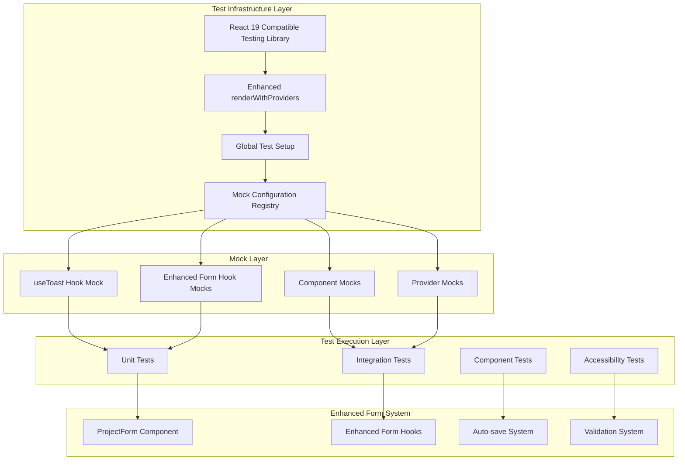
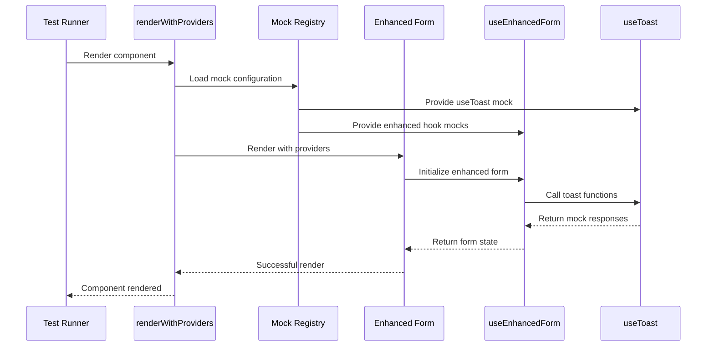

# Design Document

## Overview

This design addresses the critical test infrastructure failures affecting the enhanced form system. The solution involves a multi-layered approach to fix React 19 compatibility issues, correct hook mock configurations, and restore reliable test coverage for 70 currently failing tests.

The design prioritizes infrastructure stability while maintaining backward compatibility with existing working tests (22 enhanced loading tests, 19 toast tests, and 1 basic ProjectForm test).

## Architecture

### System Architecture Diagram



### Component Interaction Flow



## Components and Interfaces

### 1. React 19 Compatible Test Infrastructure

#### Enhanced renderWithProviders Function

```typescript
interface RenderWithProvidersOptions {
  initialState?: Partial<AppState>;
  providers?: React.ComponentType[];
  mockConfig?: MockConfiguration;
  reactVersion?: 'react18' | 'react19';
}

interface MockConfiguration {
  useToast?: boolean;
  useEnhancedForm?: boolean;
  localStorage?: boolean;
  timers?: boolean;
}

function renderWithProviders(
  ui: React.ReactElement,
  options?: RenderWithProvidersOptions
): RenderResult & {
  mockRegistry: MockRegistry;
  cleanup: () => void;
}
```

#### React 19 Error Handling Wrapper

```typescript
interface React19ErrorBoundary {
  onError: (error: AggregateError | Error) => void;
  fallback: React.ComponentType<{ error: Error }>;
  resetOnPropsChange?: boolean;
}

class TestErrorBoundary extends React.Component<React19ErrorBoundary> {
  // Handle React 19 AggregateError patterns
  // Provide detailed error reporting for test failures
  // Support error recovery and retry mechanisms
}
```

### 2. Hook Mock Configuration System

#### useToast Hook Mock Structure

```typescript
interface UseToastMock {
  useToast: jest.MockedFunction<() => UseToastReturn>;
  contextualToast: ContextualToastMethods;
}

interface UseToastReturn {
  toast: jest.MockedFunction<(options: ToastOptions) => void>;
  getToastsByCategory: jest.MockedFunction<(category: string) => Toast[]>;
  contextualToast: ContextualToastMethods;
  dismiss: jest.MockedFunction<(id: string) => void>;
  dismissAll: jest.MockedFunction<() => void>;
  clearQueue: jest.MockedFunction<() => void>;
  toasts: Toast[];
  queue: Toast[];
}

// Correct mock implementation
const useToastMock: UseToastMock = {
  useToast: jest.fn(() => ({
    toast: jest.fn(),
    getToastsByCategory: jest.fn(() => []),
    contextualToast: {
      success: jest.fn(),
      validationError: jest.fn(),
      authExpired: jest.fn(),
      networkError: jest.fn(),
      projectSaveFailed: jest.fn(),
      // ... all contextual methods
    },
    dismiss: jest.fn(),
    dismissAll: jest.fn(),
    clearQueue: jest.fn(),
    toasts: [],
    queue: [],
  })),
  contextualToast: {
    // Standalone contextual toast methods
  },
};
```

#### Enhanced Form Hook Mock Chain

```typescript
interface EnhancedFormMockChain {
  useEnhancedForm: jest.MockedFunction<() => EnhancedFormReturn>;
  useFormToast: jest.MockedFunction<() => FormToastReturn>;
  useAutoSave: jest.MockedFunction<() => AutoSaveReturn>;
  useRealTimeValidation: jest.MockedFunction<() => ValidationReturn>;
}

interface EnhancedFormReturn extends UseFormReturn {
  // Standard react-hook-form methods
  register: jest.MockedFunction<UseFormRegister>;
  handleSubmit: jest.MockedFunction<UseFormHandleSubmit>;
  formState: FormState;
  getFieldState: jest.MockedFunction<(name: string) => FieldState>;
  control: MockedControl;
  
  // Enhanced form methods
  validateField: jest.MockedFunction<(field: string, value: any) => Promise<void>>;
  getFieldValidation: jest.MockedFunction<(field: string) => ValidationState>;
  saveNow: jest.MockedFunction<() => Promise<void>>;
  isSaving: boolean;
  lastSaved?: Date;
  submitWithFeedback: jest.MockedFunction<() => Promise<void>>;
  focusFirstError: jest.MockedFunction<() => void>;
  announceFormState: jest.MockedFunction<(message: string) => void>;
}
```

### 3. Component Mock Registry

#### Enhanced Form Component Mocks

```typescript
interface ComponentMockRegistry {
  EnhancedInput: jest.MockedFunction<React.FC<EnhancedInputProps>>;
  EnhancedTextarea: jest.MockedFunction<React.FC<EnhancedTextareaProps>>;
  AutoSaveIndicator: jest.MockedFunction<React.FC<AutoSaveIndicatorProps>>;
  FormSubmissionProgress: jest.MockedFunction<React.FC<ProgressProps>>;
  EnhancedButton: jest.MockedFunction<React.FC<EnhancedButtonProps>>;
}

// Mock implementations that preserve test functionality
const componentMocks: ComponentMockRegistry = {
  EnhancedInput: jest.fn(({ children, ...props }) => (
    <input data-testid="enhanced-input" {...props} />
  )),
  EnhancedTextarea: jest.fn(({ children, ...props }) => (
    <textarea data-testid="enhanced-textarea" {...props} />
  )),
  AutoSaveIndicator: jest.fn((props) => (
    <div data-testid="auto-save-indicator" data-saving={props.isSaving}>
      {props.isSaving ? 'Saving...' : `Last saved: ${props.lastSaved}`}
    </div>
  )),
  FormSubmissionProgress: jest.fn((props) => (
    <div data-testid="form-submission-progress" data-progress={props.progress}>
      {props.currentStep}
    </div>
  )),
  EnhancedButton: jest.fn(({ children, ...props }) => (
    <button data-testid="enhanced-button" {...props}>
      {children}
    </button>
  )),
};
```

### 4. Test Environment Configuration

#### Jest Configuration Updates

```typescript
interface JestConfig {
  testEnvironment: 'jsdom';
  setupFilesAfterEnv: string[];
  moduleNameMapper: Record<string, string>;
  transform: Record<string, any>;
  transformIgnorePatterns: string[];
  testTimeout: number;
  maxWorkers: string;
  globals: {
    'ts-jest': {
      useESM: boolean;
    };
  };
}

// React 19 compatible configuration
const jestConfig: JestConfig = {
  testEnvironment: 'jsdom',
  setupFilesAfterEnv: ['<rootDir>/jest.setup.js'],
  moduleNameMapper: {
    '^@/(.*)$': '<rootDir>/src/$1',
  },
  transform: {
    '^.+\\.(js|jsx|ts|tsx)$': ['babel-jest', {
      presets: [
        ['@babel/preset-env', { targets: { node: 'current' } }],
        ['@babel/preset-react', { runtime: 'automatic' }],
        '@babel/preset-typescript'
      ]
    }]
  },
  transformIgnorePatterns: [
    'node_modules/(?!(.*\\.mjs$|@radix-ui|@testing-library|react-19-compat))'
  ],
  testTimeout: 15000,
  maxWorkers: '75%',
  globals: {
    'ts-jest': {
      useESM: true,
    },
  },
};
```

## Data Models

### Test State Management

```typescript
interface TestState {
  mockRegistry: MockRegistry;
  componentRegistry: ComponentRegistry;
  providerStack: ProviderConfiguration[];
  errorBoundary: ErrorBoundaryState;
  cleanup: CleanupFunction[];
}

interface MockRegistry {
  hooks: Map<string, jest.MockedFunction<any>>;
  components: Map<string, jest.MockedFunction<React.FC<any>>>;
  providers: Map<string, jest.MockedFunction<React.FC<any>>>;
  utilities: Map<string, jest.MockedFunction<any>>;
}

interface ErrorBoundaryState {
  hasError: boolean;
  error?: Error | AggregateError;
  errorInfo?: React.ErrorInfo;
  retryCount: number;
  maxRetries: number;
}
```

### Mock Configuration Schema

```typescript
interface MockConfigurationSchema {
  version: string;
  react: {
    version: '19.1.0';
    compatibility: 'strict' | 'loose';
    errorHandling: 'aggregate' | 'individual';
  };
  hooks: {
    useToast: UseToastMockConfig;
    useEnhancedForm: EnhancedFormMockConfig;
    useAutoSave: AutoSaveMockConfig;
    useRealTimeValidation: ValidationMockConfig;
  };
  components: {
    enhanced: ComponentMockConfig[];
    ui: ComponentMockConfig[];
  };
  providers: {
    toast: ProviderMockConfig;
    form: ProviderMockConfig;
    theme: ProviderMockConfig;
  };
}
```

## Error Handling

### React 19 AggregateError Management

```typescript
class React19ErrorHandler {
  static handleAggregateError(error: AggregateError): TestErrorReport {
    const individualErrors = error.errors;
    const categorizedErrors = this.categorizeErrors(individualErrors);
    
    return {
      type: 'AggregateError',
      totalErrors: individualErrors.length,
      categories: categorizedErrors,
      suggestions: this.generateSuggestions(categorizedErrors),
      recoverable: this.isRecoverable(categorizedErrors),
    };
  }
  
  static categorizeErrors(errors: Error[]): ErrorCategory[] {
    return errors.map(error => ({
      type: this.getErrorType(error),
      message: error.message,
      stack: error.stack,
      component: this.extractComponent(error),
      hook: this.extractHook(error),
    }));
  }
}
```

### Mock Validation and Debugging

```typescript
interface MockValidator {
  validateHookMock(hookName: string, mock: any): ValidationResult;
  validateComponentMock(componentName: string, mock: any): ValidationResult;
  generateMockReport(): MockReport;
  suggestFixes(failures: ValidationFailure[]): FixSuggestion[];
}

interface ValidationResult {
  isValid: boolean;
  errors: ValidationError[];
  warnings: ValidationWarning[];
  suggestions: string[];
}

class MockDebugger {
  static diagnoseHookFailure(hookName: string, error: Error): DiagnosisReport {
    // Analyze hook mock structure
    // Compare with actual implementation
    // Provide specific fix recommendations
  }
  
  static generateMockDiff(expected: any, actual: any): MockDiff {
    // Generate detailed diff of mock vs implementation
    // Highlight missing methods and properties
    // Suggest corrections
  }
}
```

## Testing Strategy

### Test Execution Phases

#### Phase 1: Infrastructure Validation
```typescript
describe('Test Infrastructure', () => {
  it('should handle React 19 rendering without AggregateError', () => {
    // Test basic React 19 compatibility
    // Validate renderWithProviders function
    // Ensure error boundary works correctly
  });
  
  it('should provide correct hook mocks', () => {
    // Validate useToast mock structure
    // Test enhanced form hook chain
    // Verify component mock functionality
  });
});
```

#### Phase 2: Enhanced Form System Validation
```typescript
describe('Enhanced Form System', () => {
  it('should render ProjectForm without errors', () => {
    // Test basic ProjectForm rendering
    // Validate enhanced form hook integration
    // Ensure no mock-related failures
  });
  
  it('should support all enhanced form features', () => {
    // Test real-time validation
    // Test auto-save functionality
    // Test accessibility features
  });
});
```

#### Phase 3: Integration Testing
```typescript
describe('Enhanced Form Integration', () => {
  it('should complete full form lifecycle', () => {
    // Test complete user workflow
    // Validate all enhanced features together
    // Ensure performance requirements met
  });
});
```

### Performance Requirements

```typescript
interface PerformanceTargets {
  testSuiteExecution: {
    total: '< 30 seconds';
    individual: '< 500ms per test';
    setup: '< 2 seconds';
    teardown: '< 1 second';
  };
  memoryUsage: {
    peak: '< 512MB';
    average: '< 256MB';
    leaks: 'none detected';
  };
  reliability: {
    passRate: '> 95%';
    flakiness: '< 1%';
    consistency: '100% across runs';
  };
}
```

## Implementation Phases

### Phase 1: React 19 Infrastructure Fix
**Duration**: 1-2 days
**Priority**: CRITICAL

**Tasks**:
1. Update @testing-library/react to React 19 compatible version
2. Enhance renderWithProviders for React 19 error handling
3. Implement React19ErrorBoundary component
4. Update Jest configuration for React 19 compatibility
5. Validate with simple component tests

**Success Criteria**:
- No AggregateError exceptions during component rendering
- Enhanced loading tests continue to pass (22/22)
- Basic ProjectForm test continues to pass (1/43)

### Phase 2: Hook Mock Configuration Fix
**Duration**: 1 day
**Priority**: HIGH

**Tasks**:
1. Implement correct useToast hook mock structure
2. Create enhanced form hook mock chain
3. Add localStorage and timer mocks for auto-save
4. Implement mock validation and debugging tools
5. Test enhanced form component rendering

**Success Criteria**:
- No "useToast is not a function" errors
- Enhanced form components render successfully
- All hook dependencies properly mocked

### Phase 3: Enhanced Form Test Restoration
**Duration**: 1 day
**Priority**: HIGH

**Tasks**:
1. Restore ProjectForm unit tests (42 tests)
2. Restore enhanced form integration tests (18 tests)
3. Validate all enhanced form features
4. Fix component-specific test issues
5. Achieve >95% pass rate for enhanced form tests

**Success Criteria**:
- ProjectForm tests: 41+ passing out of 43
- Integration tests: 18+ passing out of 18
- All enhanced form features validated

### Phase 4: Component Test Fixes and Optimization
**Duration**: 1 day
**Priority**: MEDIUM

**Tasks**:
1. Fix toast component test issues (10 failing tests)
2. Resolve multiple element role conflicts
3. Add missing test data attributes
4. Optimize test performance and reliability
5. Create comprehensive test documentation

**Success Criteria**:
- Toast tests: 27+ passing out of 29
- Overall test suite: >90% pass rate
- Test execution time: <30 seconds
- Comprehensive documentation available

## Deployment Strategy

### Gradual Rollout Plan

1. **Development Environment**: Deploy and validate all fixes
2. **CI/CD Pipeline**: Update automated testing infrastructure
3. **Staging Environment**: Run comprehensive test validation
4. **Production Deployment**: Enable enhanced form features with full test coverage

### Rollback Plan

1. **Infrastructure Issues**: Revert to previous @testing-library/react version
2. **Mock Problems**: Disable enhanced form mocks, use simple alternatives
3. **Performance Issues**: Reduce test parallelization, increase timeouts
4. **Complete Failure**: Disable enhanced form features, maintain basic functionality

### Monitoring and Validation

```typescript
interface TestHealthMetrics {
  passRate: number;
  executionTime: number;
  memoryUsage: number;
  flakiness: number;
  coverage: number;
}

interface TestHealthMonitor {
  collectMetrics(): TestHealthMetrics;
  validateThresholds(metrics: TestHealthMetrics): ValidationResult;
  generateAlerts(issues: ValidationIssue[]): Alert[];
  createHealthReport(): HealthReport;
}
```

This design provides a comprehensive solution to restore test infrastructure reliability while maintaining backward compatibility and enabling full validation of the enhanced form system.