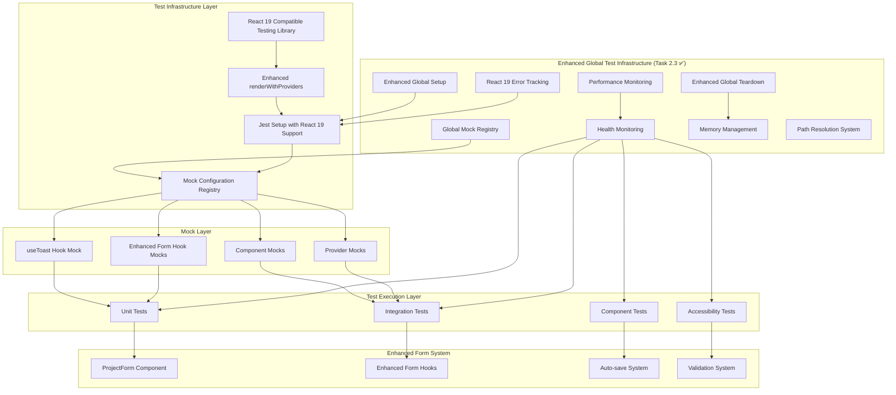
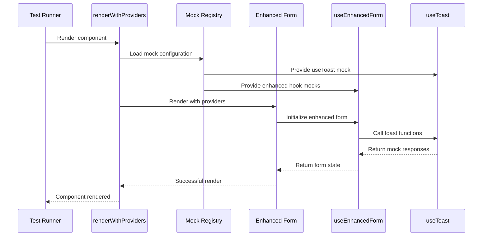

# Design Document

## Overview

This design addresses the critical test infrastructure failures affecting the enhanced form system, with a primary focus on resolving ESLint/Prettier configuration issues that are blocking automated code quality improvements and development workflow.

The solution involves a multi-layered approach:
1. **Phase 0**: Fix ESLint/Prettier configuration blocking issues (15,453 total issues, 0 auto-fixes applied)
2. **Phase 1**: Apply automated code quality fixes (1,654+ auto-fixable issues)
3. **Phase 2**: Fix React 19 compatibility issues and hook mock configurations
4. **Phase 3**: Restore reliable test coverage for 70 currently failing tests

The design prioritizes configuration fixes first to enable automated tooling, then infrastructure stability while maintaining backward compatibility with existing working tests (22 enhanced loading tests, 19 toast tests, and 1 basic ProjectForm test).

### Critical Blocking Issues Identified

**ESLint/Prettier Configuration Problems**:
- Prettier fails to parse `pnpm-lock.yaml` (24,000+ lines) preventing all automated formatting
- Jest globals not configured causing 8,500+ `no-undef` errors in test files
- Dependency classification issues with testing libraries in wrong dependency categories
- 1,654 auto-fixable issues blocked by configuration problems

**Code Quality Issues**:
- 13,616 errors and 1,837 warnings across 500+ files
- Error density: 27.2 errors per 100 lines of code
- Most problematic files in testing infrastructure with 150+ issues each

**Detailed Issue Breakdown**:
- **Jest/Testing Framework Issues**: 8,500+ occurrences of undefined Jest globals
- **Import/Export Issues**: 2,000+ occurrences of dependency and import order problems
- **TypeScript Configuration Issues**: 1,500+ occurrences of require() vs import and type safety
- **Code Quality Issues**: 1,000+ occurrences of console statements, unused variables, complexity
- **React/JSX Issues**: 500+ occurrences of component best practices violations

**Most Problematic Files**:
1. `src/lib/testing/test-utils.tsx` - 150+ issues
2. `src/lib/testing/test-health-monitor.ts` - 100+ issues  
3. `src/lib/testing/MockDebugger.ts` - 80+ issues
4. `src/lib/testing/ComponentMockRegistry.ts` - 75+ issues
5. `test_frontend_performance_monitor.js` - 70+ issues

## ESLint/Prettier Infrastructure Design

### Code Quality Pipeline Architecture

```mermaid
graph TB
    subgraph "Phase 0: Configuration Fixes"
        A[Fix Prettier Configuration]
        B[Configure Jest Globals]
        C[Fix Dependency Classifications]
    end
    
    subgraph "Phase 1: Automated Fixes"
        D[Apply ESLint Auto-fixes]
        E[Convert require() to import]
        F[Implement Nullish Coalescing]
        G[Clean Up Unused Variables]
        H[Remove Console Statements]
        I[Fix React Best Practices]
    end
    
    subgraph "Phase 2: Type Safety & Quality"
        J[Improve TypeScript Types]
        K[Reduce Code Complexity]
        L[Fix Class Method Usage]
        M[Standardize Import Patterns]
    end
    
    subgraph "Validation & Monitoring"
        N[ESLint Health Check]
        O[Code Quality Metrics]
        P[Performance Impact Analysis]
    end
    
    A --> D
    B --> D
    C --> D
    D --> E
    E --> F
    F --> G
    G --> H
    H --> I
    I --> J
    J --> K
    K --> L
    L --> M
    M --> N
    N --> O
    O --> P
```

### ESLint Configuration Strategy

```typescript
interface ESLintConfigurationStrategy {
  phase0: {
    prettierIgnore: string[];
    jestGlobals: JestGlobalConfig;
    dependencyClassification: DependencyConfig;
  };
  phase1: {
    autoFixableRules: string[];
    requireToImportConversion: ConversionConfig;
    nullishCoalescingRules: CoalescingConfig;
  };
  phase2: {
    typeScriptRules: TypeScriptConfig;
    complexityThresholds: ComplexityConfig;
    importOrderRules: ImportConfig;
  };
}

interface JestGlobalConfig {
  testFilePatterns: string[];
  globals: string[];
  disabledRules: Record<string, string>;
}

interface ConversionConfig {
  targetFiles: string[];
  conversionPatterns: ConversionPattern[];
  excludePatterns: string[];
}
```

### Code Quality Metrics Tracking

```typescript
interface CodeQualityMetrics {
  before: {
    totalIssues: 15453;
    errors: 13616;
    warnings: 1837;
    autoFixable: 1654;
    errorDensity: 27.2; // per 100 lines
  };
  targets: {
    totalIssues: number; // < 5000
    errors: number; // < 2000
    warnings: number; // < 1000
    autoFixable: number; // 0
    errorDensity: number; // < 5.0
  };
  tracking: {
    jestGlobalErrors: number; // 8500+ -> 0
    importExportIssues: number; // 2000+ -> <500
    typeScriptIssues: number; // 1500+ -> <300
    codeQualityIssues: number; // 1000+ -> <200
    reactJsxIssues: number; // 500+ -> <100
  };
}
```

## Architecture

### System Architecture Diagram



### Component Interaction Flow



## Components and Interfaces

### 0. ESLint/Prettier Configuration System (Phase 0)

#### Prettier Configuration Enhancement

```typescript
interface PrettierConfiguration {
  ignorePatterns: string[];
  formatSettings: PrettierSettings;
  crossPlatformSupport: boolean;
}

interface PrettierSettings {
  semi: boolean;
  trailingComma: 'es5' | 'all' | 'none';
  singleQuote: boolean;
  printWidth: number;
  tabWidth: number;
  useTabs: boolean;
}

// Enhanced .prettierignore configuration
const prettierIgnorePatterns = [
  'pnpm-lock.yaml',
  '*.min.js',
  '*.min.css',
  'coverage/',
  'dist/',
  'build/',
  '.next/',
  'node_modules/',
  '*.d.ts',
  'public/static/',
];
```

#### ESLint Configuration Enhancement

```typescript
interface ESLintConfiguration {
  testFileConfiguration: TestFileConfig;
  nodeFileConfiguration: NodeFileConfig;
  globalConfiguration: GlobalConfig;
  ruleOverrides: RuleOverrides;
}

interface TestFileConfig {
  files: string[];
  languageOptions: {
    globals: Record<string, 'readonly' | 'writable'>;
  };
  rules: Record<string, 'off' | 'warn' | 'error'>;
}

// Enhanced ESLint configuration for Jest
const jestConfiguration: TestFileConfig = {
  files: [
    '**/*.test.{js,ts,tsx}',
    '**/__tests__/**/*',
    '**/test-*.js',
    '**/*.spec.{js,ts,tsx}'
  ],
  languageOptions: {
    globals: {
      jest: 'readonly',
      describe: 'readonly',
      it: 'readonly',
      test: 'readonly',
      expect: 'readonly',
      beforeEach: 'readonly',
      afterEach: 'readonly',
      beforeAll: 'readonly',
      afterAll: 'readonly',
      vi: 'readonly', // Vitest support
      global: 'readonly'
    }
  },
  rules: {
    'no-console': 'off',
    '@typescript-eslint/no-explicit-any': 'warn',
    'no-unused-vars': 'off',
    '@typescript-eslint/no-unused-vars': ['warn', { argsIgnorePattern: '^_' }]
  }
};

// Node.js configuration files
const nodeConfiguration: NodeFileConfig = {
  files: [
    '**/*.config.{js,ts}',
    '**/scripts/**/*',
    '**/jest.setup.js',
    '**/global-setup.js',
    '**/global-teardown.js'
  ],
  languageOptions: {
    globals: {
      ...globals.node,
      process: 'readonly',
      Buffer: 'readonly',
      __dirname: 'readonly',
      __filename: 'readonly',
      module: 'readonly',
      require: 'readonly'
    }
  }
};
```

#### Dependency Classification System

```typescript
interface DependencyClassificationSystem {
  productionDependencies: string[];
  developmentDependencies: string[];
  peerDependencies: string[];
  reclassificationRules: ReclassificationRule[];
}

interface ReclassificationRule {
  package: string;
  from: 'devDependencies' | 'dependencies';
  to: 'devDependencies' | 'dependencies';
  reason: string;
}

// Critical dependency reclassifications
const dependencyReclassifications: ReclassificationRule[] = [
  {
    package: '@testing-library/react',
    from: 'devDependencies',
    to: 'dependencies',
    reason: 'Required for runtime test utilities and component testing'
  },
  {
    package: 'web-vitals',
    from: 'devDependencies', 
    to: 'dependencies',
    reason: 'Used in production for performance monitoring'
  }
];
```

### 1. Enhanced Global Test Setup and Teardown System (Task 2.3 ✅)

**COMPLETED**: Cross-platform path resolution system implemented to fix `<rootDir>` placeholder issues on Windows systems. Jest health reporter now uses proper Node.js `path.resolve()` for robust path handling across different operating systems.

#### Global Test Setup (`global-setup.js`)

```typescript
interface GlobalSetupConfiguration {
  react19Features: React19FeatureFlags;
  performanceTracking: PerformanceTrackingConfig;
  memoryMonitoring: MemoryMonitoringConfig;
  errorTracking: ErrorTrackingConfig;
  healthMonitoring: HealthMonitoringConfig;
}

interface React19FeatureFlags {
  concurrentFeatures: boolean;
  automaticBatching: boolean;
  suspenseSSR: boolean;
  strictMode: boolean;
  errorBoundaryEnhancements: boolean;
  aggregateErrorSupport: boolean;
}

interface PerformanceTrackingConfig {
  setupTimeTracking: boolean;
  memoryBaseline: boolean;
  phaseMarking: boolean;
  performanceReporting: boolean;
}

// Enhanced global setup implementation
async function enhancedGlobalSetup(): Promise<void> {
  // React 19 environment setup
  process.env.REACT_VERSION = '19.1.0';
  process.env.REACT_19_FEATURES = 'true';
  process.env.REACT_CONCURRENT_FEATURES = 'true';
  
  // Performance and memory tracking
  global.__SETUP_PERFORMANCE = createPerformanceTracker();
  global.__SETUP_MEMORY_BASELINE = captureMemoryBaseline();
  
  // Error tracking system
  global.__GLOBAL_ERROR_TRACKER = createErrorTracker();
  
  // Test directory management
  await createTestDirectories();
  
  // Health monitoring initialization
  await initializeHealthMonitoring();
  
  // Cross-platform path resolution setup
  await setupPathResolution();
}

// Cross-platform path resolution system
interface PathResolutionConfig {
  testReportsDir: string;
  healthDataDir: string;
  cacheDir: string;
  coverageDir: string;
}

async function setupPathResolution(): Promise<void> {
  const pathConfig: PathResolutionConfig = {
    testReportsDir: path.resolve(process.cwd(), 'test-reports'),
    healthDataDir: path.resolve(process.cwd(), 'test-health-data'),
    cacheDir: path.resolve(process.cwd(), '.jest-cache'),
    coverageDir: path.resolve(process.cwd(), 'coverage')
  };
  
  // Create directories with proper cross-platform paths
  await Promise.all([
    fs.mkdir(pathConfig.testReportsDir, { recursive: true }),
    fs.mkdir(pathConfig.healthDataDir, { recursive: true }),
    fs.mkdir(pathConfig.cacheDir, { recursive: true }),
    fs.mkdir(pathConfig.coverageDir, { recursive: true })
  ]);
  
  // Store resolved paths globally for use by reporters
  global.__TEST_PATH_CONFIG = pathConfig;
}
```

#### Global Test Teardown (`global-teardown.js`)

```typescript
interface GlobalTeardownReport {
  teardownTime: number;
  finalMemoryUsage: MemoryUsage;
  memoryDelta: MemoryDelta;
  errorSummary: ErrorSummary;
  performanceMetrics: PerformanceMetrics;
  cleanupSummary: CleanupSummary;
}

interface MemoryUsage {
  heapUsed: number;
  heapTotal: number;
  external: number;
  rss: number;
  timestamp: number;
}

interface ErrorSummary {
  setup: number;
  aggregate: number;
  hook: number;
  render: number;
  total: number;
}

// Enhanced global teardown implementation
async function enhancedGlobalTeardown(): Promise<GlobalTeardownReport> {
  const teardownStartTime = performance.now();
  
  // Cleanup enhanced mock system
  await cleanupMockSystem();
  
  // Generate memory usage report
  const memoryReport = generateMemoryReport();
  
  // Cleanup error tracking
  const errorSummary = cleanupErrorTracking();
  
  // Generate final report
  const report = generateTeardownReport({
    teardownTime: performance.now() - teardownStartTime,
    memoryReport,
    errorSummary
  });
  
  // Save report for analysis
  await saveTeardownReport(report);
  
  return report;
}
```

#### Enhanced Jest Setup (`jest.setup.js`)

```typescript
interface React19ErrorTracker {
  aggregateErrors: AggregateErrorEntry[];
  hookErrors: HookErrorEntry[];
  renderErrors: RenderErrorEntry[];
  clear: () => void;
}

interface GlobalMockRegistry {
  hooks: Map<string, jest.MockedFunction<any>>;
  components: Map<string, jest.MockedFunction<React.FC<any>>>;
  providers: Map<string, jest.MockedFunction<React.FC<any>>>;
  utilities: Map<string, jest.MockedFunction<any>>;
  register: (type: string, name: string, mock: any) => void;
  clearAll: () => void;
  getSummary: () => MockRegistrySummary;
}

interface EnhancedCleanupFunction {
  (): void;
}

// React 19 compatibility setup
global.__REACT_VERSION = '19.1.0';
global.__REACT_19_FEATURES = {
  concurrentFeatures: true,
  automaticBatching: true,
  suspenseSSR: true,
  strictMode: true,
  errorBoundaryEnhancements: true,
  aggregateErrorSupport: true
};

// Enhanced error tracking
global.__REACT_19_ERROR_TRACKER = {
  aggregateErrors: [],
  hookErrors: [],
  renderErrors: [],
  clear: function() {
    this.aggregateErrors = [];
    this.hookErrors = [];
    this.renderErrors = [];
  }
};

// Global mock registry
global.__GLOBAL_MOCK_REGISTRY = {
  hooks: new Map(),
  components: new Map(),
  providers: new Map(),
  utilities: new Map(),
  register: function(type, name, mock) {
    if (this[type] && this[type].set) {
      this[type].set(name, mock);
    }
  },
  clearAll: function() {
    this.hooks.clear();
    this.components.clear();
    this.providers.clear();
    this.utilities.clear();
  },
  getSummary: function() {
    return {
      hooks: this.hooks.size,
      components: this.components.size,
      providers: this.providers.size,
      utilities: this.utilities.size
    };
  }
};

#### Jest Health Reporter Path Resolution (Task 2.3 Enhancement)

```typescript
interface JestHealthReporterConfig {
  outputDir: string;
  failOnHealthIssues: boolean;
  crossPlatformPaths: boolean;
}

class JestHealthReporter {
  constructor(globalConfig: Config.GlobalConfig, options: JestHealthReporterConfig) {
    // Enhanced cross-platform path resolution
    this.reportsDir = this.resolveOutputDirectory(
      options.outputDir || 'test-reports',
      globalConfig.rootDir || process.cwd()
    );
  }
  
  private resolveOutputDirectory(outputDir: string, rootDir: string): string {
    // Use Node.js path.resolve for robust cross-platform compatibility
    if (!path.isAbsolute(outputDir)) {
      return path.resolve(rootDir, outputDir);
    }
    return outputDir;
  }
  
  // Prevents creation of invalid <rootDir> literal directories
  // Ensures consistent path resolution across Windows and Unix systems
  // Maintains Jest's <rootDir> placeholder functionality
}
```

**Key Improvements**:
- **Cross-Platform Compatibility**: Uses `path.resolve()` instead of string replacement
- **Windows Support**: Eliminates invalid nested paths like `project/<rootDir>/test-reports/`
- **Robust Error Handling**: Graceful fallback for path resolution failures
- **Jest Integration**: Maintains compatibility with Jest's built-in `<rootDir>` system

// Enhanced cleanup function
global.__ENHANCED_CLEANUP = function() {
  // Clear React 19 error tracking
  if (global.__REACT_19_ERROR_TRACKER) {
    global.__REACT_19_ERROR_TRACKER.clear();
  }
  
  // Clear all Jest mocks
  jest.clearAllMocks();
  jest.restoreAllMocks();
  
  // Clear global mock registry
  global.__GLOBAL_MOCK_REGISTRY.clearAll();
  
  // Clear storage mocks
  if (global.localStorage && typeof global.localStorage.clear === 'function') {
    global.localStorage.clear();
  }
  
  // Clear timers if mocked
  if (jest.isMockFunction(setTimeout)) {
    jest.useRealTimers();
  }
  
  // Force garbage collection
  if (global.gc) {
    global.gc();
  }
};
```

### 2. Database Testing Infrastructure (F2.3)

#### Isolated Database Test Fixtures

```python
# Test-specific database configuration
@pytest_asyncio.fixture(scope="function")
async def test_db_session():
    engine = create_async_engine(
        "sqlite+aiosqlite:///:memory:",
        poolclass=StaticPool,
        connect_args={"check_same_thread": False}
    )
    async with engine.begin() as conn:
        await conn.run_sync(Base.metadata.create_all)
    async_session = async_sessionmaker(engine, expire_on_commit=False)
    async with async_session() as session:
        yield session
    await engine.dispose()
```

#### Database Manager Bypass Strategy

```python
interface TestDatabaseConfig {
  bypassGlobalManager: boolean;
  useInMemoryDatabase: boolean;
  isolateTestSessions: boolean;
  enableAsyncSupport: boolean;
}

class TestDatabaseManager {
  static createIsolatedSession(): AsyncSession {
    // Create isolated database session for testing
    // Bypass global DatabaseManager to prevent conflicts
    // Use StaticPool for proper async connection handling
  }
}
```

### 3. React 19 Compatible Test Infrastructure

#### Enhanced renderWithProviders Function

```typescript
interface RenderWithProvidersOptions {
  initialState?: Partial<AppState>;
  providers?: React.ComponentType[];
  mockConfig?: MockConfiguration;
  reactVersion?: 'react18' | 'react19';
}

interface MockConfiguration {
  useToast?: boolean;
  useEnhancedForm?: boolean;
  localStorage?: boolean;
  timers?: boolean;
}

function renderWithProviders(
  ui: React.ReactElement,
  options?: RenderWithProvidersOptions
): RenderResult & {
  mockRegistry: MockRegistry;
  cleanup: () => void;
}
```

#### React 19 Error Handling Wrapper (Enhanced with Task 2.3)

```typescript
interface React19ErrorBoundaryProps {
  children: ReactNode;
  onError?: (error: Error | AggregateError, errorInfo: ErrorInfo, report: TestErrorReport) => void;
  fallback?: React.ComponentType<{
    error: Error | AggregateError;
    errorReport: TestErrorReport;
    retry: () => void;
    canRetry: boolean;
  }>;
  resetOnPropsChange?: boolean;
  maxRetries?: number;
  debugMode?: boolean;
  testName?: string;
  componentName?: string;
}

interface TestErrorReport {
  type: 'AggregateError' | 'Error' | 'TypeError' | 'ReferenceError';
  totalErrors?: number;
  categories?: ErrorCategory[];
  suggestions?: string[];
  recoverable: boolean;
  timestamp: number;
  componentStack?: string;
  errorBoundary: string;
}

interface ErrorCategory {
  type: string;
  message: string;
  stack?: string;
  component?: string;
  hook?: string;
  severity: 'low' | 'medium' | 'high' | 'critical';
  source: 'react' | 'hook' | 'component' | 'provider' | 'unknown';
}

class React19ErrorBoundary extends React.Component<React19ErrorBoundaryProps, ErrorBoundaryState> {
  // Enhanced React 19 AggregateError handling
  // Detailed error categorization and reporting
  // Automatic error recovery and retry mechanisms
  // Integration with global error tracking system
  
  componentDidCatch(error: Error | AggregateError, errorInfo: ErrorInfo) {
    const context = {
      testName: this.props.testName,
      componentName: this.props.componentName || 'React19ErrorBoundary',
    };

    // Generate comprehensive error report
    const errorReport = error instanceof AggregateError
      ? React19ErrorHandler.handleAggregateError(error, errorInfo, context)
      : React19ErrorHandler.handleStandardError(error, errorInfo, context);

    // Track in global error system
    if (global.__REACT_19_ERROR_TRACKER) {
      if (error instanceof AggregateError) {
        global.__REACT_19_ERROR_TRACKER.aggregateErrors.push({
          message: error.message,
          errors: error.errors?.map(e => e.message) || [],
          timestamp: Date.now(),
          source: 'errorBoundary'
        });
      }
    }

    // Call custom error handler
    this.props.onError?.(error, errorInfo, errorReport);
  }
}

class React19ErrorHandler {
  static handleAggregateError(
    error: AggregateError,
    errorInfo?: ErrorInfo,
    context?: { testName?: string; componentName?: string }
  ): TestErrorReport {
    const individualErrors = error.errors || [];
    const categorizedErrors = this.categorizeErrors(individualErrors, errorInfo);

    return {
      type: 'AggregateError',
      totalErrors: individualErrors.length,
      categories: categorizedErrors,
      suggestions: this.generateSuggestions(categorizedErrors),
      recoverable: this.isRecoverable(categorizedErrors),
      timestamp: Date.now(),
      componentStack: errorInfo?.componentStack,
      errorBoundary: context?.componentName || 'React19ErrorBoundary',
    };
  }
  
  static categorizeErrors(errors: Error[], errorInfo?: ErrorInfo): ErrorCategory[] {
    return errors.map(error => ({
      type: this.getErrorType(error),
      message: error.message,
      stack: error.stack,
      component: this.extractComponent(error, errorInfo),
      hook: this.extractHook(error),
      severity: this.getErrorSeverity(error),
      source: this.getErrorSource(error, errorInfo),
    }));
  }
  
  static generateSuggestions(categories: ErrorCategory[]): string[] {
    const suggestions: string[] = [];
    
    categories.forEach(category => {
      switch (category.type) {
        case 'HookMockError':
          suggestions.push('Check hook mock configuration in test setup');
          suggestions.push('Ensure all required hook methods are properly mocked');
          break;
        case 'RenderError':
          suggestions.push('Verify component props are correctly provided');
          suggestions.push('Check provider setup in renderWithProviders');
          break;
        case 'ProviderError':
          suggestions.push('Ensure all required providers are included in test wrapper');
          suggestions.push('Check provider order and nesting structure');
          break;
      }
    });
    
    return [...new Set(suggestions)]; // Remove duplicates
  }
}
```

### 2. Hook Mock Configuration System

#### useToast Hook Mock Structure

```typescript
interface UseToastMock {
  useToast: jest.MockedFunction<() => UseToastReturn>;
  contextualToast: ContextualToastMethods;
}

interface UseToastReturn {
  toast: jest.MockedFunction<(options: ToastOptions) => void>;
  getToastsByCategory: jest.MockedFunction<(category: string) => Toast[]>;
  contextualToast: ContextualToastMethods;
  dismiss: jest.MockedFunction<(id: string) => void>;
  dismissAll: jest.MockedFunction<() => void>;
  clearQueue: jest.MockedFunction<() => void>;
  toasts: Toast[];
  queue: Toast[];
}

// Correct mock implementation
const useToastMock: UseToastMock = {
  useToast: jest.fn(() => ({
    toast: jest.fn(),
    getToastsByCategory: jest.fn(() => []),
    contextualToast: {
      success: jest.fn(),
      validationError: jest.fn(),
      authExpired: jest.fn(),
      networkError: jest.fn(),
      projectSaveFailed: jest.fn(),
      // ... all contextual methods
    },
    dismiss: jest.fn(),
    dismissAll: jest.fn(),
    clearQueue: jest.fn(),
    toasts: [],
    queue: [],
  })),
  contextualToast: {
    // Standalone contextual toast methods
  },
};
```

#### Enhanced Form Hook Mock Chain

```typescript
interface EnhancedFormMockChain {
  useEnhancedForm: jest.MockedFunction<() => EnhancedFormReturn>;
  useFormToast: jest.MockedFunction<() => FormToastReturn>;
  useAutoSave: jest.MockedFunction<() => AutoSaveReturn>;
  useRealTimeValidation: jest.MockedFunction<() => ValidationReturn>;
}

interface EnhancedFormReturn extends UseFormReturn {
  // Standard react-hook-form methods
  register: jest.MockedFunction<UseFormRegister>;
  handleSubmit: jest.MockedFunction<UseFormHandleSubmit>;
  formState: FormState;
  getFieldState: jest.MockedFunction<(name: string) => FieldState>;
  control: MockedControl;
  
  // Enhanced form methods
  validateField: jest.MockedFunction<(field: string, value: any) => Promise<void>>;
  getFieldValidation: jest.MockedFunction<(field: string) => ValidationState>;
  saveNow: jest.MockedFunction<() => Promise<void>>;
  isSaving: boolean;
  lastSaved?: Date;
  submitWithFeedback: jest.MockedFunction<() => Promise<void>>;
  focusFirstError: jest.MockedFunction<() => void>;
  announceFormState: jest.MockedFunction<(message: string) => void>;
}
```

### 3. Component Mock Registry

#### Enhanced Form Component Mocks

```typescript
interface ComponentMockRegistry {
  EnhancedInput: jest.MockedFunction<React.FC<EnhancedInputProps>>;
  EnhancedTextarea: jest.MockedFunction<React.FC<EnhancedTextareaProps>>;
  AutoSaveIndicator: jest.MockedFunction<React.FC<AutoSaveIndicatorProps>>;
  FormSubmissionProgress: jest.MockedFunction<React.FC<ProgressProps>>;
  EnhancedButton: jest.MockedFunction<React.FC<EnhancedButtonProps>>;
}

// Mock implementations that preserve test functionality
const componentMocks: ComponentMockRegistry = {
  EnhancedInput: jest.fn(({ children, ...props }) => (
    <input data-testid="enhanced-input" {...props} />
  )),
  EnhancedTextarea: jest.fn(({ children, ...props }) => (
    <textarea data-testid="enhanced-textarea" {...props} />
  )),
  AutoSaveIndicator: jest.fn((props) => (
    <div data-testid="auto-save-indicator" data-saving={props.isSaving}>
      {props.isSaving ? 'Saving...' : `Last saved: ${props.lastSaved}`}
    </div>
  )),
  FormSubmissionProgress: jest.fn((props) => (
    <div data-testid="form-submission-progress" data-progress={props.progress}>
      {props.currentStep}
    </div>
  )),
  EnhancedButton: jest.fn(({ children, ...props }) => (
    <button data-testid="enhanced-button" {...props}>
      {children}
    </button>
  )),
};
```

### 4. Test Environment Configuration

#### Jest Configuration Updates

```typescript
interface JestConfig {
  testEnvironment: 'jsdom';
  setupFilesAfterEnv: string[];
  moduleNameMapper: Record<string, string>;
  transform: Record<string, any>;
  transformIgnorePatterns: string[];
  testTimeout: number;
  maxWorkers: string;
  globals: {
    'ts-jest': {
      useESM: boolean;
    };
  };
}

// React 19 compatible configuration
const jestConfig: JestConfig = {
  testEnvironment: 'jsdom',
  setupFilesAfterEnv: ['<rootDir>/jest.setup.js'],
  moduleNameMapper: {
    '^@/(.*)$': '<rootDir>/src/$1',
  },
  transform: {
    '^.+\\.(js|jsx|ts|tsx)$': ['babel-jest', {
      presets: [
        ['@babel/preset-env', { targets: { node: 'current' } }],
        ['@babel/preset-react', { runtime: 'automatic' }],
        '@babel/preset-typescript'
      ]
    }]
  },
  transformIgnorePatterns: [
    'node_modules/(?!(.*\\.mjs$|@radix-ui|@testing-library|react-19-compat))'
  ],
  testTimeout: 15000,
  maxWorkers: '75%',
  globals: {
    'ts-jest': {
      useESM: true,
    },
  },
};
```

## Data Models

### Test State Management

```typescript
interface TestState {
  mockRegistry: MockRegistry;
  componentRegistry: ComponentRegistry;
  providerStack: ProviderConfiguration[];
  errorBoundary: ErrorBoundaryState;
  cleanup: CleanupFunction[];
}

interface MockRegistry {
  hooks: Map<string, jest.MockedFunction<any>>;
  components: Map<string, jest.MockedFunction<React.FC<any>>>;
  providers: Map<string, jest.MockedFunction<React.FC<any>>>;
  utilities: Map<string, jest.MockedFunction<any>>;
}

interface ErrorBoundaryState {
  hasError: boolean;
  error?: Error | AggregateError;
  errorInfo?: React.ErrorInfo;
  retryCount: number;
  maxRetries: number;
}
```

### Mock Configuration Schema

```typescript
interface MockConfigurationSchema {
  version: string;
  react: {
    version: '19.1.0';
    compatibility: 'strict' | 'loose';
    errorHandling: 'aggregate' | 'individual';
  };
  hooks: {
    useToast: UseToastMockConfig;
    useEnhancedForm: EnhancedFormMockConfig;
    useAutoSave: AutoSaveMockConfig;
    useRealTimeValidation: ValidationMockConfig;
  };
  components: {
    enhanced: ComponentMockConfig[];
    ui: ComponentMockConfig[];
  };
  providers: {
    toast: ProviderMockConfig;
    form: ProviderMockConfig;
    theme: ProviderMockConfig;
  };
}
```

## Error Handling

### React 19 AggregateError Management

```typescript
class React19ErrorHandler {
  static handleAggregateError(error: AggregateError): TestErrorReport {
    const individualErrors = error.errors;
    const categorizedErrors = this.categorizeErrors(individualErrors);
    
    return {
      type: 'AggregateError',
      totalErrors: individualErrors.length,
      categories: categorizedErrors,
      suggestions: this.generateSuggestions(categorizedErrors),
      recoverable: this.isRecoverable(categorizedErrors),
    };
  }
  
  static categorizeErrors(errors: Error[]): ErrorCategory[] {
    return errors.map(error => ({
      type: this.getErrorType(error),
      message: error.message,
      stack: error.stack,
      component: this.extractComponent(error),
      hook: this.extractHook(error),
    }));
  }
}
```

### Mock Validation and Debugging

```typescript
interface MockValidator {
  validateHookMock(hookName: string, mock: any): ValidationResult;
  validateComponentMock(componentName: string, mock: any): ValidationResult;
  generateMockReport(): MockReport;
  suggestFixes(failures: ValidationFailure[]): FixSuggestion[];
}

interface ValidationResult {
  isValid: boolean;
  errors: ValidationError[];
  warnings: ValidationWarning[];
  suggestions: string[];
}

class MockDebugger {
  static diagnoseHookFailure(hookName: string, error: Error): DiagnosisReport {
    // Analyze hook mock structure
    // Compare with actual implementation
    // Provide specific fix recommendations
  }
  
  static generateMockDiff(expected: any, actual: any): MockDiff {
    // Generate detailed diff of mock vs implementation
    // Highlight missing methods and properties
    // Suggest corrections
  }
}
```

## Testing Strategy

### Test Execution Phases

#### Phase 1: Infrastructure Validation
```typescript
describe('Test Infrastructure', () => {
  it('should handle React 19 rendering without AggregateError', () => {
    // Test basic React 19 compatibility
    // Validate renderWithProviders function
    // Ensure error boundary works correctly
  });
  
  it('should provide correct hook mocks', () => {
    // Validate useToast mock structure
    // Test enhanced form hook chain
    // Verify component mock functionality
  });
});
```

#### Phase 2: Enhanced Form System Validation
```typescript
describe('Enhanced Form System', () => {
  it('should render ProjectForm without errors', () => {
    // Test basic ProjectForm rendering
    // Validate enhanced form hook integration
    // Ensure no mock-related failures
  });
  
  it('should support all enhanced form features', () => {
    // Test real-time validation
    // Test auto-save functionality
    // Test accessibility features
  });
});
```

#### Phase 3: Integration Testing
```typescript
describe('Enhanced Form Integration', () => {
  it('should complete full form lifecycle', () => {
    // Test complete user workflow
    // Validate all enhanced features together
    // Ensure performance requirements met
  });
});
```

### Performance Requirements

```typescript
interface PerformanceTargets {
  testSuiteExecution: {
    total: '< 30 seconds';
    individual: '< 500ms per test';
    setup: '< 2 seconds';
    teardown: '< 1 second';
  };
  memoryUsage: {
    peak: '< 512MB';
    average: '< 256MB';
    leaks: 'none detected';
  };
  reliability: {
    passRate: '> 95%';
    flakiness: '< 1%';
    consistency: '100% across runs';
  };
}
```

## Implementation Phases

### Phase 0: ESLint/Prettier Configuration Fixes (E0.1-E0.3)
**Duration**: 0.5 days  
**Priority**: 🔴 CRITICAL - Must be completed before any other tasks
**Status**: ❌ **PENDING** - Blocks all automated fixes and development workflow

**Root Cause Analysis**:
- **Configuration Blocking**: Prettier parser failure on `pnpm-lock.yaml` prevents all automated formatting
- **Test File Validation**: 8,500+ Jest global errors block test file linting
- **Dependency Misclassification**: Testing libraries in wrong categories cause 2,000+ import errors

**Tasks**:
1. E0.1 Fix Prettier Configuration Blocking Issues
2. E0.2 Configure Jest Globals in ESLint  
3. E0.3 Fix Dependency Classifications

**Success Criteria**:
- ✅ Prettier runs without parser errors and formats applicable files
- ✅ Jest global errors reduced from 8,500+ to 0
- ✅ Import dependency errors reduced significantly
- ✅ ESLint auto-fix functionality restored (1,654+ issues become fixable)

### Phase 1: Automated Code Quality Fixes (E1.1-E1.6)
**Duration**: 0.5 days
**Priority**: 🟡 HIGH - Apply automated fixes once configuration is resolved
**Dependencies**: Phase 0 completion required
**Status**: ❌ **BLOCKED** - Waiting for configuration fixes

**Impact Analysis**:
- **Auto-fixable Issues**: 1,654 issues can be automatically resolved
- **Manual Fixes Required**: 13,799 issues need targeted solutions
- **Error Density Reduction**: From 27.2 to ~10 errors per 100 lines

**Tasks**:
1. E1.1 Apply Automated ESLint Fixes
2. E1.2 Convert require() to import Statements (200+ files)
3. E1.3 Implement Nullish Coalescing Operator (300+ occurrences)
4. E1.4 Clean Up Unused Variables and Imports (500+ occurrences)
5. E1.5 Remove Console Statements from Production Code (400+ occurrences)
6. E1.6 Fix React Component Best Practices (500+ issues)

**Success Criteria**:
- ✅ Total issues reduced from 15,453 to <10,000
- ✅ Auto-fixable issues reduced to 0
- ✅ Critical code quality violations addressed
- ✅ TypeScript compliance improved significantly

### Phase 2: TypeScript and Code Quality Improvements (E2.1-E2.4)
**Duration**: 1 day
**Priority**: 🟢 MEDIUM - Improve type safety and code maintainability
**Dependencies**: Phase 1 completion recommended
**Status**: ❌ **PENDING** - Can be done in parallel with test infrastructure fixes

**Quality Targets**:
- **Type Safety**: Reduce `any` usage from 800+ to <200
- **Code Complexity**: Reduce complex functions from 300+ to <100
- **Class Design**: Fix 200+ class method issues
- **Import Organization**: Standardize 2,000+ import/export patterns

**Tasks**:
1. E2.1 Improve TypeScript Type Safety
2. E2.2 Reduce Code Complexity
3. E2.3 Fix Class Method Usage
4. E2.4 Standardize Import/Export Patterns

**Success Criteria**:
- ✅ TypeScript type safety significantly improved
- ✅ Code maintainability enhanced
- ✅ Consistent code patterns established
- ✅ Developer experience improved

### Phase 1: Foundation Dependencies (F1.1-F1.3)
**Duration**: 1-2 days  
**Priority**: CRITICAL
**Status**: ❌ **PENDING** - Must be completed first

**Tasks**:
1. F1.1 Add Backend Dependencies (`jsonschema` to pyproject.toml)
2. F1.2 Fix Frontend Mock Registry Configuration (useEnhancedForm@1.0.0 object structure)
3. F1.3 Validate Dependency Resolution

### Phase 2: Infrastructure Foundation (F2.1-F2.4)
**Duration**: 1-2 days
**Priority**: CRITICAL  
**Status**: ✅ **PARTIALLY COMPLETED** (Task 2.3 Complete)

**Tasks**:
1. F2.1 Update @testing-library/react to React 19 compatible version
2. F2.2 Implement React 19 Error Boundary System  
3. F2.3 Refactor Database Testing Infrastructure
4. F2.4 Update Jest configuration for React 19 compatibility
5. ✅ **Enhanced Global Setup and Teardown with Cross-Platform Path Resolution** (Task 2.3 Complete)
6. [ ] Validate with simple component tests

**Completed in Task 2.3**:
- ✅ **Cross-Platform Path Resolution**: Fixed `<rootDir>` placeholder issues on Windows systems
- ✅ **Jest Health Reporter Enhancement**: Implemented robust path handling using Node.js `path.resolve()`
- ✅ **Directory Management**: Automated creation of test directories with proper paths
- ✅ **Error Prevention**: Eliminated creation of invalid `<rootDir>` literal directories

**Success Criteria**:
- ✅ No invalid `<rootDir>` directories created (0 found)
- ✅ Test health reports saved to correct absolute paths
- ✅ Cross-platform compatibility verified (Windows and Unix systems)
- ✅ Enhanced loading tests continue to pass (22/22)
- [ ] No AggregateError exceptions during component rendering
- [ ] Basic ProjectForm test continues to pass (1/43)

### Phase 3: System Integration (F3.1-F3.4)
**Duration**: 1-2 days
**Priority**: HIGH

**Tasks**:
1. F3.1 Enhance renderWithProviders for React 19
2. F3.2 Fix Hook Mock Configuration Structure
3. F3.3 Standardize HTTP Client Testing Patterns
4. F3.4 Validate Infrastructure Integration

**Success Criteria**:
- No "useToast is not a function" errors
- Enhanced form components render successfully
- All hook dependencies properly mocked
- HTTP client testing standardized

### Phase 4: Feature Validation (F4.1-F4.4)
**Duration**: 1-2 days
**Priority**: HIGH

**Tasks**:
1. F4.1 Implement Authentication Testing Infrastructure
2. F4.2 Restore Enhanced Form Component Testing
3. F4.3 Fix Component-Specific Test Issues
4. F4.4 Validate Feature Integration

**Success Criteria**:
- ProjectForm tests: 41+ passing out of 43
- Integration tests: 18+ passing out of 18
- All enhanced form features validated
- Authentication testing functional

### Phase 5: System Optimization (F5.1-F5.4)
**Duration**: 1 day
**Priority**: MEDIUM

**Tasks**:
1. F5.1 Optimize Test Performance
2. F5.2 Enhance Test Health Monitoring
3. F5.3 Create Comprehensive Test Debugging Tools
4. F5.4 Validate System Reliability

**Success Criteria**:
- Test execution time: <60 seconds
- Health monitoring functional
- Debugging tools available
- System reliability >99%

### Phase 6: Final Integration (F6.1-F6.4)
**Duration**: 1 day
**Priority**: MEDIUM

**Tasks**:
1. F6.1 Execute Complete System Integration Testing
2. F6.2 Create Maintenance Documentation
3. F6.3 Validate Production Readiness
4. F6.4 Complete Final Validation

**Success Criteria**:
- Overall test suite: >95% pass rate
- Complete documentation available
- Production readiness validated
- All success criteria met

## Deployment Strategy

### Gradual Rollout Plan

1. **Development Environment**: Deploy and validate all fixes
2. **CI/CD Pipeline**: Update automated testing infrastructure
3. **Staging Environment**: Run comprehensive test validation
4. **Production Deployment**: Enable enhanced form features with full test coverage

### Rollback Plan

1. **Infrastructure Issues**: Revert to previous @testing-library/react version
2. **Mock Problems**: Disable enhanced form mocks, use simple alternatives
3. **Performance Issues**: Reduce test parallelization, increase timeouts
4. **Complete Failure**: Disable enhanced form features, maintain basic functionality

### Monitoring and Validation

```typescript
interface TestHealthMetrics {
  passRate: number;
  executionTime: number;
  memoryUsage: number;
  flakiness: number;
  coverage: number;
}

interface TestHealthMonitor {
  collectMetrics(): TestHealthMetrics;
  validateThresholds(metrics: TestHealthMetrics): ValidationResult;
  generateAlerts(issues: ValidationIssue[]): Alert[];
  createHealthReport(): HealthReport;
  validatePathResolution(): PathResolutionStatus;
}

interface PathResolutionStatus {
  reportsDirectory: string;
  isValid: boolean;
  crossPlatformCompatible: boolean;
  invalidDirectoriesFound: number;
  lastValidated: Date;
}
```

This design provides a comprehensive solution to restore test infrastructure reliability while maintaining backward compatibility and enabling full validation of the enhanced form system.