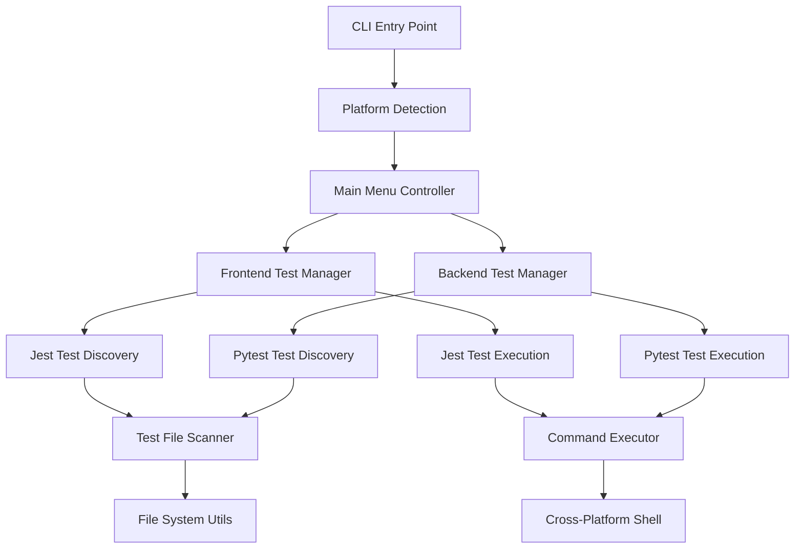

# Design Document

## Overview

The Cross-Platform Test Runner CLI Tool is designed as an interactive command-line interface that provides developers with a unified way to discover, select, and execute tests across both frontend (Next.js/Jest) and backend (Python/pytest) environments. The tool will be implemented as a Node.js application using cross-platform libraries to ensure consistent behavior across Windows, macOS, and Linux.

## Architecture

### High-Level Architecture



### Core Components

1. **CLI Entry Point**: Main application entry with argument parsing and initialization
2. **Platform Detection**: Identifies OS and available package managers
3. **Menu System**: Interactive navigation with consistent UX across platforms
4. **Test Managers**: Environment-specific logic for frontend and backend testing
5. **Test Discovery**: Scans directories and identifies test files by patterns
6. **Command Execution**: Cross-platform command execution with real-time output
7. **Configuration Parser**: Reads test modes from comprehensive-test-guide.md

## Components and Interfaces

### 1. CLI Entry Point (`src/index.js`)

```javascript
interface CLIOptions {
  environment?: 'frontend' | 'backend';
  mode?: string;
  help?: boolean;
  version?: boolean;
}

class TestRunnerCLI {
  constructor(options: CLIOptions);
  async run(): Promise<void>;
  private async initialize(): Promise<void>;
  private async showMainMenu(): Promise<void>;
}
```

### 2. Platform Detection (`src/platform/detector.js`)

```javascript
interface PlatformInfo {
  os: 'windows' | 'macos' | 'linux';
  shell: 'cmd' | 'powershell' | 'bash' | 'zsh';
  pathSeparator: '\\' | '/';
  hasNodejs: boolean;
  hasPnpm: boolean;
  hasPoetry: boolean;
}

class PlatformDetector {
  static async detect(): Promise<PlatformInfo>;
  static async validateDependencies(): Promise<string[]>;
}
```

### 3. Menu System (`src/ui/menu.js`)

```javascript
interface MenuOption {
  key: string;
  label: string;
  description?: string;
  action: () => Promise<void>;
}

interface MenuConfig {
  title: string;
  options: MenuOption[];
  allowBack: boolean;
  allowExit: boolean;
}

class InteractiveMenu {
  constructor(config: MenuConfig);
  async show(): Promise<string>;
  private async handleInput(input: string): Promise<void>;
  private renderMenu(): void;
}
```

### 4. Test Discovery (`src/discovery/scanner.js`)

```javascript
interface TestFile {
  path: string;
  relativePath: string;
  name: string;
  category: 'unit' | 'integration' | 'accessibility' | 'e2e' | 'performance';
  size: number;
}

interface TestDirectory {
  path: string;
  name: string;
  files: TestFile[];
  subdirectories: TestDirectory[];
}

class TestScanner {
  constructor(rootPath: string, patterns: string[]);
  async scan(): Promise<TestDirectory>;
  async categorizeTests(files: TestFile[]): Promise<Map<string, TestFile[]>>;
  private async scanDirectory(dirPath: string): Promise<TestDirectory>;
}
```

### 5. Frontend Test Manager (`src/managers/frontend.js`)

```javascript
interface FrontendTestConfig {
  rootPath: string;
  packageManager: 'pnpm' | 'npm' | 'yarn';
  testPatterns: string[];
  scripts: Map<string, string>;
}

class FrontendTestManager {
  constructor(config: FrontendTestConfig);
  async discoverTests(): Promise<TestDirectory>;
  async runAllTests(): Promise<TestResult>;
  async runTestsByCategory(category: string): Promise<TestResult>;
  async runTestFile(filePath: string): Promise<TestResult>;
  async runTestMode(mode: string): Promise<TestResult>;
  private buildCommand(type: string, target?: string): string[];
}
```

### 6. Backend Test Manager (`src/managers/backend.js`)

```javascript
interface BackendTestConfig {
  rootPath: string;
  poetryPath: string;
  testPatterns: string[];
  pytestMarkers: string[];
}

class BackendTestManager {
  constructor(config: BackendTestConfig);
  async discoverTests(): Promise<TestDirectory>;
  async runAllTests(): Promise<TestResult>;
  async runTestsByCategory(category: string): Promise<TestResult>;
  async runTestFile(filePath: string): Promise<TestResult>;
  async runWithMarkers(markers: string[]): Promise<TestResult>;
  private buildPytestCommand(args: string[]): string[];
}
```

### 7. Command Executor (`src/execution/executor.js`)

```javascript
interface ExecutionOptions {
  cwd: string;
  env?: Record<string, string>;
  timeout?: number;
  showOutput?: boolean;
}

interface TestResult {
  success: boolean;
  exitCode: number;
  duration: number;
  output: string;
  errorOutput: string;
  summary: TestSummary;
}

interface TestSummary {
  total: number;
  passed: number;
  failed: number;
  skipped: number;
  coverage?: number;
}

class CommandExecutor {
  static async execute(command: string[], options: ExecutionOptions): Promise<TestResult>;
  static async executeWithProgress(command: string[], options: ExecutionOptions): Promise<TestResult>;
  private static parseTestOutput(output: string, type: 'jest' | 'pytest'): TestSummary;
}
```

### 8. Configuration Parser (`src/config/parser.js`)

```javascript
interface TestMode {
  name: string;
  description: string;
  command: string;
  flags: string[];
  estimatedTime: string;
  category: 'speed' | 'coverage' | 'debug' | 'performance';
}

class ConfigParser {
  static async parseTestGuide(filePath: string): Promise<TestMode[]>;
  static async loadPackageScripts(packageJsonPath: string): Promise<Map<string, string>>;
  private static extractCommandsFromMarkdown(content: string): TestMode[];
}
```

## Data Models

### Test File Structure

```typescript
// Frontend test file patterns
const FRONTEND_PATTERNS = [
  '**/*.test.{js,jsx,ts,tsx}',
  '**/*.spec.{js,jsx,ts,tsx}',
  '**/*.unit.test.{js,jsx,ts,tsx}',
  '**/*.integration.test.{js,jsx,ts,tsx}',
  '**/*.accessibility.test.{js,jsx,ts,tsx}'
];

// Backend test file patterns  
const BACKEND_PATTERNS = [
  'test_*.py',
  '*_test.py',
  'tests/**/*.py'
];

// Test categorization rules
const CATEGORY_RULES = {
  unit: /\.(unit\.test|test)\./,
  integration: /\.integration\.test\./,
  accessibility: /\.accessibility\.test\./,
  performance: /\.performance\.test\./,
  e2e: /\.e2e\.|\/e2e\//
};
```

### Command Templates

```javascript
// Frontend command templates
const FRONTEND_COMMANDS = {
  all: ['pnpm', 'test', '--maxWorkers=75%', '--cache'],
  unit: ['pnpm', 'test:unit'],
  integration: ['pnpm', 'test:integration'],
  accessibility: ['pnpm', 'test:accessibility'],
  coverage: ['pnpm', 'test:coverage'],
  watch: ['pnpm', 'test:watch'],
  single: (file) => ['pnpm', 'test', file, '--maxWorkers=1', '--cache', '--silent']
};

// Backend command templates
const BACKEND_COMMANDS = {
  all: ['poetry', 'run', 'python', '-m', 'pytest', 'tests/', '-v'],
  unit: ['poetry', 'run', 'python', '-m', 'pytest', 'tests/unit/', '-v'],
  integration: ['poetry', 'run', 'python', '-m', 'pytest', 'tests/integration/', '-v'],
  coverage: ['poetry', 'run', 'python', '-m', 'pytest', '--cov=backend', 'tests/', '-v'],
  markers: (marker) => ['poetry', 'run', 'python', '-m', 'pytest', '-m', marker, '-v'],
  single: (file) => ['poetry', 'run', 'python', '-m', 'pytest', file, '-v']
};
```

## Error Handling

### Error Categories

1. **Dependency Errors**: Missing Node.js, pnpm, or Poetry
2. **File System Errors**: Invalid paths, permission issues
3. **Command Execution Errors**: Test failures, timeout issues
4. **Configuration Errors**: Invalid test guide format, missing package.json
5. **User Input Errors**: Invalid menu selections, keyboard interrupts

### Error Handling Strategy

```javascript
class ErrorHandler {
  static handle(error: Error, context: string): void {
    switch (error.type) {
      case 'DEPENDENCY_MISSING':
        this.showDependencyInstructions(error.dependency);
        break;
      case 'COMMAND_FAILED':
        this.showCommandError(error.command, error.output);
        break;
      case 'FILE_NOT_FOUND':
        this.showFileError(error.path);
        break;
      default:
        this.showGenericError(error, context);
    }
  }

  private static showDependencyInstructions(dependency: string): void {
    const instructions = {
      'pnpm': 'Install pnpm: npm install -g pnpm',
      'poetry': 'Install Poetry: curl -sSL https://install.python-poetry.org | python3 -',
      'node': 'Install Node.js from https://nodejs.org/'
    };
    console.log(`Missing dependency: ${dependency}`);
    console.log(`Installation: ${instructions[dependency]}`);
  }
}
```

## Testing Strategy

### Unit Tests

- Test each component in isolation
- Mock external dependencies (file system, command execution)
- Test cross-platform path handling
- Validate command generation logic

### Integration Tests

- Test complete workflows (discovery → execution → results)
- Test with real test files in controlled environment
- Validate cross-platform command execution
- Test error handling scenarios

### End-to-End Tests

- Test complete user workflows from CLI entry to test completion
- Test on multiple platforms (Windows, macOS, Linux)
- Validate integration with actual pnpm and Poetry commands
- Test with real project structure

### Test Structure

```
tests/
├── unit/
│   ├── platform/
│   ├── discovery/
│   ├── managers/
│   └── execution/
├── integration/
│   ├── frontend-workflow.test.js
│   ├── backend-workflow.test.js
│   └── cross-platform.test.js
└── e2e/
    ├── complete-workflow.test.js
    └── error-scenarios.test.js
```

## Performance Considerations

### Optimization Strategies

1. **Lazy Loading**: Load test discovery results only when needed
2. **Caching**: Cache test file discovery results during session
3. **Parallel Execution**: Use available CPU cores for test execution
4. **Streaming Output**: Show real-time test progress without buffering
5. **Memory Management**: Clean up resources after test execution

### Performance Targets

- Test discovery: < 2 seconds for typical project
- Menu navigation: < 100ms response time
- Command execution startup: < 1 second
- Memory usage: < 50MB during normal operation

## Security Considerations

### Input Validation

- Sanitize all user input before command execution
- Validate file paths to prevent directory traversal
- Escape shell arguments to prevent injection attacks
- Limit command execution timeout to prevent resource exhaustion

### File System Access

- Restrict file access to project directory and subdirectories
- Validate test file patterns to prevent arbitrary file execution
- Use read-only access for test discovery
- Implement proper error handling for permission issues

## Deployment and Distribution

### Package Structure

```
test-runner-cli/
├── package.json
├── bin/
│   └── test-runner
├── src/
│   ├── index.js
│   ├── platform/
│   ├── ui/
│   ├── discovery/
│   ├── managers/
│   ├── execution/
│   └── config/
├── tests/
└── docs/
    └── README.md
```

### Installation Methods

1. **NPM Global Package**: `npm install -g @medical-device-assistant/test-runner`
2. **Local Development**: Clone and link for development
3. **Standalone Executable**: Bundle with pkg for distribution

### Cross-Platform Compatibility

- Use Node.js built-in modules for maximum compatibility
- Test on Windows 10+, macOS 10.15+, Ubuntu 18.04+
- Handle different shell environments gracefully
- Provide platform-specific installation instructions

This design provides a robust, user-friendly, and maintainable solution for cross-platform test execution while integrating seamlessly with the existing Medical Device Regulatory Assistant project structure.