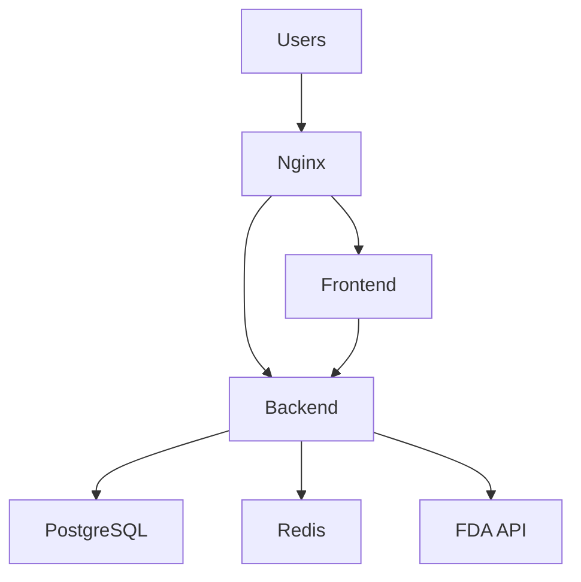

# Operations Runbook - Medical Device Regulatory Assistant

This runbook provides step-by-step procedures for common operational tasks and incident response.

## Table of Contents

1. [Emergency Contacts](#emergency-contacts)
2. [Service Overview](#service-overview)
3. [Monitoring and Alerting](#monitoring-and-alerting)
4. [Incident Response](#incident-response)
5. [Common Operations](#common-operations)
6. [Troubleshooting Procedures](#troubleshooting-procedures)
7. [Maintenance Procedures](#maintenance-procedures)
8. [Disaster Recovery](#disaster-recovery)

## Emergency Contacts

### On-Call Rotation
- **Primary**: DevOps Team Lead
- **Secondary**: Backend Developer
- **Escalation**: CTO

### External Contacts
- **Cloud Provider Support**: [Provider-specific contact]
- **FDA API Support**: https://open.fda.gov/contact/
- **Security Incident**: security@company.com

## Service Overview

### Architecture Components

| Component | Purpose | Health Check | Dependencies |
|-----------|---------|--------------|--------------|
| Frontend (Next.js) | User interface | `/api/health` | Backend API |
| Backend (FastAPI) | API services | `/health` | Database, FDA API |
| PostgreSQL | Data storage | `/health/database` | None |
| Redis | Caching | `/health/redis` | None |
| Nginx | Load balancer | `/health` | Frontend, Backend |

### Service Dependencies



## Monitoring and Alerting

### Key Metrics to Monitor

#### Application Metrics
- **Response Time**: 95th percentile < 2 seconds
- **Error Rate**: < 1% for 5xx errors
- **Throughput**: Requests per second
- **Availability**: > 99.9% uptime

#### Infrastructure Metrics
- **CPU Usage**: < 80% average
- **Memory Usage**: < 85% average
- **Disk Usage**: < 90% full
- **Network I/O**: Monitor for anomalies

#### Business Metrics
- **FDA API Rate Limit**: < 200 requests/minute
- **Predicate Search Success Rate**: > 95%
- **User Authentication Success Rate**: > 99%
- **Audit Trail Completeness**: 100%

### Alert Severity Levels

#### Critical (P1) - Immediate Response Required
- Service completely down
- Database unavailable
- Security breach detected
- Data corruption

#### High (P2) - Response within 30 minutes
- High error rate (>5%)
- Performance degradation (>5s response time)
- FDA API rate limit exceeded
- Backup failures

#### Medium (P3) - Response within 2 hours
- Individual service degradation
- Non-critical feature failures
- Resource usage warnings

#### Low (P4) - Response within 24 hours
- Minor performance issues
- Informational alerts
- Capacity planning warnings

## Incident Response

### Incident Response Process

1. **Detection** (0-5 minutes)
   - Alert received via monitoring system
   - User report or support ticket
   - Proactive monitoring detection

2. **Initial Response** (5-15 minutes)
   - Acknowledge alert
   - Assess severity and impact
   - Notify stakeholders if P1/P2
   - Begin investigation

3. **Investigation** (15-60 minutes)
   - Check service health endpoints
   - Review logs and metrics
   - Identify root cause
   - Implement temporary fixes if needed

4. **Resolution** (Variable)
   - Apply permanent fix
   - Verify resolution
   - Monitor for recurrence
   - Update stakeholders

5. **Post-Incident** (24-48 hours)
   - Conduct post-mortem
   - Document lessons learned
   - Implement preventive measures
   - Update runbooks

### Incident Communication Template

```
Subject: [INCIDENT] Medical Device Assistant - [Brief Description]

Status: INVESTIGATING/IDENTIFIED/MONITORING/RESOLVED
Severity: P1/P2/P3/P4
Start Time: YYYY-MM-DD HH:MM UTC
Impact: [Description of user impact]

Current Status:
[What we know so far]

Actions Taken:
[What we've done to investigate/resolve]

Next Steps:
[What we're doing next]

ETA for Resolution: [If known]
```

## Common Operations

### 1. Service Restart

#### Restart Individual Service
```bash
# Restart backend service
docker-compose -f docker-compose.prod.yml restart backend

# Restart frontend service
docker-compose -f docker-compose.prod.yml restart frontend

# Restart database (use caution)
docker-compose -f docker-compose.prod.yml restart postgres
```

#### Rolling Restart (Zero Downtime)
```bash
# Scale up additional instances
docker-compose -f docker-compose.prod.yml up -d --scale backend=3

# Wait for health checks to pass
sleep 30

# Scale back down
docker-compose -f docker-compose.prod.yml up -d --scale backend=2
```

### 2. Log Analysis

#### View Real-time Logs
```bash
# All services
docker-compose -f docker-compose.prod.yml logs -f

# Specific service
docker-compose -f docker-compose.prod.yml logs -f backend

# Filter by error level
docker-compose -f docker-compose.prod.yml logs backend | grep ERROR
```

#### Search Logs in Grafana
1. Open Grafana → Explore
2. Select Loki data source
3. Use LogQL queries:
   ```logql
   {container_name="backend"} |= "ERROR"
   {container_name="frontend"} |= "404"
   ```

### 3. Database Operations

#### Check Database Status
```bash
# Connect to database
docker-compose -f docker-compose.prod.yml exec postgres psql -U postgres -d medical_device_assistant

# Check active connections
SELECT count(*) FROM pg_stat_activity;

# Check database size
SELECT pg_size_pretty(pg_database_size('medical_device_assistant'));
```

#### Manual Backup
```bash
# Create backup
docker-compose -f docker-compose.prod.yml exec postgres /backups/backup-script.sh

# Verify backup
ls -la /var/lib/docker/volumes/medical-device-regulatory-assistant_backend_backups/_data/
```

### 4. Cache Operations

#### Redis Cache Management
```bash
# Check Redis status
docker-compose -f docker-compose.prod.yml exec redis redis-cli ping

# View cache statistics
docker-compose -f docker-compose.prod.yml exec redis redis-cli info stats

# Clear specific cache keys
docker-compose -f docker-compose.prod.yml exec redis redis-cli del "predicate_search:*"

# Clear all cache (use with caution)
docker-compose -f docker-compose.prod.yml exec redis redis-cli flushall
```

## Troubleshooting Procedures

### 1. High Response Times

#### Investigation Steps
1. Check application metrics in Grafana
2. Identify bottleneck service
3. Check resource usage (CPU, memory, disk I/O)
4. Review database query performance
5. Check FDA API response times

#### Resolution Actions
```bash
# Check slow queries
docker-compose -f docker-compose.prod.yml exec postgres psql -U postgres -d medical_device_assistant -c "
SELECT query, mean_time, calls, total_time 
FROM pg_stat_statements 
ORDER BY mean_time DESC 
LIMIT 10;"

# Restart services if needed
docker-compose -f docker-compose.prod.yml restart backend

# Scale up if resource constrained
docker-compose -f docker-compose.prod.yml up -d --scale backend=3
```

### 2. High Error Rates

#### Investigation Steps
1. Check error logs for patterns
2. Identify error types (4xx vs 5xx)
3. Check external service dependencies
4. Review recent deployments

#### Resolution Actions
```bash
# Check recent errors
docker-compose -f docker-compose.prod.yml logs --since=1h backend | grep -E "(ERROR|CRITICAL)"

# Test FDA API connectivity
curl -I "https://api.fda.gov/device/510k.json?limit=1"

# Check database connectivity
docker-compose -f docker-compose.prod.yml exec backend poetry run python -c "
import asyncio
from database.connection import test_connection
asyncio.run(test_connection())
"
```

### 3. Database Issues

#### Connection Pool Exhaustion
```bash
# Check active connections
docker-compose -f docker-compose.prod.yml exec postgres psql -U postgres -c "
SELECT state, count(*) 
FROM pg_stat_activity 
WHERE datname = 'medical_device_assistant' 
GROUP BY state;"

# Kill idle connections
docker-compose -f docker-compose.prod.yml exec postgres psql -U postgres -c "
SELECT pg_terminate_backend(pid) 
FROM pg_stat_activity 
WHERE datname = 'medical_device_assistant' 
AND state = 'idle' 
AND state_change < now() - interval '5 minutes';"
```

#### Disk Space Issues
```bash
# Check disk usage
docker-compose -f docker-compose.prod.yml exec postgres df -h

# Clean up old WAL files
docker-compose -f docker-compose.prod.yml exec postgres psql -U postgres -c "SELECT pg_switch_wal();"

# Vacuum database
docker-compose -f docker-compose.prod.yml exec postgres psql -U postgres -d medical_device_assistant -c "VACUUM ANALYZE;"
```

### 4. FDA API Rate Limiting

#### Investigation
```bash
# Check current rate limit usage
docker-compose -f docker-compose.prod.yml logs backend | grep -i "rate limit"

# Monitor FDA API requests
docker-compose -f docker-compose.prod.yml exec backend poetry run python -c "
from services.fda_client import OpenFDAClient
import asyncio
client = OpenFDAClient()
print(f'Current rate limit: {client.get_rate_limit_status()}')
"
```

#### Resolution
```bash
# Implement exponential backoff
# Update FDA client configuration
# Consider caching strategies
# Contact FDA for rate limit increase if needed
```

## Maintenance Procedures

### 1. Scheduled Maintenance

#### Pre-Maintenance Checklist
- [ ] Notify stakeholders 24 hours in advance
- [ ] Create fresh database backup
- [ ] Verify rollback procedures
- [ ] Prepare maintenance window communication
- [ ] Test changes in staging environment

#### During Maintenance
```bash
# 1. Enable maintenance mode (if available)
# 2. Stop services gracefully
docker-compose -f docker-compose.prod.yml down

# 3. Perform maintenance tasks
# 4. Start services
docker-compose -f docker-compose.prod.yml up -d

# 5. Verify health checks
curl https://your-domain.com/api/health
curl https://your-domain.com:8000/health

# 6. Monitor for issues
docker-compose -f docker-compose.prod.yml logs -f
```

### 2. Security Updates

#### System Updates
```bash
# Update base system (if not using containers)
sudo apt update && sudo apt upgrade -y

# Update Docker images
docker-compose -f docker-compose.prod.yml pull
docker-compose -f docker-compose.prod.yml up -d
```

#### Application Updates
```bash
# Pull latest code
git fetch origin
git checkout v1.x.x  # specific version tag

# Build and deploy
docker-compose -f docker-compose.prod.yml build
docker-compose -f docker-compose.prod.yml up -d
```

### 3. Certificate Renewal

#### SSL Certificate Renewal
```bash
# Backup current certificates
cp nginx/ssl/cert.pem nginx/ssl/cert.pem.backup
cp nginx/ssl/key.pem nginx/ssl/key.pem.backup

# Install new certificates
cp new-cert.pem nginx/ssl/cert.pem
cp new-key.pem nginx/ssl/key.pem

# Restart nginx
docker-compose -f docker-compose.prod.yml restart nginx

# Verify certificate
openssl x509 -in nginx/ssl/cert.pem -text -noout | grep "Not After"
```

## Disaster Recovery

### 1. Complete System Failure

#### Recovery Steps
1. **Assess Damage**
   - Determine scope of failure
   - Check data integrity
   - Identify recovery requirements

2. **Infrastructure Recovery**
   ```bash
   # Provision new infrastructure
   # Restore from backups
   # Deploy application
   ```

3. **Data Recovery**
   ```bash
   # Restore database from latest backup
   docker-compose -f docker-compose.prod.yml exec postgres /backups/restore-script.sh /backups/latest_backup.sql.gz
   
   # Verify data integrity
   docker-compose -f docker-compose.prod.yml exec postgres psql -U postgres -d medical_device_assistant -c "
   SELECT COUNT(*) FROM users;
   SELECT COUNT(*) FROM projects;
   SELECT COUNT(*) FROM agent_interactions;
   "
   ```

4. **Service Restoration**
   ```bash
   # Deploy services
   docker-compose -f docker-compose.prod.yml up -d
   
   # Verify functionality
   curl https://your-domain.com/api/health
   ```

### 2. Data Corruption

#### Recovery Procedure
1. **Stop Application**
   ```bash
   docker-compose -f docker-compose.prod.yml stop frontend backend
   ```

2. **Assess Corruption**
   ```bash
   # Check database integrity
   docker-compose -f docker-compose.prod.yml exec postgres psql -U postgres -d medical_device_assistant -c "
   SELECT schemaname, tablename, attname, n_distinct, correlation 
   FROM pg_stats 
   WHERE schemaname = 'public';
   "
   ```

3. **Restore from Backup**
   ```bash
   # Find latest good backup
   docker-compose -f docker-compose.prod.yml exec postgres ls -la /backups/
   
   # Restore database
   docker-compose -f docker-compose.prod.yml exec postgres /backups/restore-script.sh /backups/backup_YYYYMMDD_HHMMSS.sql.gz
   ```

4. **Verify and Resume**
   ```bash
   # Start services
   docker-compose -f docker-compose.prod.yml start frontend backend
   
   # Test functionality
   # Monitor for issues
   ```

### 3. Security Incident

#### Immediate Response
1. **Isolate System**
   ```bash
   # Stop external access
   docker-compose -f docker-compose.prod.yml stop nginx
   
   # Preserve evidence
   docker-compose -f docker-compose.prod.yml logs > incident_logs_$(date +%Y%m%d_%H%M%S).txt
   ```

2. **Assess Impact**
   - Check audit logs
   - Identify compromised data
   - Determine attack vector

3. **Containment**
   - Change all passwords and secrets
   - Revoke API keys
   - Update security configurations

4. **Recovery**
   - Apply security patches
   - Restore from clean backup if needed
   - Implement additional security measures

## Performance Optimization

### 1. Database Optimization

```sql
-- Analyze query performance
EXPLAIN ANALYZE SELECT * FROM projects WHERE user_id = 'uuid';

-- Update table statistics
ANALYZE projects;

-- Reindex if needed
REINDEX TABLE projects;
```

### 2. Cache Optimization

```bash
# Monitor cache hit rates
docker-compose -f docker-compose.prod.yml exec redis redis-cli info stats | grep hit

# Adjust cache TTL if needed
# Review cache key patterns
# Implement cache warming strategies
```

### 3. Application Optimization

- Monitor memory usage patterns
- Profile slow endpoints
- Optimize database queries
- Review FDA API usage patterns
- Implement request batching where possible

## Escalation Procedures

### When to Escalate

1. **Immediate Escalation (P1)**
   - Service down for >15 minutes
   - Data loss or corruption
   - Security breach confirmed
   - Unable to restore service

2. **Escalate within 1 hour (P2)**
   - Performance degradation >1 hour
   - Repeated service failures
   - Backup failures
   - Capacity limits reached

### Escalation Contacts

1. **Technical Escalation**
   - Senior DevOps Engineer
   - Backend Team Lead
   - Database Administrator

2. **Business Escalation**
   - Product Manager
   - Engineering Manager
   - CTO

3. **External Escalation**
   - Cloud provider support
   - Security incident response team
   - Legal team (for compliance issues)

---

**Remember**: Always document actions taken during incidents and update this runbook based on lessons learned.