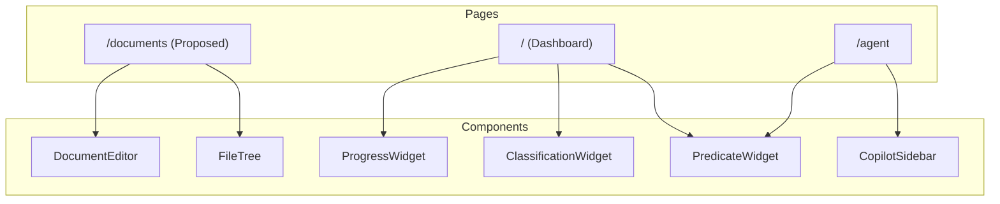

# Link Investigation Report (Revised)

## 1. Introduction

This report investigates the existence of the files related to the following pages:

*   `http://localhost:3000/documents`
*   `http://localhost:3000/predicate-search`
*   `http://localhost:3000/analytics`
*   `http://localhost:3000/settings`

## 2. Link Analysis

### `http://localhost:3000/documents`

**Conclusion:** The components for a document management page have been created, but a specific page at `/documents` is not explicitly mentioned.

**Evidence:**

*   **`mvp-development-roadmap/task-execute-history/task-6.md`**: This task report details the implementation of a "Markdown Editor with AI Copilot". It mentions the creation of the following components:
    *   `src/components/editor/markdown-editor.tsx`
    *   `src/components/editor/file-tree.tsx`
    *   `src/components/editor/document-editor.tsx`

**Related Files:**

*   `medical-device-regulatory-assistant/src/components/editor/markdown-editor.tsx`
*   `medical-device-regulatory-assistant/src/components/editor/file-tree.tsx`
*   `medical-device-regulatory-assistant/src/components/editor/document-editor.tsx`
*   `medical-device-regulatory-assistant/src/types/copilot.ts`
*   `medical-device-regulatory-assistant/src/lib/mock-data.ts`

### `http://localhost:3000/predicate-search`

**Conclusion:** The functionality for predicate search is integrated into the dashboard and the agent workflow, rather than being a standalone page.

**Evidence:**

*   **`mvp-development-roadmap/task-execute-history/task-3.md`**: This task report on the "Regulatory Strategy Dashboard UI" mentions the creation of `src/components/dashboard/predicate-widget.tsx`.
*   **`frontend-testing-comprehensive/task-execute-history/Task-7.1.md`**: This task report on migrating display-only components mentions migrating the `PredicateWidget` to use real API calls.
*   **`mvp-development-roadmap/task-execute-history/task-5.md`**: This task report on the CopilotKit Chat Interface mentions the slash command `/predicate-search`.

**Related Files:**

*   `medical-device-regulatory-assistant/src/components/dashboard/predicate-widget.tsx`
*   `medical-device-regulatory-assistant/src/hooks/use-predicates.ts`
*   `medical-device-regulatory-assistant/src/lib/services/dashboard-service.ts`
*   `medical-device-regulatory-assistant/backend/tools/fda_predicate_search_tool.py`
*   `medical-device-regulatory-assistant/backend/tests/test_fda_predicate_search_tool.py`
*   `medical-device-regulatory-assistant/src/types/dashboard.ts`

### `http://localhost:3000/analytics`

**Conclusion:** The functionality for analytics is part of the dashboard, so a separate `/analytics` page does not exist.

**Evidence:**

*   **`mvp-development-roadmap/task-execute-history/task-3.md`**: This task report on the "Regulatory Strategy Dashboard UI" mentions the creation of the following analytics components:
    *   `src/components/dashboard/classification-widget.tsx`
    *   `src/components/dashboard/predicate-widget.tsx`
    *   `src/components/dashboard/progress-widget.tsx`

**Related Files:**

*   `medical-device-regulatory-assistant/src/components/dashboard/regulatory-dashboard.tsx`
*   `medical-device-regulatory-assistant/src/components/dashboard/classification-widget.tsx`
*   `medical-device-regulatory-assistant/src/components/dashboard/predicate-widget.tsx`
*   `medical-device-regulatory-assistant/src/components/dashboard/progress-widget.tsx`
*   `medical-device-regulatory-assistant/src/hooks/use-dashboard.ts`
*   `medical-device-regulatory-assistant/src/types/dashboard.ts`

### `http://localhost:3000/settings`

**Conclusion:** The files for a settings page have not been created yet.

**Evidence:**

*   After a thorough review of all the `task-execute-history` files, I could not find any specific tasks or implementation details related to the creation of a `settings` page. The only mention of a settings page is in the `mvp-development-roadmap/requirements.md` file, which states that the Header component should have "User controls and settings access". This suggests that the page is planned but has not been implemented yet.

## 3. Summary and Recommendations

Based on the analysis of the `task-execute-history` files, it is clear that the development has been focused on the core features of the application, such as the dashboard, agent workflow, and document management. The `documents` and `predicate-search` functionalities are well-developed, although they are not implemented as standalone pages.

I recommend the following actions:

*   **Create a `/documents` page:** Create a new page at `/documents` and integrate the existing document management components into it.
*   **Clarify the navigation:** Update the main navigation to provide clear links to the document management and predicate search functionalities, even if they are part of other pages.
*   **Implement the `/settings` page:** Create a new task to implement the `/settings` page, as it is a required feature.

## 4. Mermaid Chart

## 5. Analyzed Files

*   `/.kiro/specs/mvp-development-roadmap/task-execute-history/*`
*   `/.kiro/specs/frontend-testing-comprehensive/task-execute-history/*`
*   `/.kiro/specs/backend-health-system-fix/task-execute-history/*`
