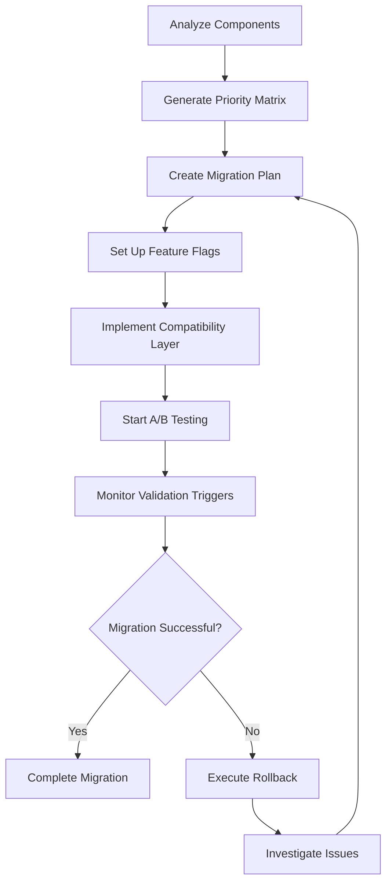

# Migration Process Documentation

## Overview

This document provides comprehensive guidance for migrating frontend components from mock data to real backend API integration. The migration follows a gradual, risk-managed approach with automated rollback capabilities.

## Migration Architecture

### Components Overview

```
src/lib/migration/
├── migration-strategy.ts      # Core migration strategy and analysis
├── priority-matrix.ts         # Component prioritization and planning
├── rollback-strategy.ts       # Rollback automation and management
├── validation-criteria.ts     # Success metrics and validation
├── timeline-planner.ts        # Timeline and resource planning
├── strategy-report.ts         # Comprehensive reporting
├── feature-flags.ts           # Feature flag management
├── compatibility-layer.ts     # Backward compatibility
├── ab-testing.ts             # A/B testing framework
└── validation-triggers.ts     # Automated monitoring and triggers
```

### Migration Flow



## Phase 1: Pre-Migration Setup

### 1.1 Component Analysis

```typescript
import { MigrationStrategyAnalyzer } from '@/lib/migration/migration-strategy';

const analyzer = new MigrationStrategyAnalyzer();
const componentAnalysis = analyzer.analyzeComponent('src/components/dashboard/classification-widget.tsx');

console.log('Mock data usage:', componentAnalysis.mockDataUsage);
console.log('Migration readiness:', componentAnalysis.migrationReadiness);
```

### 1.2 Priority Matrix Generation

```typescript
import { generateMigrationPriorityMatrix } from '@/lib/migration/priority-matrix';

const priorityReport = generateMigrationPriorityMatrix({
  weightings: {
    userImpact: 0.3,
    technicalComplexity: 0.25,
    testCoverage: 0.15,
    dependencies: 0.15,
    riskLevel: 0.15
  }
});

console.log('High priority components:', priorityReport.matrix.components.filter(c => c.priority === 'high'));
```

### 1.3 Feature Flag Setup

```typescript
import { FeatureFlagManager } from '@/lib/migration/feature-flags';

const flagManager = new FeatureFlagManager();

// Enable classification API for 10% of users
flagManager.enableFlag('enable_real_classification_api', 10);

// Check flag status
const context = {
  userId: 'user123',
  componentPath: 'classification-widget',
  environment: 'development',
  timestamp: Date.now()
};

const result = flagManager.evaluateFlag('enable_real_classification_api', context);
console.log('Flag enabled:', result.enabled);
```

## Phase 2: Gradual Migration

### 2.1 Component Migration Process

For each component, follow this process:

1. **Analyze Current Implementation**
   ```bash
   # Run component analysis
   npm run analyze-component src/components/dashboard/classification-widget.tsx
   ```

2. **Create Compatibility Layer**
   ```typescript
   import { useCompatibilityData } from '@/lib/migration/compatibility-layer';
   
   function ClassificationWidget() {
     const context = createMigrationContext(userId, 'classification-widget', projectId);
     const { data, loading, error, isUsingMockData } = useCompatibilityData(
       'classifications',
       context,
       { projectId }
     );
     
     return (
       <div>
         {isUsingMockData && <Badge>Using Mock Data</Badge>}
         {/* Component implementation */}
       </div>
     );
   }
   ```

3. **Enable Feature Flag Gradually**
   ```typescript
   // Start with 5% rollout
   flagManager.enableFlag('enable_real_classification_api', 5);
   
   // Monitor for 24 hours, then increase to 25%
   setTimeout(() => {
     flagManager.enableFlag('enable_real_classification_api', 25);
   }, 24 * 60 * 60 * 1000);
   ```

### 2.2 A/B Testing Setup

```typescript
import { ABTestManager } from '@/lib/migration/ab-testing';

const abTestManager = new ABTestManager();

// Start performance comparison test
abTestManager.startTest('migration_performance_comparison');

// In component
const { variantId, recordEvent } = useABTest('migration_performance_comparison', userId);

// Record performance metrics
recordEvent('page_load', loadTime);
recordEvent('api_call', responseTime);
```

### 2.3 Monitoring and Validation

```typescript
import { createValidationMonitor } from '@/lib/migration/validation-triggers';

const monitor = createValidationMonitor();

// Start monitoring
monitor.startMonitoring();

// Check trigger status
const triggers = monitor.getAllTriggers();
console.log('Active triggers:', triggers.filter(t => t.enabled));
```

## Phase 3: Rollback Procedures

### 3.1 Automatic Rollback

The system automatically monitors for issues and can trigger rollbacks:

- **Error Rate > 5%**: Immediate rollback to mock data
- **Response Time > 5s**: Gradual traffic reduction
- **User Satisfaction < 3.5**: Diagnostic collection and alerts

### 3.2 Manual Rollback

```typescript
import { RollbackStrategyManager } from '@/lib/migration/rollback-strategy';

const rollbackManager = new RollbackStrategyManager(rollbackConfig);

// Execute immediate rollback
const execution = await rollbackManager.executeRollback(
  'feature-flag-rollback',
  'manual',
  'Performance issues detected'
);

console.log('Rollback status:', execution.status);
```

### 3.3 Component-Specific Rollback

```bash
# Disable specific component migration
npm run disable-migration-flag enable_real_classification_api

# Verify rollback
npm run verify-mock-data-active classification-widget
```

## Troubleshooting Guide

### Common Issues

#### 1. High Response Times

**Symptoms:**
- API calls taking > 2 seconds
- User complaints about slow loading
- Performance monitoring alerts

**Diagnosis:**
```typescript
// Check performance metrics
const metrics = await metricsCollector.collectMetrics();
const responseTime = metrics.metrics.find(m => m.name === 'api_response_time');
console.log('Current response time:', responseTime?.value);
```

**Solutions:**
1. Enable caching: `flagManager.enableFlag('enable_api_caching', 100)`
2. Optimize database queries
3. Add database indexes
4. Implement connection pooling

#### 2. Data Inconsistencies

**Symptoms:**
- Components showing different data
- Validation errors in console
- User reports of missing information

**Diagnosis:**
```typescript
import { validateDatabaseIntegrity } from '@/lib/database/data-integrity';

const validation = await validateDatabaseIntegrity(connection);
console.log('Data integrity issues:', validation.violations);
```

**Solutions:**
1. Run data integrity fixes: `npm run fix-data-integrity`
2. Reseed database: `npm run seed-database --scenario=existing_project_workflow`
3. Clear cache: `npm run clear-api-cache`

#### 3. Feature Flag Issues

**Symptoms:**
- Components not switching between mock/real data
- Inconsistent behavior across users
- Flag evaluation errors

**Diagnosis:**
```typescript
const flagResult = flagManager.evaluateFlag('enable_real_classification_api', context);
console.log('Flag evaluation:', flagResult);

const metrics = flagManager.getMetrics('enable_real_classification_api');
console.log('Flag metrics:', metrics);
```

**Solutions:**
1. Clear flag cache: `flagManager.clearCache()`
2. Verify flag conditions
3. Check user context data
4. Review flag configuration

### Emergency Procedures

#### Complete System Rollback

```bash
# Emergency rollback script
npm run emergency-rollback

# This will:
# 1. Disable all migration feature flags
# 2. Switch all components to mock data
# 3. Clear API caches
# 4. Restart services
# 5. Verify system health
```

#### Partial Component Rollback

```bash
# Rollback specific component
npm run rollback-component classification-widget

# Verify rollback
npm run verify-component-status classification-widget
```

## Monitoring and Metrics

### Key Metrics to Monitor

1. **Performance Metrics**
   - API response time (target: < 2s)
   - Page load time (target: < 3s)
   - Database query time (target: < 500ms)

2. **Reliability Metrics**
   - Error rate (target: < 1%)
   - System availability (target: > 99.9%)
   - Data integrity score (target: > 95%)

3. **User Experience Metrics**
   - Task completion rate (target: > 90%)
   - User satisfaction score (target: > 4.0/5.0)
   - Support ticket volume

### Monitoring Commands

```bash
# Check system health
npm run health-check

# View migration metrics
npm run migration-metrics

# Generate migration report
npm run generate-migration-report

# View A/B test results
npm run ab-test-results migration_performance_comparison
```

## Best Practices

### 1. Gradual Rollout

- Start with 5% of users
- Monitor for 24 hours before increasing
- Increase in increments: 5% → 25% → 50% → 100%
- Always have rollback plan ready

### 2. Testing Strategy

- Run comprehensive tests before each rollout increase
- Monitor both technical and business metrics
- Collect user feedback actively
- Validate data integrity continuously

### 3. Communication

- Notify stakeholders before major rollout increases
- Provide regular status updates
- Document all issues and resolutions
- Maintain incident response procedures

### 4. Risk Management

- Set up automated monitoring and alerts
- Define clear rollback triggers
- Maintain backup data and configurations
- Test rollback procedures regularly

## Migration Checklist

### Pre-Migration
- [ ] Component analysis completed
- [ ] Priority matrix generated
- [ ] Feature flags configured
- [ ] Compatibility layer implemented
- [ ] A/B tests set up
- [ ] Monitoring configured
- [ ] Rollback procedures tested
- [ ] Team trained on procedures

### During Migration
- [ ] Monitor key metrics continuously
- [ ] Collect user feedback
- [ ] Document issues and resolutions
- [ ] Communicate status to stakeholders
- [ ] Be ready to rollback if needed

### Post-Migration
- [ ] Validate all functionality
- [ ] Confirm performance targets met
- [ ] Remove unused mock data
- [ ] Update documentation
- [ ] Conduct retrospective
- [ ] Plan next migration phase

## Support and Escalation

### Contact Information

- **Technical Issues**: tech-team@company.com
- **Performance Issues**: performance-team@company.com
- **User Experience Issues**: product-team@company.com
- **Emergency Escalation**: on-call-engineer@company.com

### Escalation Procedures

1. **Level 1**: Development team handles routine issues
2. **Level 2**: Technical lead for complex technical issues
3. **Level 3**: Engineering manager for critical system issues
4. **Level 4**: Executive team for business-critical problems

This migration guide provides the foundation for a successful, low-risk migration from mock data to real backend integration.