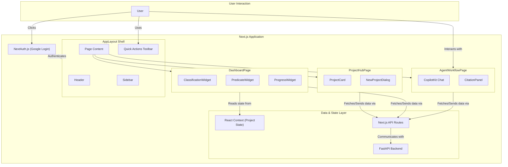

### 1. Frontend Architecture Diagram

This diagram illustrates the high-level architecture of the Next.js frontend, showing how the core pages, components, and services interconnect.

**How the Components Interconnect:**

1.  **Authentication**: The user is first authenticated via `NextAuth.js`. Upon success, the user's session data is available throughout the application.
2.  **Layout Shell**: The main `AppLayout` acts as a persistent container, providing the `Header`, `Sidebar`, and `QuickActionsToolbar` across all pages. It renders the current page's content within the `PageContent` area.
3.  **Pages**: The application has three primary pages:
    *   **Project Hub**: The entry point after login, displaying a list of projects.
    *   **Regulatory Dashboard**: A detailed view for a single project, composed of several widgets.
    *   **Agent Workflow**: The conversational UI for interacting with the AI.
4.  **Components**: Each page is built from smaller, reusable components (e.g., `ProjectCard`, `ClassificationWidget`). These components are responsible for displaying specific pieces of data.
5.  **Data Flow**:
    *   When components need data or need to perform an action, they call functions that trigger **Next.js API Routes**.
    *   These API routes handle the communication with the **FastAPI backend**, ensuring a secure and clean separation between the frontend and the core AI/business logic.
    *   Shared state, such as the currently selected project's ID and details, is managed by **React Context** to avoid prop-drilling and make it available to all relevant components on a page.

---

### 2. Component Testing Plan (Unit & Integration)

This plan uses **Jest** and **React Testing Library** to verify that each component is implemented correctly and handles user interaction as expected.

| Component Group | Component(s) | Test Cases |
| :--- | :--- | :--- |
| **Core Layout** | `AppLayout`, `Header`, `Sidebar` | 1. **Renders all children**: Ensure the header, sidebar, and main content are rendered.   2. **Navigation**: Verify that clicking links in the `Sidebar` triggers navigation (using a mock router).   3. **Responsiveness**: Check that the mobile hamburger menu appears and functions on smaller viewports. |
| **Project Management** | `ProjectHub`, `ProjectCard`, `NewProjectDialog` | 1. **Render Projects**: `ProjectHub` correctly renders a list of `ProjectCard`s from mock data.   2. **Display Data**: `ProjectCard` accurately displays the project's name, description, and status badge.   3. **Open Dialog**: Clicking the "New Project" button opens the `NewProjectDialog`.   4. **Form Validation**: `NewProjectDialog` shows validation errors for empty required fields.   5. **Form Submission**: Submitting a valid form calls the appropriate API handler with the correct data. |
| **Dashboard** | `ClassificationWidget`, `PredicateWidget`, `ProgressWidget` | 1. **Initial State**: Widgets correctly render their initial state (e.g., a "Start Classification" button).   2. **Data Display**: When passed mock data, widgets display the correct information (e.g., device class, product code).   3. **Confidence Score**: `ProgressWidget` accurately reflects the `confidenceScore` prop (e.g., a score of `0.85` results in an 85% full progress bar).   4. **Error State**: Widgets display a user-friendly error message when passed an error prop. |
| **Agent & Actions** | `QuickActionsToolbar`, `CopilotSidebar`, `CitationPanel` | 1. **Action Trigger**: Clicking a button in the `QuickActionsToolbar` calls the corresponding mock function.   2. **Render Citations**: `CitationPanel` correctly renders a list of sources from mock data.   3. **Panel Toggle**: The `CitationPanel` can be opened and closed.   4. **Chat Render**: `CopilotSidebar` renders correctly and displays initial instructions. |

---

### 3. End-to-End (E2E) Testing Plan with Playwright

This plan simulates critical user journeys to test the application flow page-by-page, identifying integration errors, UI/UX bugs, and areas for improvement.

#### **Test Objective**: To validate the complete user experience from login to interacting with the AI, ensuring all pages and components work together seamlessly.

#### **Critical User Journey 1: Onboarding and Project Creation**

1.  **Navigate**: Go to the application's root URL.
2.  **Check**: Expect to be redirected to the login page.
3.  **Action**: Simulate a successful Google OAuth login (this will require mocking the auth provider callback).
4.  **Check**:
    *   Expect the URL to be the `/projects` or `/` (Project Hub).
    *   Expect the `Header` to display the user's name.
    *   Expect to see the "Create New Project" button.
    *   **Look for**: Layout shifts, slow loading of the main page.
5.  **Action**: Click the "Create New Project" button.
6.  **Check**: Expect the `NewProjectDialog` to appear as a modal overlay.
7.  **Action**:
    *   Fill in "Device Name" with "CardioProbe X".
    *   Fill in "Intended Use" with "For monitoring cardiac activity".
    *   Click "Create".
8.  **Check**:
    *   Expect the dialog to close.
    *   Expect a new `ProjectCard` with the title "CardioProbe X" to be visible on the page.
    *   **Look for**: Lack of feedback (e.g., a loading spinner) during form submission, incorrect data on the new card.
9.  **Screenshot**: Take a full-page screenshot named `project-hub-after-creation.png`.

#### **Critical User Journey 2: Exploring the Dashboard and Agent Workflow**

1.  **Navigate**: Start on the Project Hub page (can continue from Journey 1).
2.  **Action**: Click on the "CardioProbe X" `ProjectCard`.
3.  **Check**:
    *   Expect the URL to change to `/projects/{id}/dashboard`.
    *   Expect the `ClassificationWidget` to be visible with a "Start Classification" button.
    *   Expect the `PredicateWidget` to be visible in its initial state.
    *   **Look for**: Data from the wrong project, slow widget loading.
4.  **Action**: Click on the "Agent Workflow" link in the `Sidebar`.
5.  **Check**:
    *   Expect the URL to change to `/projects/{id}/agent`.
    *   Expect the `CopilotSidebar` to be visible with its welcome message.
    *   Expect the `SlashCommandCard`s for `/predicate-search`, etc., to be visible.
    *   **Look for**: Chat history from another project, unresponsive UI elements.
6.  **Screenshot**: Take a full-page screenshot named `agent-workflow-initial-view.png`.

#### **Critical User Journey 3: AI Interaction and Results**

1.  **Navigate**: Start on the Agent Workflow page.
2.  **Action**: Click the "Find Similar Predicates" button in the `QuickActionsToolbar`.
3.  **Check**:
    *   Expect the chat input to be populated with a command like `/predicate-search`.
    *   Expect a loading indicator to appear in the chat history.
    *   **(Backend must be mocked to return a predefined successful response)**.
4.  **Check**:
    *   After the mocked response, expect the loading indicator to disappear.
    *   Expect the chat to display a summary of the results.
    *   Expect the `CitationPanel` to be populated with at least one source.
    *   **Look for**: Unformatted text in the chat response, links in the `CitationPanel` that are not clickable.
5.  **Action**: Click on a source in the `CitationPanel`.
6.  **Check**: Expect a new browser tab to open with the source URL.
7.  **Screenshot**: Take a screenshot named `agent-results-with-citations.png`.

#### **Critical User Journey 4: Responsiveness Validation**

1.  **For each key page** (`Project Hub`, `Regulatory Dashboard`):
2.  **Action**: Set viewport to tablet size (`width: 768, height: 1024`).
3.  **Check**: Expect the layout to adjust correctly (e.g., grid columns change, sidebar might hide).
4.  **Screenshot**: Take a screenshot (e.g., `dashboard-tablet.png`).
5.  **Action**: Set viewport to mobile size (`width: 375, height: 812`).
6.  **Check**: Expect the mobile hamburger menu to be present and functional. Expect content to be readable without horizontal scrolling.
7.  **Screenshot**: Take a screenshot (e.g., `dashboard-mobile.png`).
8.  **Look for**: Overlapping elements, text that is too small, buttons that are difficult to tap.