# Medical Device Regulatory Assistant - Frontend Investigation Report

This document provides a comprehensive analysis of the Next.js frontend application for the Medical Device Regulatory Assistant, an AI-powered regulatory pathway discovery platform for medical device companies.

## System Overview

The Medical Device Regulatory Assistant is a specialized platform designed to streamline the regulatory process for medical device companies, with an initial focus on the US FDA market and 510(k) predicate search workflows. The frontend is built using Next.js 15.5.2 with React 19.1.0, TypeScript, and Tailwind CSS.

## 1. Application Architecture & Page Relationship Mapping

```mermaid
graph TB
    subgraph "Authentication Layer"
        Auth["Google OAuth 2.0<br/>NextAuth.js"]
    end

    subgraph "Root Layout (layout.tsx)"
        SessionProv[SessionProvider]
        ProjectProv[ProjectContextProvider]
    end

    subgraph "Core Application Pages"
        Home["🏠 Home Dashboard<br/>page.tsx"]
        Projects["📁 Projects Hub<br/>projects/page.tsx"]
        ProjectDetail["📊 Project Detail<br/>projects/[id]/page.tsx"]
        Agent["🤖 Agent Workflow<br/>agent/page.tsx"]
        Audit["📜 Audit Log<br/>audit/page.tsx"]
        Editor["✍️ Document Editor<br/>editor/page.tsx"]
    end

    subgraph "Demo & Testing"
        Demo["🧪 Navigation Demo<br/>demo/navigation/page.tsx"]
    end

    subgraph "API Layer"
        API["API Routes<br/>app/api/"]
        Backend["FastAPI Backend<br/>backend/"]
    end

    Auth --> SessionProv
    SessionProv --> ProjectProv
    ProjectProv --> Home
    ProjectProv --> Projects
    ProjectProv --> ProjectDetail
    ProjectProv --> Agent
    ProjectProv --> Audit
    ProjectProv --> Editor
    ProjectProv --> Demo

    Home --> Projects
    Projects --> ProjectDetail
    ProjectDetail --> Agent
    ProjectDetail --> Editor
    ProjectDetail --> Audit

    Agent --> API
    Projects --> API
    ProjectDetail --> API
    API --> Backend

    classDef homeStyle fill:#e1f5fe
    classDef projectsStyle fill:#f3e5f5
    classDef agentStyle fill:#e8f5e8
    classDef backendStyle fill:#fff3e0

    class Home homeStyle
    class Projects projectsStyle
    class Agent agentStyle
    class Backend backendStyle
```



The user's journey begins with secure authentication via Google OAuth, managed by NextAuth.js. Once authenticated, the application wraps the core pages with a `SessionProvider` for session state and a `ProjectContextProvider` to manage project-specific data. The user lands on the **Home Dashboard**, which serves as the main entry point. From here, they can navigate to the **Projects Hub** to view and manage their regulatory projects. Selecting a specific project leads to the **Project Detail** page, which is the central hub for a single project's workflow. This detail page provides access to the **Agent Workflow** for AI-powered analysis, the **Document Editor** for creating regulatory documents, and the **Audit Log** for tracking compliance. These core features interact with the backend services through a dedicated API layer, ensuring a clear separation between the frontend and the core business logic.

**Architecture Description:**

- **Authentication Layer**: Google OAuth 2.0 integration using NextAuth.js for secure user authentication
- **Context Providers**: SessionProvider manages authentication state, ProjectContextProvider handles project-specific data
- **Core Pages**: Main application functionality focused on regulatory workflow management
- **API Integration**: Next.js API routes connecting to FastAPI backend for AI-powered regulatory analysis
- **Demo Environment**: Testing and development utilities for component validation

## 2. Technology Stack & Dependencies

### Core Technologies

- **Framework**: Next.js 15.5.2 (App Router)
- **UI Library**: React 19.1.0 with TypeScript
- **Styling**: Tailwind CSS 4.x with Shadcn UI components
- **Authentication**: NextAuth.js with Google OAuth 2.0
- **AI Integration**: CopilotKit for conversational AI interface
- **Package Manager**: pnpm 9.0.0

### Key Dependencies

```json
{
  "frontend": {
    "@copilotkit/react-core": "^1.10.3",
    "@copilotkit/react-ui": "^1.10.3",
    "@radix-ui/*": "Latest versions for UI primitives",
    "react-hook-form": "^7.62.0",
    "zod": "^4.1.5"
  },
  "testing": {
    "jest": "^30.1.1",
    "playwright": "^1.55.0",
    "@testing-library/react": "^16.3.0",
    "jest-axe": "^10.0.0"
  },
  "development": {
    "typescript": "^5",
    "eslint": "^9",
    "prettier": "^3.6.2"
  }
}
```

## 3. Page Components Analysis

### Root Layout (`layout.tsx`)

- **🔐 PROVIDER SessionProvider**: Manages authentication state across the application
  
  - Status: ✅ Implemented with NextAuth.js integration
  - Suggestion: Well-implemented for secure session management

- **📊 PROVIDER ProjectContextProvider**: Provides project-specific context throughout the app
  
  - Status: ✅ Implemented for project-based workflow management
  - Suggestion: Consider lazy loading for performance optimization

### Home Dashboard (`page.tsx`)

- **🏗️ LAYOUT AppLayout**: Main application layout with navigation and sidebar
  
  - Status: ✅ Implemented with responsive design
  - Suggestion: Excellent foundation for consistent UI/UX

- **📊 CARD Project Status**: Displays current MVP development status
  
  - Status: ✅ Static implementation showing "Setup Complete"
  - Suggestion: Connect to real project metrics and progress tracking

- **🚀 CARD Next Steps**: Shows development phase information
  
  - Status: ✅ Static content showing "Phase 1"
  - Suggestion: Integrate with project management system for dynamic updates

- **🎯 CARD Focus Area**: Highlights 510(k) predicate search focus
  
  - Status: ✅ Properly aligned with MVP objectives
  - Suggestion: Add progress indicators for feature development

- **👋 CARD Welcome**: Application overview and capabilities list
  
  - Status: ⚠️ Core capabilities marked as "Coming Soon"
  - Suggestion: Update status as features are implemented and add navigation links

### Agent Workflow Page (`agent/page.tsx`)

- **🤖 COMPONENT AgentWorkflowPage**: AI-powered regulatory assistant interface
  - Status: 🔄 In development with CopilotKit integration
  - Features: Conversational AI, slash commands, project context
  - Suggestion: Implement real-time FDA database integration and predicate search

### Projects Hub (`projects/page.tsx`)

- **🗂️ COMPONENT ProjectList**: Displays user's regulatory projects
  
  - Status: ✅ Implemented with mock data integration
  - Features: Project creation, listing, and management
  - Suggestion: Add filtering, sorting, and pagination for scalability

- **📝 COMPONENT ProjectForm**: Project creation and editing interface
  
  - Status: ✅ Form validation and submission handling
  - Suggestion: Add project templates for common device types

### Project Detail Page (`projects/[id]/page.tsx`)

- **📈 COMPONENT RegulatoryDashboard**: Core project analysis interface
  
  - Status: 🔄 Complex component with multiple widgets
  - Features: Classification widgets, predicate analysis, progress tracking
  - Suggestion: Implement real-time updates and WebSocket integration

- **⚙️ BUTTON Settings**: Project configuration access
  
  - Status: ❌ onClick handler not implemented
  - Suggestion: Implement project settings modal or dedicated page

- **📤 BUTTON Export**: Project data export functionality
  
  - Status: ❌ onClick handler not implemented
  - Suggestion: Add PDF/Excel export for regulatory submissions

### Audit Log Page (`audit/page.tsx`)

- **📜 COMPONENT AuditLogPage**: Compliance and audit trail interface
  - Status: ✅ Basic implementation for regulatory compliance
  - Features: Action logging, user tracking, timestamp management
  - Suggestion: Add advanced filtering, search, and export capabilities

### Document Editor (`editor/page.tsx`)

- **✍️ COMPONENT DocumentEditor**: Regulatory document creation and editing
  - Status: 🔄 Markdown-based editor with real-time preview
  - Features: Document templates, auto-save, version control
  - Suggestion: Add collaborative editing and FDA template integration

### Navigation Demo (`demo/navigation/page.tsx`)

- **🧪 COMPONENT FileExplorer**: Development and testing utility
  - Status: ✅ Mock data integration for component testing
  - Features: Folder navigation, keyboard shortcuts, action logging
  - Suggestion: Maintain as development tool for component validation

## 4. Component Architecture & Design System

### UI Component Library (Shadcn UI + Radix UI)

```typescript
// Core UI Components Available
{
  "layout": ["AppLayout", "Header", "Sidebar", "Footer"],
  "forms": ["Input", "Select", "Checkbox", "RadioGroup", "Switch"],
  "feedback": ["Alert", "Toast", "Progress", "Badge", "Tooltip"],
  "navigation": ["Tabs", "Dropdown", "Popover", "Dialog"],
  "data": ["Table", "Card", "Separator", "ScrollArea"],
  "accessibility": ["VisuallyHidden", "FocusTrap", "SkipNav"]
}
```

### Custom Hooks & State Management

```typescript
// Available Custom Hooks
{
  "data": ["useProjects", "useClassification", "usePredicates", "useDashboard"],
  "ui": ["useToast", "useKeyboardShortcuts", "useAutoSave"],
  "integration": ["useWebSocket", "useAgentExecution", "useDocuments"],
  "utility": ["useOffline"]
}
```

## 5. Testing Infrastructure Status

### Test Coverage Analysis

```typescript
// Current Testing Setup
{
  "unit_tests": {
    "framework": "Jest 30.1.1 + React Testing Library 16.3.0",
    "coverage": "Comprehensive component and hook testing",
    "accessibility": "jest-axe integration for WCAG compliance"
  },
  "integration_tests": {
    "framework": "Jest with MSW for API mocking",
    "coverage": "User workflows and data flow testing"
  },
  "e2e_tests": {
    "framework": "Playwright 1.55.0",
    "coverage": "Critical user journeys and cross-browser testing"
  },
  "performance": {
    "lighthouse": "Core Web Vitals monitoring",
    "bundlesize": "Bundle size optimization tracking"
  }
}
```

### Test Scripts Available

- `pnpm test` - Unit tests with Jest
- `pnpm test:e2e` - End-to-end tests with Playwright
- `pnpm test:accessibility` - Accessibility compliance testing
- `pnpm test:performance` - Performance benchmarking
- `pnpm lighthouse` - Core Web Vitals analysis

## 6. Implementation Status & Roadmap

### ✅ Completed Features

1. **Authentication System**: Google OAuth 2.0 with NextAuth.js
2. **Project Management**: CRUD operations for regulatory projects
3. **UI Foundation**: Responsive design with Shadcn UI components
4. **Testing Infrastructure**: Comprehensive test suite setup
5. **Development Tools**: ESLint, Prettier, TypeScript configuration

### 🔄 In Progress Features

1. **Agent Workflow**: CopilotKit integration for AI conversations
2. **Dashboard Widgets**: Classification and predicate analysis components
3. **Document Editor**: Markdown-based regulatory document creation
4. **Real-time Updates**: WebSocket integration for live data

### ❌ Pending Implementation

1. **FDA API Integration**: Real-time openFDA database connectivity
2. **Predicate Search**: Automated 510(k) predicate device discovery
3. **Classification Engine**: AI-powered device classification with confidence scores
4. **Comparison Tables**: Side-by-side technological characteristic analysis
5. **Submission Checklists**: Automated 510(k) submission requirement generation

## 7. Core Capabilities Implementation Status

### Priority 1: Predicate Search & Analysis (🔴 Not Started)

```typescript
// Target Implementation
interface PredicateSearchCapability {
  search: "Automated FDA 510(k) database search";
  ranking: "AI-powered predicate device ranking";
  comparison: "Side-by-side technological analysis";
  confidence: "Confidence scoring for substantial equivalence";
  status: "❌ Awaiting implementation";
}
```

### Priority 2: Device Classification (🔴 Not Started)

```typescript
// Target Implementation
interface ClassificationCapability {
  analysis: "AI-powered device classification";
  productCodes: "FDA product code suggestions";
  cfrSections: "Relevant CFR section identification";
  confidence: "Classification confidence scoring";
  status: "❌ Awaiting implementation";
}
```

### Priority 3: FDA Integration (🔴 Not Started)

```typescript
// Target Implementation
interface FDAIntegrationCapability {
  openFDA: "Real-time FDA database connectivity";
  rateLimit: "240 requests/minute compliance";
  caching: "Intelligent result caching";
  errorHandling: "Robust API error management";
  status: "❌ Awaiting implementation";
}
```

## 8. Performance & Accessibility Status

### Performance Metrics

- **Bundle Size**: Monitored with bundlesize tool
- **Core Web Vitals**: Lighthouse CI integration
- **Loading Performance**: Next.js optimization with code splitting
- **Caching Strategy**: Static generation for documentation pages

### Accessibility Compliance

- **WCAG 2.1 AA**: Target compliance level
- **Screen Reader**: Semantic HTML and ARIA labels
- **Keyboard Navigation**: Full keyboard accessibility
- **Color Contrast**: High contrast mode support
- **Testing**: Automated jest-axe integration

## 9. Security & Compliance Implementation

### Authentication & Authorization

- **OAuth 2.0**: Google authentication integration
- **Session Management**: Secure session handling with NextAuth.js
- **CSRF Protection**: Built-in Next.js CSRF protection
- **Data Privacy**: No PHI handling in MVP scope

### Audit Trail System

- **Action Logging**: All user actions tracked for compliance
- **Source Citations**: FDA source URLs and effective dates
- **Confidence Scores**: AI decision transparency
- **Export Capability**: Audit trail export for regulatory inspections

## 10. Recommendations & Next Steps

### Immediate Priorities (Week 1-2)

1. **Implement FDA API Integration**: Connect to openFDA for real predicate data
2. **Build Predicate Search**: Core 510(k) predicate discovery functionality
3. **Create Classification Engine**: AI-powered device classification system
4. **Add Comparison Tables**: Side-by-side predicate analysis interface

### Medium-term Goals (Week 3-4)

1. **Enhanced Agent Workflow**: Advanced CopilotKit integration with slash commands
2. **Real-time Features**: WebSocket implementation for live updates
3. **Performance Optimization**: Bundle size reduction and caching improvements
4. **Accessibility Enhancement**: Complete WCAG 2.1 AA compliance

### Long-term Vision (Month 2+)

1. **Advanced Analytics**: Submission success rate tracking
2. **Collaboration Features**: Multi-user project support
3. **Integration Ecosystem**: QMS system connectivity
4. **Global Expansion**: EU MDR support preparation

## 11. Technical Debt & Maintenance

### Current Technical Debt

1. **Mock Data Dependencies**: Replace with real API integrations
2. **Unimplemented Handlers**: Complete onClick handlers for settings/export
3. **WebSocket Legacy**: Modernize real-time update implementation
4. **Performance Optimization**: Bundle size and loading time improvements

### Maintenance Schedule

- **Daily**: Automated test execution and code quality checks
- **Weekly**: Dependency updates and security scanning
- **Monthly**: Performance monitoring and optimization review
- **Quarterly**: Architecture review and technical debt assessment

This comprehensive analysis provides a complete picture of the current frontend implementation status and roadmap for the Medical Device Regulatory Assistant platform.