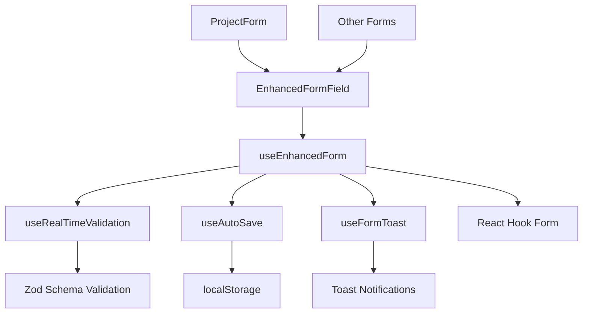

# Enhanced Form System Documentation

## Overview

The Enhanced Form System is a comprehensive form management solution built on top of React Hook Form, providing advanced features for the Medical Device Regulatory Assistant application. It includes real-time validation, auto-save functionality, accessibility enhancements, and comprehensive error handling.

## Architecture

### Core Components



### Key Features

1. **Real-time Validation**: Debounced field validation with immediate feedback
2. **Auto-save**: Automatic form data persistence with conflict resolution
3. **Accessibility**: WCAG 2.1 AA compliant with screen reader support
4. **Error Handling**: Comprehensive error recovery and user feedback
5. **Performance**: Optimized for large forms and frequent interactions

## API Reference

### useEnhancedForm Hook

The main hook that provides enhanced form functionality.

```typescript
import { useEnhancedForm } from '@/hooks/use-enhanced-form';

const form = useEnhancedForm({
  schema: projectSchema,
  autoSave: {
    enabled: true,
    interval: 2000,
    onSave: async (data) => {
      await saveProjectDraft(data);
    },
    storageKey: 'project-form-new',
  },
  realTimeValidation: {
    enabled: true,
    debounceMs: 300,
  },
  accessibility: {
    announceErrors: true,
    focusFirstError: true,
  },
  formName: 'Project Form',
});
```

#### Options

| Option                          | Type        | Default             | Description                           |
| ------------------------------- | ----------- | ------------------- | ------------------------------------- |
| `schema`                        | `ZodSchema` | Required            | Zod validation schema                 |
| `autoSave.enabled`              | `boolean`   | `false`             | Enable auto-save functionality        |
| `autoSave.interval`             | `number`    | `2000`              | Auto-save interval in milliseconds    |
| `autoSave.onSave`               | `function`  | Required if enabled | Callback for saving data              |
| `autoSave.storageKey`           | `string`    | Optional            | localStorage key for persistence      |
| `realTimeValidation.enabled`    | `boolean`   | `true`              | Enable real-time validation           |
| `realTimeValidation.debounceMs` | `number`    | `300`               | Validation debounce delay             |
| `accessibility.announceErrors`  | `boolean`   | `true`              | Announce errors to screen readers     |
| `accessibility.focusFirstError` | `boolean`   | `true`              | Focus first error field on validation |
| `formName`                      | `string`    | Optional            | Form name for error messages          |

#### Return Value

The hook returns all standard React Hook Form methods plus enhanced features:

```typescript
interface EnhancedFormReturn<T> extends UseFormReturn<T> {
  // Real-time validation
  validateField: (
    fieldName: keyof T,
    value: any,
    immediate?: boolean
  ) => Promise<void>;
  getFieldValidation: (fieldName: keyof T) => ValidationState;

  // Auto-save functionality
  saveNow: () => Promise<void>;
  isSaving: boolean;
  lastSaved?: Date;

  // Enhanced submission
  submitWithFeedback: (onSubmit: (data: T) => Promise<void>) => Promise<void>;

  // Form state helpers
  isDirtyField: (fieldName: keyof T) => boolean;
  getTouchedFields: () => (keyof T)[];

  // Accessibility helpers
  focusFirstError: () => void;
  announceFormState: (message: string) => void;
}
```

### Enhanced Form Components

#### EnhancedInput

Enhanced input component with real-time validation and accessibility features.

```typescript
import { EnhancedInput } from '@/components/forms/EnhancedFormField';

<EnhancedInput
  {...register('name')}
  label="Project Name"
  validation={getFieldValidation('name')}
  showCharacterCount={true}
  maxLength={255}
  autoFocus={true}
  required
/>
```

#### EnhancedTextarea

Enhanced textarea with auto-resize and validation.

```typescript
import { EnhancedTextarea } from '@/components/forms/EnhancedFormField';

<EnhancedTextarea
  {...register('description')}
  label="Description"
  validation={getFieldValidation('description')}
  showCharacterCount={true}
  maxLength={1000}
  minRows={3}
  maxRows={10}
/>
```

#### AutoSaveIndicator

Visual indicator for auto-save status.

```typescript
import { AutoSaveIndicator } from '@/components/forms/EnhancedFormField';

<AutoSaveIndicator
  isSaving={isSaving}
  lastSaved={lastSaved}
  error={autoSaveError}
/>
```

### Toast Integration

The enhanced form system integrates with a comprehensive toast notification system.

```typescript
import { useFormToast } from '@/hooks/use-form-toast';

const formToast = useFormToast();

// Show validation error
formToast.showValidationError('name', 'Project name is required');

// Show submission success
formToast.showSubmissionSuccess('Project created successfully');

// Show auto-save progress
const progress = formToast.showSaveProgress(0);
progress.updateProgress(50);
progress.complete();
```

## Usage Examples

### Basic Form Implementation

```typescript
import React from 'react';
import { useEnhancedForm } from '@/hooks/use-enhanced-form';
import { EnhancedInput, EnhancedTextarea } from '@/components/forms/EnhancedFormField';
import { projectSchema } from '@/lib/validation/project';

interface ProjectFormProps {
  onSubmit: (data: ProjectFormData) => Promise<void>;
  initialData?: Partial<ProjectFormData>;
}

export function ProjectForm({ onSubmit, initialData }: ProjectFormProps) {
  const form = useEnhancedForm({
    schema: projectSchema,
    defaultValues: initialData,
    autoSave: {
      enabled: true,
      interval: 2000,
      onSave: async (data) => {
        await saveProjectDraft(data);
      },
      storageKey: 'project-form-new',
    },
    formName: 'Project Form',
  });

  const {
    register,
    handleSubmit,
    formState: { errors, isSubmitting },
    getFieldValidation,
    submitWithFeedback,
    isSaving,
    lastSaved,
  } = form;

  return (
    <form onSubmit={handleSubmit((data) => submitWithFeedback(() => onSubmit(data)))}>
      <EnhancedInput
        {...register('name')}
        label="Project Name"
        validation={getFieldValidation('name')}
        error={errors.name}
        showCharacterCount={true}
        maxLength={255}
        required
      />

      <EnhancedTextarea
        {...register('description')}
        label="Description"
        validation={getFieldValidation('description')}
        error={errors.description}
        showCharacterCount={true}
        maxLength={1000}
      />

      <AutoSaveIndicator
        isSaving={isSaving}
        lastSaved={lastSaved}
      />

      <button type="submit" disabled={isSubmitting}>
        {isSubmitting ? 'Creating...' : 'Create Project'}
      </button>
    </form>
  );
}
```

### Advanced Validation Schema

```typescript
import { z } from 'zod';

export const projectSchema = z
  .object({
    name: z
      .string()
      .min(1, 'Project name is required')
      .max(255, 'Project name must be less than 255 characters')
      .regex(
        /^[a-zA-Z0-9\s\-_]+$/,
        'Project name can only contain letters, numbers, spaces, hyphens, and underscores'
      )
      .refine(
        (val) => val.trim() === val,
        'Project name cannot start or end with whitespace'
      )
      .refine(
        (val) => val.trim().length > 0,
        'Project name cannot be only whitespace'
      ),

    description: z
      .string()
      .optional()
      .refine(
        (val) => !val || val.length >= 10,
        'Description must be at least 10 characters when provided'
      )
      .refine(
        (val) => !val || val.length <= 1000,
        'Description must be less than 1000 characters'
      ),

    device_type: z.string().optional(),

    intended_use: z.string().optional(),

    status: z
      .enum(['DRAFT', 'IN_PROGRESS', 'COMPLETED', 'ARCHIVED'])
      .optional(),
  })
  .refine(
    (data) => {
      // Cross-field validation: Software devices should have descriptions
      if (
        data.device_type?.toLowerCase().includes('software') &&
        !data.description
      ) {
        return false;
      }
      return true;
    },
    {
      message: 'Software devices require a description',
      path: ['description'],
    }
  );
```

### Custom Validation Hook

```typescript
import { useCallback } from 'react';
import { z } from 'zod';

export function useRealTimeValidation<T>(
  schema: z.ZodSchema<T>,
  debounceMs: number = 300
) {
  const [validationState, setValidationState] = useState<
    Record<string, ValidationState>
  >({});
  const [debounceTimers, setDebounceTimers] = useState<
    Record<string, NodeJS.Timeout>
  >({});

  const validateField = useCallback(
    async (fieldName: string, value: any, immediate = false) => {
      // Clear existing timer
      if (debounceTimers[fieldName]) {
        clearTimeout(debounceTimers[fieldName]);
      }

      const validate = async () => {
        setValidationState((prev) => ({
          ...prev,
          [fieldName]: { ...prev[fieldName], isValidating: true },
        }));

        try {
          // Validate single field
          const fieldSchema =
            schema.shape[fieldName as keyof typeof schema.shape];
          if (fieldSchema) {
            await fieldSchema.parseAsync(value);

            setValidationState((prev) => ({
              ...prev,
              [fieldName]: {
                isValid: true,
                isValidating: false,
                hasBeenTouched: true,
              },
            }));
          }
        } catch (error) {
          if (error instanceof z.ZodError) {
            setValidationState((prev) => ({
              ...prev,
              [fieldName]: {
                isValid: false,
                isValidating: false,
                hasBeenTouched: true,
                message: error.errors[0]?.message,
              },
            }));
          }
        }
      };

      if (immediate) {
        await validate();
      } else {
        const timer = setTimeout(validate, debounceMs);
        setDebounceTimers((prev) => ({ ...prev, [fieldName]: timer }));
      }
    },
    [schema, debounceMs, debounceTimers]
  );

  const getFieldValidation = useCallback(
    (fieldName: string) => {
      return (
        validationState[fieldName] || {
          isValid: true,
          isValidating: false,
          hasBeenTouched: false,
        }
      );
    },
    [validationState]
  );

  return { validateField, getFieldValidation };
}
```

## Migration Guide

### Migrating from Standard React Hook Form

1. **Replace useForm with useEnhancedForm**:

```typescript
// Before
import { useForm } from 'react-hook-form';
const form = useForm();

// After
import { useEnhancedForm } from '@/hooks/use-enhanced-form';
const form = useEnhancedForm({ schema: yourSchema });
```

2. **Add validation schema**:

```typescript
import { z } from 'zod';

const schema = z.object({
  name: z.string().min(1, 'Name is required'),
  // ... other fields
});
```

3. **Replace standard inputs with enhanced components**:

```typescript
// Before
<input {...register('name')} />

// After
<EnhancedInput
  {...register('name')}
  label="Name"
  validation={getFieldValidation('name')}
/>
```

4. **Add auto-save configuration**:

```typescript
const form = useEnhancedForm({
  schema,
  autoSave: {
    enabled: true,
    interval: 2000,
    onSave: async (data) => {
      await saveDraft(data);
    },
    storageKey: 'form-draft',
  },
});
```

### Migrating Existing Forms

1. **Identify forms that would benefit from enhancement**:
   - Long forms with multiple fields
   - Forms with complex validation
   - Forms where data loss is a concern
   - Forms used by users with accessibility needs

2. **Gradual migration approach**:
   - Start with the most critical forms
   - Migrate one form at a time
   - Test thoroughly before moving to the next form

3. **Update form validation**:
   - Convert existing validation to Zod schemas
   - Add real-time validation where appropriate
   - Implement cross-field validation rules

## Performance Considerations

### Optimization Strategies

1. **Debounced Validation**:
   - Use appropriate debounce delays (300ms recommended)
   - Avoid validating on every keystroke
   - Implement immediate validation for critical fields

2. **Auto-save Optimization**:
   - Use reasonable save intervals (2-5 seconds)
   - Implement data diffing to avoid unnecessary saves
   - Handle storage quota exceeded errors gracefully

3. **Memory Management**:
   - Clean up timers and event listeners on unmount
   - Avoid storing large objects in component state
   - Use refs for values that don't need to trigger re-renders

4. **Bundle Size**:
   - Import only needed validation functions
   - Use tree-shaking to eliminate unused code
   - Consider lazy loading for complex forms

### Performance Monitoring

```typescript
import { usePerformanceMonitor } from '@/hooks/use-performance-monitor';

export function MyForm() {
  const { measureRender, measureValidation } = usePerformanceMonitor('MyForm');

  useEffect(() => {
    measureRender();
  }, []);

  const handleValidation = useCallback(
    measureValidation(async (field, value) => {
      // Validation logic
    }),
    []
  );

  // ... rest of component
}
```

## Testing

### Unit Testing

```typescript
import { renderHook, act } from '@testing-library/react';
import { useEnhancedForm } from '@/hooks/use-enhanced-form';
import { projectSchema } from '@/lib/validation/project';

describe('useEnhancedForm', () => {
  it('validates fields in real-time', async () => {
    const { result } = renderHook(() =>
      useEnhancedForm({ schema: projectSchema })
    );

    await act(async () => {
      await result.current.validateField('name', 'Test Project');
    });

    const validation = result.current.getFieldValidation('name');
    expect(validation.isValid).toBe(true);
  });

  it('handles auto-save functionality', async () => {
    const mockSave = jest.fn();
    const { result } = renderHook(() =>
      useEnhancedForm({
        schema: projectSchema,
        autoSave: {
          enabled: true,
          onSave: mockSave,
        },
      })
    );

    await act(async () => {
      await result.current.saveNow();
    });

    expect(mockSave).toHaveBeenCalled();
  });
});
```

### Integration Testing

```typescript
import { render, screen, waitFor } from '@testing-library/react';
import userEvent from '@testing-library/user-event';
import { ProjectForm } from '@/components/projects/project-form';

describe('ProjectForm Integration', () => {
  it('completes full form lifecycle', async () => {
    const user = userEvent.setup();
    const mockOnSubmit = jest.fn();

    render(<ProjectForm onSubmit={mockOnSubmit} />);

    // Fill form
    await user.type(screen.getByLabelText(/name/i), 'Test Project');

    // Verify auto-save
    await waitFor(() => {
      expect(localStorage.setItem).toHaveBeenCalled();
    });

    // Submit form
    await user.click(screen.getByRole('button', { name: /submit/i }));

    expect(mockOnSubmit).toHaveBeenCalledWith({
      name: 'Test Project',
    });
  });
});
```

## Accessibility

### WCAG 2.1 AA Compliance

The enhanced form system is designed to meet WCAG 2.1 AA accessibility standards:

1. **Keyboard Navigation**:
   - All form elements are keyboard accessible
   - Proper tab order is maintained
   - Focus indicators are clearly visible

2. **Screen Reader Support**:
   - Proper ARIA labels and descriptions
   - Error announcements
   - Form state changes are announced

3. **Visual Design**:
   - Sufficient color contrast ratios
   - Clear focus indicators
   - Scalable text and UI elements

### Accessibility Features

```typescript
// Automatic error announcements
const form = useEnhancedForm({
  accessibility: {
    announceErrors: true,
    focusFirstError: true,
  },
});

// Manual announcements
form.announceFormState('Form saved successfully');

// Focus management
form.focusFirstError();
```

## Troubleshooting

### Common Issues

1. **Auto-save not working**:
   - Check localStorage availability
   - Verify onSave callback is provided
   - Check for storage quota exceeded errors

2. **Validation not triggering**:
   - Ensure schema is properly defined
   - Check debounce settings
   - Verify field names match schema

3. **Performance issues**:
   - Reduce validation debounce delay
   - Optimize validation logic
   - Check for memory leaks

4. **Accessibility problems**:
   - Verify ARIA attributes are present
   - Test with screen readers
   - Check keyboard navigation

### Debug Mode

Enable debug mode for detailed logging:

```typescript
const form = useEnhancedForm({
  schema: projectSchema,
  debug: process.env.NODE_ENV === 'development',
});
```

## Best Practices

1. **Schema Design**:
   - Keep validation rules simple and clear
   - Provide helpful error messages
   - Use cross-field validation sparingly

2. **Auto-save Configuration**:
   - Use appropriate save intervals
   - Handle network errors gracefully
   - Provide clear feedback to users

3. **Performance**:
   - Monitor form performance in production
   - Use React DevTools Profiler
   - Optimize based on actual usage patterns

4. **User Experience**:
   - Provide immediate feedback for errors
   - Show progress indicators for long operations
   - Allow users to recover from errors easily

5. **Testing**:
   - Test with real user data
   - Include accessibility testing
   - Test error scenarios thoroughly

## Future Enhancements

Planned improvements for the enhanced form system:

1. **Advanced Features**:
   - Multi-step form support
   - Conditional field rendering
   - Advanced validation rules

2. **Performance**:
   - Virtual scrolling for large forms
   - Optimistic updates
   - Background validation

3. **Accessibility**:
   - Voice input support
   - Enhanced screen reader features
   - Better mobile accessibility

4. **Developer Experience**:
   - Better TypeScript integration
   - Visual form builder
   - Enhanced debugging tools
