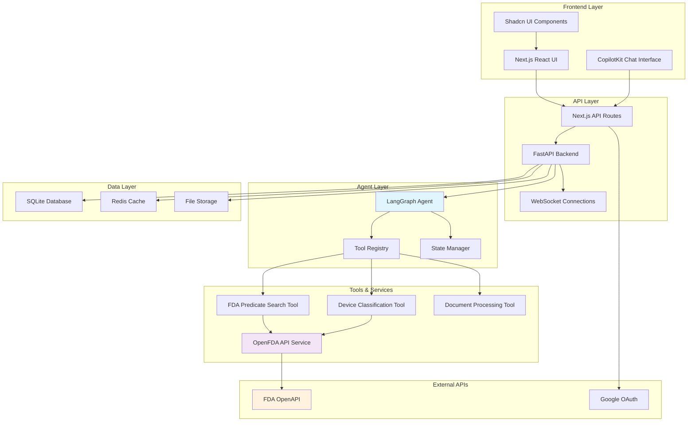
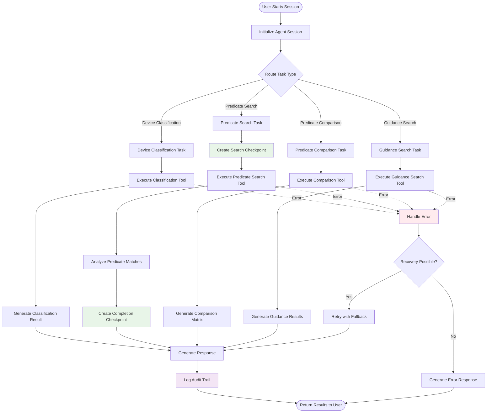
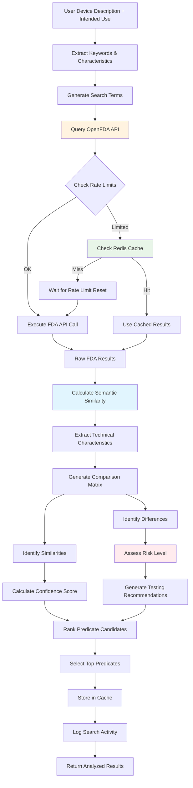
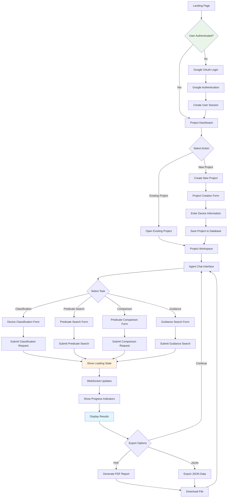
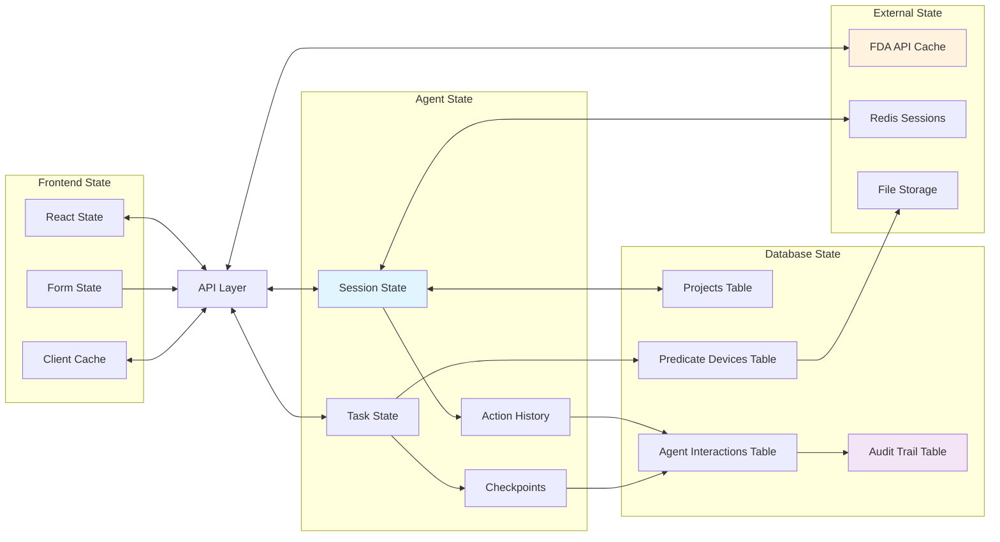
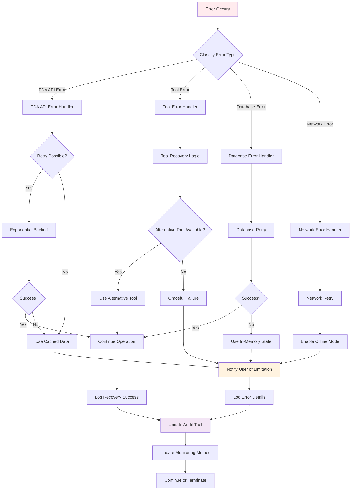
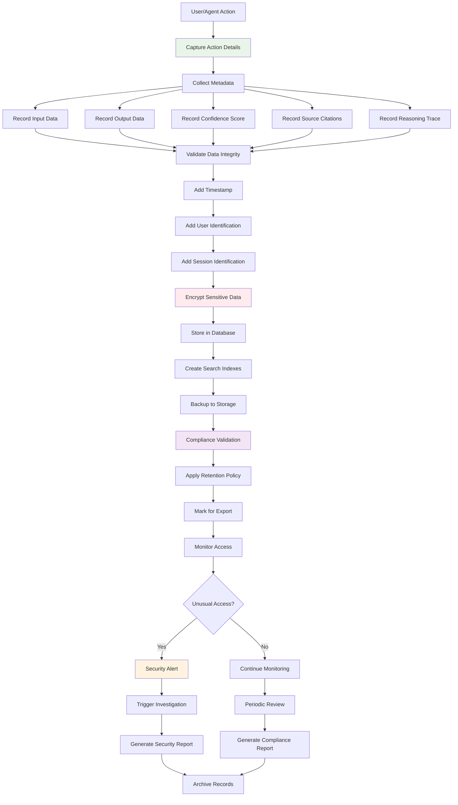

# Medical Device Regulatory Assistant - System Architecture Flowcharts

Based on the project documentation and codebase analysis, here are comprehensive flowcharts describing how the Medical Device Regulatory Assistant system works.

## 1. High-Level System Architecture

**Explanation**: This diagram shows the overall system architecture with clear separation of concerns. The frontend uses Next.js with CopilotKit for conversational AI, the backend uses FastAPI with LangGraph agents, and the system integrates with external FDA APIs for regulatory data.

## 2. Agent Workflow Execution

**Explanation**: This flowchart shows how the LangGraph agent executes different regulatory tasks. The system uses checkpoints for long-running processes (like predicate searches), maintains state throughout execution, and includes comprehensive error handling with recovery mechanisms.

## 3. FDA Predicate Search Workflow

**Explanation**: This detailed workflow shows how the FDA predicate search tool works, including rate limiting, caching, semantic analysis, and the generation of comprehensive comparison matrices with testing recommendations.

## 4. User Interface Flow

**Explanation**: This flowchart shows the complete user journey from authentication through project creation to task execution and results export. The interface uses real-time WebSocket updates to show progress during long-running operations.

## 5. Data Flow and State Management

**Explanation**: This diagram illustrates how data flows through the system and how different types of state are managed. The system maintains state at multiple levels: frontend React state, agent session state, database persistence, and external caches for performance.

## 6. Error Handling and Recovery

**Explanation**: This flowchart shows the comprehensive error handling and recovery system. The system classifies errors by type and applies appropriate recovery strategies, including retries, fallbacks, and graceful degradation while maintaining full audit trails.

## 7. Compliance and Audit Trail

**Explanation**: This flowchart details the comprehensive audit trail and compliance system. Every action is captured with full metadata, encrypted for security, and monitored for compliance with regulatory requirements. The system maintains immutable audit logs suitable for FDA inspections.

## Summary

These flowcharts illustrate the sophisticated architecture of the Medical Device Regulatory Assistant:

1. **Modular Architecture**: Clear separation between frontend, API, agent, and data layers
2. **Intelligent Agents**: LangGraph-based agents with state management and checkpointing
3. **Comprehensive Analysis**: Advanced FDA predicate search with semantic analysis and risk assessment
4. **User-Centric Design**: Intuitive interface with real-time updates and multiple export options
5. **Robust Error Handling**: Multi-level error recovery with graceful degradation
6. **Regulatory Compliance**: Complete audit trails and compliance monitoring suitable for FDA requirements

The system successfully transforms the complex, manual process of FDA regulatory pathway discovery into an automated, AI-powered workflow that reduces time from days to hours while maintaining the rigor required for regulatory submissions.