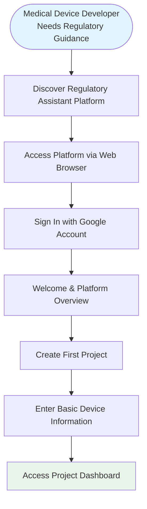
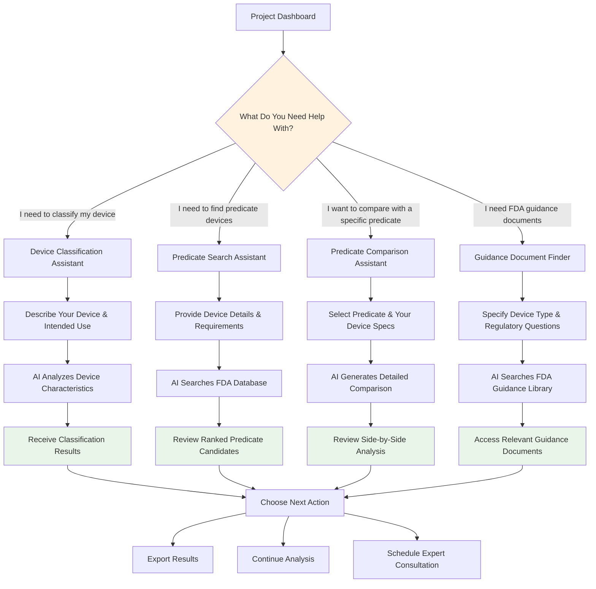

# Medical Device Regulatory Assistant - User Journey Workflow

## Simplified User Experience Flow for Medical Device Developers & Regulatory Affairs Professionals

This document outlines the step-by-step user journey when using the Medical Device Regulatory Assistant, focusing on what users see and do rather than technical implementation details.

---

## 1. Getting Started Journey



**What Happens Here:**
- **Discovery**: User learns about the platform through referrals, marketing, or regulatory community
- **Access**: Simple web-based access - no software installation required
- **Authentication**: Secure Google OAuth login for quick access
- **Onboarding**: Brief introduction to platform capabilities and regulatory focus
- **Project Creation**: User enters basic device information (name, description, intended use)
- **Dashboard Access**: User gains access to their personalized regulatory workspace

---

## 2. Core Regulatory Workflow



**What Happens Here:**
- **Task Selection**: User chooses from four main regulatory assistance areas
- **Information Input**: User provides device details through guided forms or conversational interface
- **AI Analysis**: Platform processes information using FDA databases and regulatory knowledge
- **Results Review**: User receives comprehensive analysis with confidence scores and source citations
- **Action Planning**: User decides on next steps based on AI recommendations

---

## 3. Device Classification Journey

```mermaid
graph TD
    START_CLASS[Start Device Classification] --> DESCRIBE[Describe Your Medical Device]
    DESCRIBE --> INTENDED_USE[Define Intended Use Statement]
    INTENDED_USE --> TECH_CHARS[Specify Technical Characteristics]
    
    TECH_CHARS --> SUBMIT_CLASS[Submit for Classification Analysis]
    SUBMIT_CLASS --> PROCESSING[AI Analyzes Against FDA Database]
    
    PROCESSING --> RESULTS_READY[Classification Results Ready]
    RESULTS_READY --> VIEW_CLASS[View Device Class (I, II, or III)]
    VIEW_CLASS --> VIEW_PRODUCT_CODE[See Recommended Product Code]
    VIEW_PRODUCT_CODE --> VIEW_PATHWAY[Understand Regulatory Pathway]
    
    VIEW_PATHWAY --> CONFIDENCE[Review Confidence Score & Reasoning]
    CONFIDENCE --> SOURCES[Check FDA Source Citations]
    SOURCES --> DECISION{Accept Classification?}
    
    DECISION -->|Yes| SAVE_RESULTS[Save to Project]
    DECISION -->|Need More Info| REQUEST_REVIEW[Request Human Expert Review]
    DECISION -->|Disagree| PROVIDE_FEEDBACK[Provide Additional Information]
    
    PROVIDE_FEEDBACK --> REANALYZE[Rerun Analysis with New Info]
    REANALYZE --> RESULTS_READY
    
    SAVE_RESULTS --> NEXT_ACTION[Plan Next Regulatory Steps]
    REQUEST_REVIEW --> EXPERT_CONTACT[Connect with Regulatory Expert]
    
    style PROCESSING fill:#fff3e0
    style VIEW_CLASS fill:#e8f5e8
    style CONFIDENCE fill:#e1f5fe
```

**What Happens Here:**
- **Device Description**: User provides comprehensive device information through guided prompts
- **Analysis Processing**: AI compares device against FDA classification database
- **Results Presentation**: Clear classification with device class, product code, and regulatory pathway
- **Confidence Assessment**: User sees how confident the AI is and why
- **Source Verification**: Direct links to FDA regulations and precedents
- **Decision Support**: Options to accept, request review, or provide additional information

---

## 4. Predicate Search Journey

```mermaid
graph TD
    START_PRED[Start Predicate Search] --> DEVICE_INFO[Enter Device Information]
    DEVICE_INFO --> SEARCH_CRITERIA[Define Search Criteria]
    SEARCH_CRITERIA --> LAUNCH_SEARCH[Launch FDA Database Search]
    
    LAUNCH_SEARCH --> SEARCHING[AI Searches FDA 510(k) Database]
    SEARCHING --> PROGRESS[View Search Progress]
    PROGRESS --> ANALYSIS[AI Analyzes Potential Matches]
    
    ANALYSIS --> RANKING[AI Ranks Predicates by Similarity]
    RANKING --> RESULTS_LIST[View Ranked Predicate List]
    
    RESULTS_LIST --> SELECT_PREDICATE[Select Predicate for Details]
    SELECT_PREDICATE --> PREDICATE_DETAILS[View Detailed Predicate Information]
    
    PREDICATE_DETAILS --> SIMILARITY_SCORE[See Similarity Score & Reasoning]
    SIMILARITY_SCORE --> COMPARISON_PREVIEW[Preview Comparison Highlights]
    COMPARISON_PREVIEW --> DECISION{This Predicate Looks Good?}
    
    DECISION -->|Yes| FULL_COMPARISON[Generate Full Comparison Analysis]
    DECISION -->|Maybe| SAVE_CANDIDATE[Save as Candidate]
    DECISION -->|No| BACK_TO_LIST[Return to Predicate List]
    
    BACK_TO_LIST --> RESULTS_LIST
    SAVE_CANDIDATE --> RESULTS_LIST
    
    FULL_COMPARISON --> DETAILED_ANALYSIS[Review Detailed Comparison Matrix]
    DETAILED_ANALYSIS --> TESTING_RECS[See Testing Recommendations]
    TESTING_RECS --> EXPORT_ANALYSIS[Export Complete Analysis]
    
    style SEARCHING fill:#fff3e0
    style RESULTS_LIST fill:#e8f5e8
    style SIMILARITY_SCORE fill:#e1f5fe
    style DETAILED_ANALYSIS fill:#e8f5e8
```

**What Happens Here:**
- **Search Setup**: User defines device characteristics and search parameters
- **Database Search**: AI searches FDA's 510(k) database for similar devices
- **Results Ranking**: Predicates are ranked by technological similarity and regulatory relevance
- **Predicate Evaluation**: User reviews each candidate with AI-generated similarity scores
- **Detailed Analysis**: Selected predicates get full comparison analysis
- **Testing Guidance**: AI recommends additional testing needed for differences
- **Documentation**: Complete analysis ready for regulatory submission use

---

## 5. Predicate Comparison Journey

```mermaid
graph TD
    START_COMP[Start Predicate Comparison] --> SELECT_PRED[Select Known Predicate Device]
    SELECT_PRED --> ENTER_SPECS[Enter Your Device Specifications]
    ENTER_SPECS --> COMPARISON_TYPE[Choose Comparison Focus]
    
    COMPARISON_TYPE -->|Technical| TECH_COMPARISON[Technical Characteristics Analysis]
    COMPARISON_TYPE -->|Regulatory| REG_COMPARISON[Regulatory Requirements Analysis]
    COMPARISON_TYPE -->|Complete| FULL_COMPARISON[Comprehensive Analysis]
    
    TECH_COMPARISON --> TECH_MATRIX[View Technical Comparison Matrix]
    REG_COMPARISON --> REG_MATRIX[View Regulatory Comparison Matrix]
    FULL_COMPARISON --> COMPLETE_MATRIX[View Complete Comparison Matrix]
    
    TECH_MATRIX --> SIMILARITIES[Review Similarities]
    REG_MATRIX --> SIMILARITIES
    COMPLETE_MATRIX --> SIMILARITIES
    
    SIMILARITIES --> DIFFERENCES[Review Differences]
    DIFFERENCES --> RISK_ASSESSMENT[See Risk Assessment]
    RISK_ASSESSMENT --> TESTING_NEEDS[Understand Testing Requirements]
    
    TESTING_NEEDS --> SUBSTANTIAL_EQ[Assess Substantial Equivalence]
    SUBSTANTIAL_EQ --> CONFIDENCE_SCORE[Review Overall Confidence]
    CONFIDENCE_SCORE --> RECOMMENDATIONS[Get Strategic Recommendations]
    
    RECOMMENDATIONS --> DECISION{Proceed with This Predicate?}
    DECISION -->|Yes| PREPARE_SUBMISSION[Prepare 510(k) Documentation]
    DECISION -->|No| FIND_ALTERNATIVE[Search for Alternative Predicates]
    DECISION -->|Need Expert Review| SCHEDULE_CONSULTATION[Schedule Expert Consultation]
    
    style COMPLETE_MATRIX fill:#e8f5e8
    style SUBSTANTIAL_EQ fill:#e1f5fe
    style RECOMMENDATIONS fill:#fff3e0
```

**What Happens Here:**
- **Predicate Selection**: User chooses a specific predicate device (K-number) for comparison
- **Device Specification**: User provides detailed specifications of their device
- **Comparison Analysis**: AI generates comprehensive side-by-side comparison
- **Similarity Assessment**: Clear identification of technological and regulatory similarities
- **Difference Analysis**: Detailed analysis of differences and their regulatory implications
- **Risk Evaluation**: Assessment of how differences might affect regulatory approval
- **Strategic Guidance**: Recommendations for proceeding with 510(k) submission

---

## 6. Results and Action Planning

```mermaid
graph TD
    RESULTS[Analysis Results Ready] --> REVIEW[Review AI Analysis & Recommendations]
    REVIEW --> CONFIDENCE_CHECK[Check Confidence Scores]
    CONFIDENCE_CHECK --> SOURCE_VERIFY[Verify FDA Source Citations]
    
    SOURCE_VERIFY --> DECISION{Satisfied with Analysis?}
    DECISION -->|Yes| PLAN_ACTIONS[Plan Next Steps]
    DECISION -->|Need More Detail| REQUEST_DEEPER[Request Deeper Analysis]
    DECISION -->|Have Questions| ASK_AI[Ask Follow-up Questions]
    
    REQUEST_DEEPER --> ADDITIONAL_ANALYSIS[AI Provides Additional Detail]
    ASK_AI --> AI_RESPONSE[AI Answers Questions]
    
    ADDITIONAL_ANALYSIS --> PLAN_ACTIONS
    AI_RESPONSE --> PLAN_ACTIONS
    
    PLAN_ACTIONS --> EXPORT_OPTIONS[Choose Export Format]
    EXPORT_OPTIONS -->|PDF Report| PDF_EXPORT[Generate PDF Report]
    EXPORT_OPTIONS -->|Excel Data| EXCEL_EXPORT[Export to Excel]
    EXPORT_OPTIONS -->|Word Document| WORD_EXPORT[Generate Word Document]
    
    PDF_EXPORT --> DOWNLOAD[Download Files]
    EXCEL_EXPORT --> DOWNLOAD
    WORD_EXPORT --> DOWNLOAD
    
    DOWNLOAD --> NEXT_STEPS[Plan Implementation]
    NEXT_STEPS -->|Continue Analysis| NEW_TASK[Start New Analysis Task]
    NEXT_STEPS -->|Prepare Submission| SUBMISSION_PREP[Begin 510(k) Preparation]
    NEXT_STEPS -->|Consult Expert| EXPERT_REFERRAL[Connect with Regulatory Expert]
    
    style CONFIDENCE_CHECK fill:#e1f5fe
    style PLAN_ACTIONS fill:#e8f5e8
    style DOWNLOAD fill:#fff3e0
```

**What Happens Here:**
- **Results Review**: User examines AI analysis with confidence scores and reasoning
- **Source Verification**: User can check all FDA citations and source documents
- **Quality Assessment**: User evaluates whether analysis meets their needs
- **Follow-up Questions**: Conversational interface allows clarification questions
- **Export Options**: Multiple formats available for different use cases
- **Implementation Planning**: Clear next steps for regulatory strategy

---

## Key User Benefits Throughout the Journey

### ⏱️ **Time Savings**
- **Traditional Process**: 2-3 days of manual research
- **With AI Assistant**: 2-3 hours of guided analysis
- **Efficiency Gain**: 80-90% time reduction

### 🎯 **Accuracy & Confidence**
- **Confidence Scores**: Every recommendation includes confidence level (0-100%)
- **Source Citations**: Direct links to FDA databases and regulations
- **Reasoning Traces**: Clear explanation of how conclusions were reached
- **Human Oversight**: Always emphasizes need for expert review

### 📋 **Comprehensive Analysis**
- **Multi-faceted Review**: Technical, regulatory, and strategic perspectives
- **Risk Assessment**: Clear identification of potential regulatory challenges
- **Testing Guidance**: Specific recommendations for required testing
- **Submission Readiness**: Analysis formatted for regulatory submission use

### 🔄 **Iterative Improvement**
- **Conversational Interface**: Ask follow-up questions and refine analysis
- **Multiple Scenarios**: Compare different regulatory strategies
- **Continuous Learning**: AI improves recommendations based on user feedback
- **Expert Integration**: Seamless handoff to human regulatory experts when needed

### 📊 **Professional Documentation**
- **Export Ready**: Professional reports suitable for regulatory submissions
- **Audit Trail**: Complete record of analysis process and decisions
- **Collaboration**: Easy sharing with team members and consultants
- **Version Control**: Track changes and updates to regulatory strategy

---

## Success Metrics from User Perspective

### **Immediate Value**
- ✅ Device classification completed in minutes instead of hours
- ✅ Predicate candidates identified and ranked automatically
- ✅ Comparison analysis ready for regulatory team review
- ✅ FDA guidance documents found and organized by relevance

### **Strategic Value**
- ✅ Reduced risk of predicate-related 510(k) failures
- ✅ Faster time to market through efficient regulatory planning
- ✅ Lower regulatory consulting costs for routine analysis
- ✅ Improved confidence in regulatory strategy decisions

### **Long-term Value**
- ✅ Building regulatory knowledge and expertise within the organization
- ✅ Standardized approach to regulatory analysis across projects
- ✅ Complete audit trail for FDA inspections and quality systems
- ✅ Scalable regulatory process as company grows

This user journey transforms the complex, intimidating world of FDA medical device regulation into a guided, AI-assisted process that empowers medical device developers to make informed regulatory decisions efficiently and confidently.